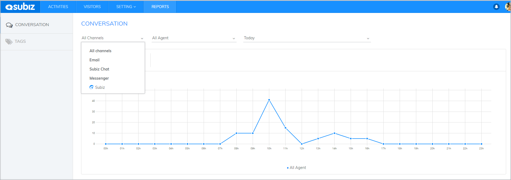
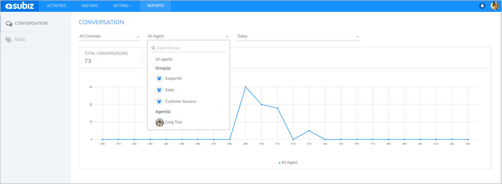
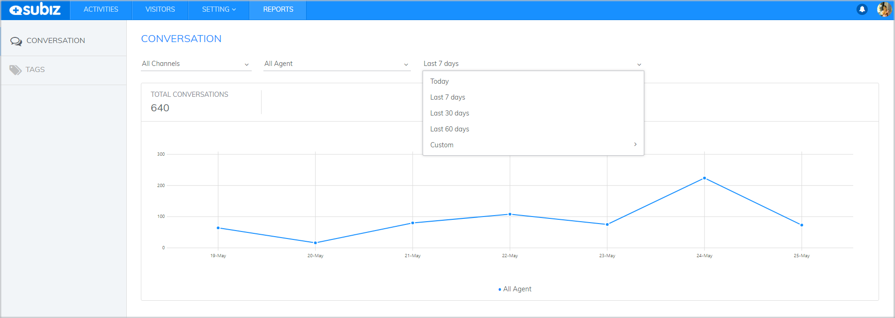
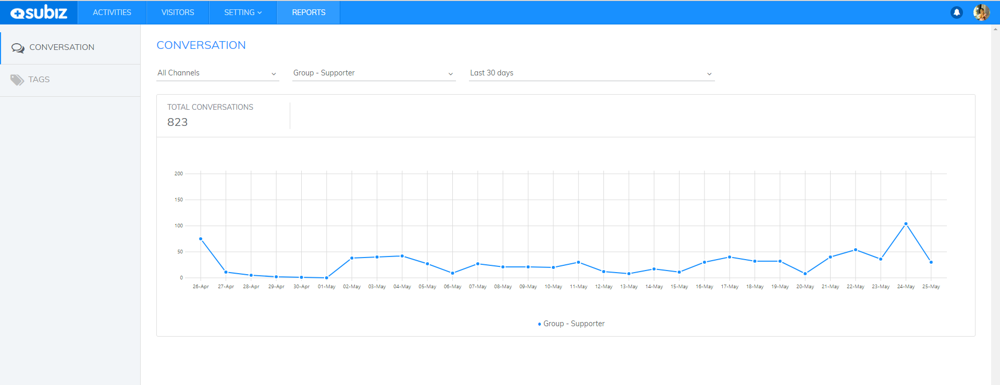
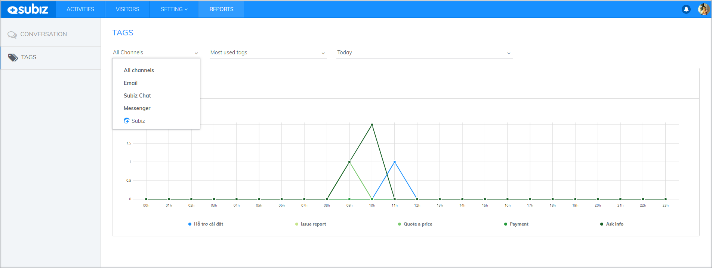
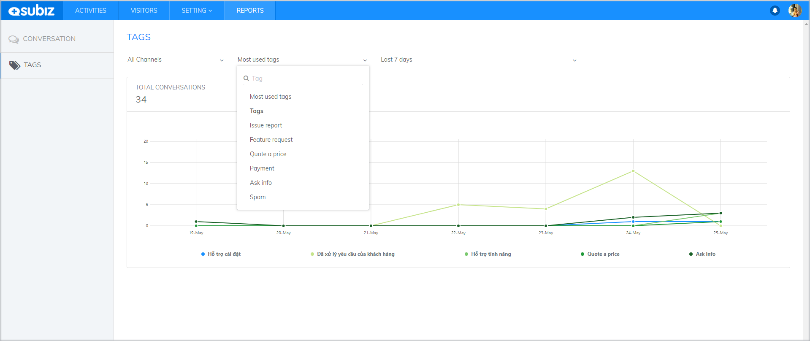
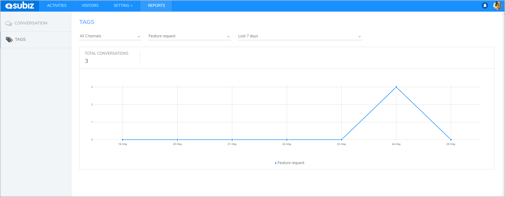
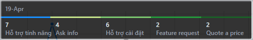

# Reports

### Overview of Reports

In Subiz, all your interactive data with your customers is saved. These reports will help you to check your online business, control the quality of customer service and manage your staff effectively.  
  
To track your Subiz's interaction statistics, you need to log in your Subiz account and click on **Reports.**  
  
Your interaction statistics can be shown in the following categories:

* **Conversations:** You can count conversations according to the specific time and each agent / a group of agents. You can see the detailed statistics of interactions, including the time having the most conversations, agents having the most/least conversation and channels working effectively.
* **Tags:** Tag report will help you sort and manage your interactions effectively. If you not only want to  sell via online channels, but also provide customer service and technical support ... this statistical function will help you manage your online business and identify effective channels for customer support.

Therefore, thanks to Subiz reports, you not only see statistics but also build customer databases to manage your business, take care of your customers, and and create effective business plans.

### Conversation Report

Conversation report gives you an overview of customer interactions on Subiz. You can make conversation report according to specific criteria.  
  
This database helps you to develop marketing strategies, do online business on various channels and evaluate the effectiveness of advertising campaigns, promotion ... For example, you are implementing advertising on the Fanpage in 30 days. When the campaign is finished , you can check the amount of interactions via the Messenger channel in the last 30 days. Based on the statistics, you can evaluate the effectiveness of this program and make the necessary adjustments.

#### Statistical criteria

In the Reports section, you can count the number of conversations by **Channel**, **Agent**, and **Time**:



Filtering conversations according to Channels helps you see how many interactions each channel: Subiz Chat / Email / Messenger 




 Filtering conversations according to Agent / Group Agents  helps you evaluate the working performance of each Agent, as well as evaluate the overall business situation.




You can filter conversations according to specific time periods and make comparisons to see fluctuations. 




#### How to read statistical charts

After you've selected the criteria for statistics, you can look at your statistics as a chart.

* **Vertical axis:** Number of conversations
* **Horizontal axis:** Time axis \(unit of time: date or hour depending on the time period you choose\)

By placing your cursor at the intersection, you will see the number of conversations displayed at the selected time. Looking at the chart, you can evaluate the total conversations over time and see conversations at a specific time.  
  
For example: Statistics of Subiz Chat conversations by Support group in the last 30 days. 

### Tags Report

Subiz Tag is a feature that allows users to tag the interactions on all channels integrated Subiz. The purpose of this feature is to help agents easily manage and categorize customer interactions such as: Support, Sales, Promotions...

Thanks to this function you can manage interactions according to their content and evaluate the effectiveness of the promotion. For example, your website is running a "Golden Week" promotion. After 7 days, you can statistically count how many interactions are tagged "quote a price", "successful deal"... These statistics will help you valuate the effectiveness of the promotion.

#### Statistical criteria

You can count the Tags according to Channels, Tags and Time



Select the channels that you want to filter tagged messages:




You can count tagged messages according to a specific tag or most used tags.

* According to most Used Tags: 5 tags

* According to a specific tag




You can select the time that you want to count tagged messages




#### How to read statistical charts

After selecting the statistical criteria, the data will be displayed as a chart

* **Vertical axis:** Number of Tags
* **Horizontal axis:** Time axis \(unit of time: date or hour depending on the time period you choose\)

At each intersection, you can see the number of tagged messages  per specific tag at a given time. This will help you manage the interaction more conveniently

For Example: 5 most used Tags in 19th April:

