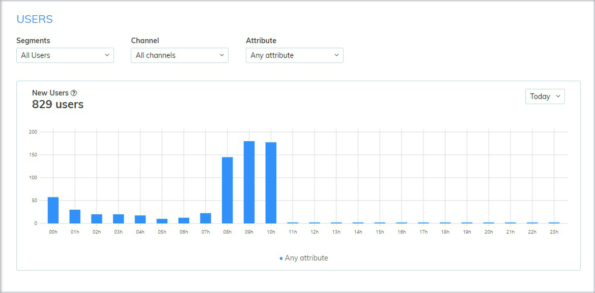
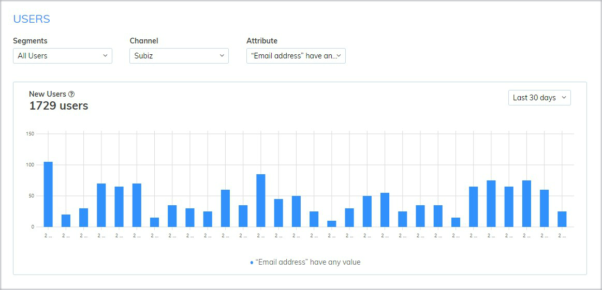

# Report of users

Users report will tell you how many and which channels new users are from. It is a point for evaluation of your conversion rate.

### Information of users report

On users report, you can check the total number of new users over a given time period according to such information as Segments, Channel, Attribute.



There are 3 segments: All users, My users, Connected users.

* All users: All new visitors on your website or who had a conversation on Subiz.
* My users: All new users had at least one conversation with you.
* Connected users: All new users had a conversation with all agent of your account.



There are 3 intersation channels on Subiz as: Subiz chat on website, Facebook messenger, Subiz Email.



Attribute of users that has been collected and updated by Capture Lead or Agent. You can create your owner [user attribute](https://app.subiz.com/settings/user-attributes#) optimize and enhance support process.



### How to read users report

After selecting the criteria for report, you will see a chart. 

* Vertical axis: Total number of users 
* Horizontal axis: Time period. 

This chart shows the number of new users with specific interactions over time period. From there, you can evaluate the total number of users who access, interact over each channel or have specific attribute.

For example:  All new Users have Email Address attribute for the last 30 days

