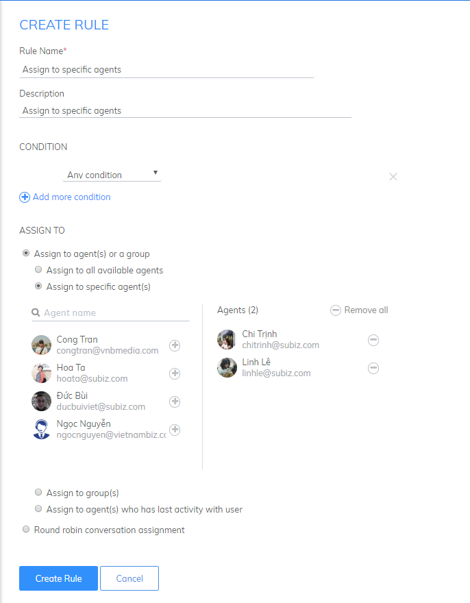
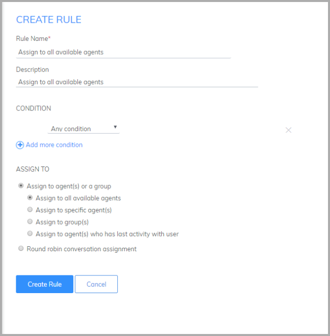
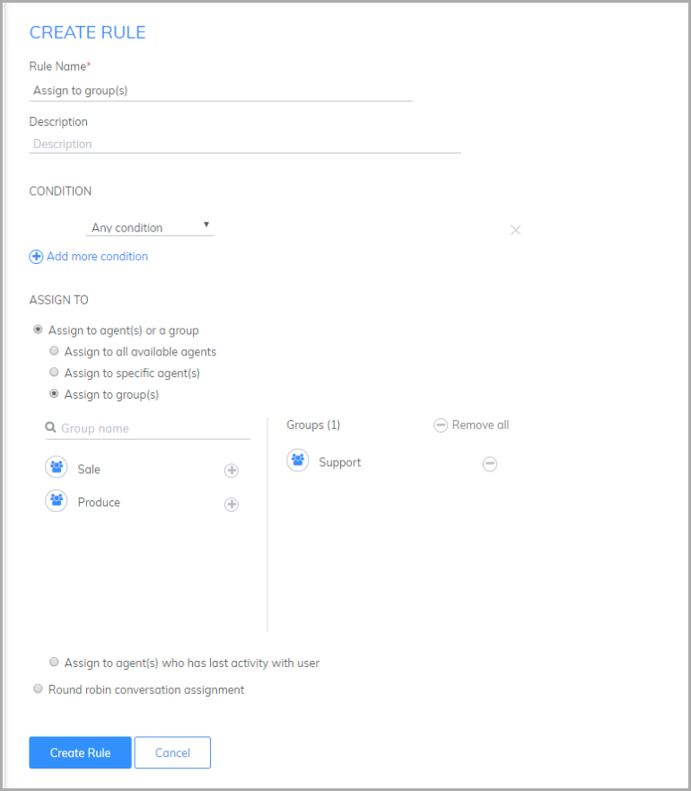
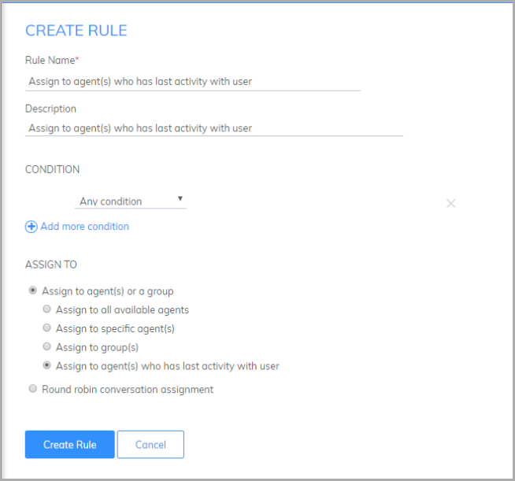
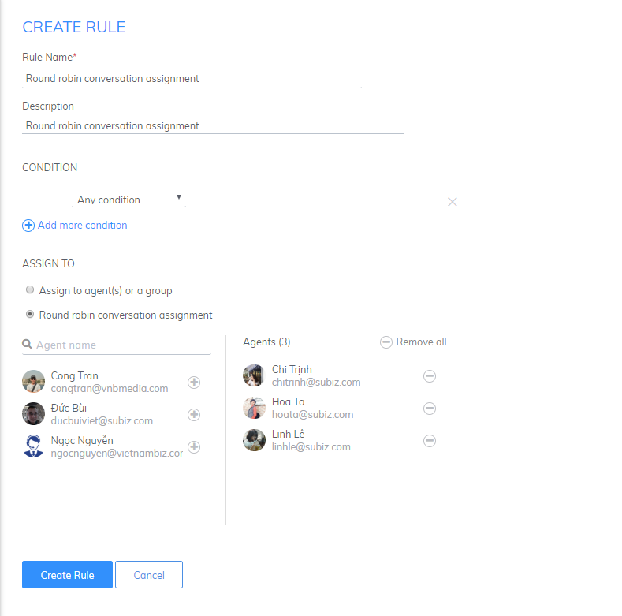
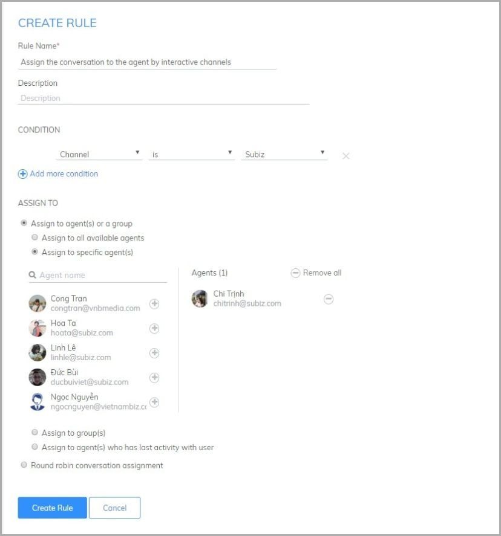
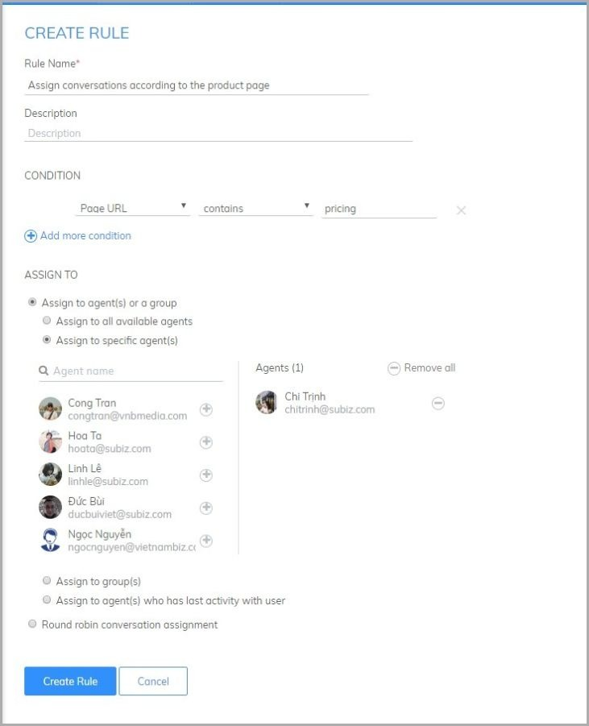
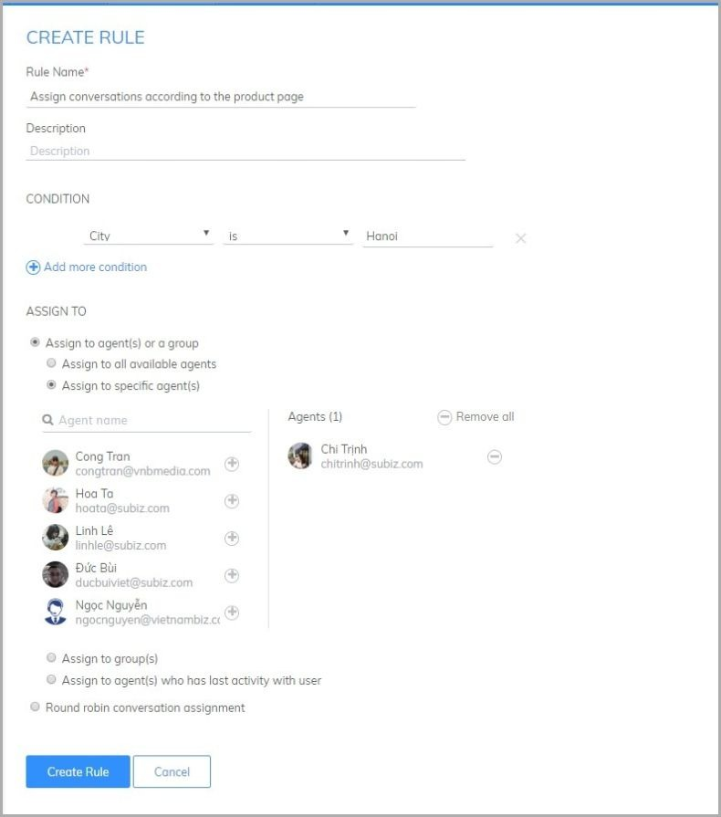

# Example about Rule distribution dialog

### Assign all conversations for an agent or multiple agents 

You can use the default rule if you want to deliver the conversation to the agent owner. In case you want to transfer to another agent support that user, please following as belows:

### Assign to Agents or Agent Groups 

When choosing to distribute to Agents or Agent Groups, any agent in the distributed group can join simultaneously in the conversation.

You have to choose one of the following distribution types: 

* **Assign to all available agents:** Distribute the conversation to all agents who are logged in Subiz account.

* **Assign to specific agent\(s\):** You would like to dialogue the conversation to agents also receive and support the users. Select the Distributed agent conditions and choose the agent you want to distribute the conversation

* **Assign to groups:** When you want to distribute a conversation to a specific group, for example, ask the price of the product transferred to Sale, ask about the product warranty transferred to the technical department. 

* **Assign to the agent the last interaction with the user:** Distributing the conversation to the Agent that interacts most closely with the user. 

### Round robins conversation assignment 

When assign according to this rule, new user dialogues will be allocated equally to several agents or groups of agents. When you have multiple conversations, dividing the conversation will help reduce the pressure and speed up the response of the agent. You can set up as bellow:

### Assign the conversation to the agent by interactive channels 

You have multiple channels of interaction: Website, Email, Fanpage and want to distribute the agent's channel to each channel to categorize users but still manage the data centrally. You do the following:

### Assign conversations according to the product page

 If you have a sales website that sells a lot of products, you can assign consultants to each item. This will make it easier for consultants to better understand customer needs and advice. You set the rule as follows: 

### Assign conversations by geographic region 

When your business has branches in different provinces and wants to distribute the dialogues to local agents that support a customer, Subiz will help you identify and deliver the conversations to the right agent.

