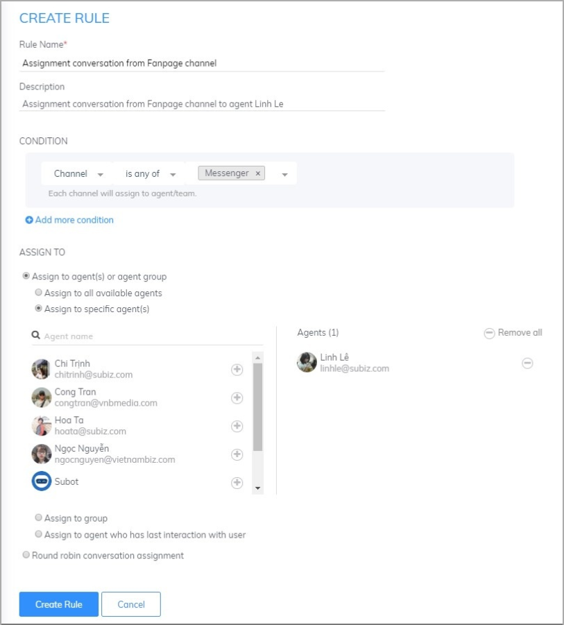

# Some common assignment rule

### Assignment conversation base on business hours 

Along with applying the Subot and dividing the rule by the business hours of the business, you can automate response to their message and also ask their information. Therefore, you can contact the user the next day. 

#### Step 1: Set up Subot to automate response to the user in out of business hours \([See details](https://help-en.subiz.com/getting-started-with-subiz/how-to-use-subiz/managing-agent/subot-auto-reply-bot-and-ask-users-information)\) 

#### Step 2: Set up business hours \([See details](https://help-en.subiz.com/getting-started-with-subiz/how-to-use-subiz/set-up-business-hours)\) 

#### Step 3: Set up an assignment rule base on business hours You set up 2 rules as below: 

* _**Rule 1:** Assignment rule to the agent during business hours_

* _**Rule 2:** Assignment rule to the agent out of business hours_

### 

### Assignment conversation by agent's shift/working day of the week 

You have multiple agents and divided by different shifts according to the working day of the week. You could set up the rule to distribute automatically according to Agent's fixed schedule. 

For example, Agent Chi Trinh receives a chat on days 2, 4, 6 and Sunday and agent Linh Le receives a chat on days 3, 5, 7. You will install 2 Rules as follows:

* _**Rule 1:** Assignment conversation for agent Chi Trinh._

* _**Rule 2:** Assignment conversation for agent Linh Le._

### Assignment conversation base on the website’s language

Apart from support local customer, you also have an overseas customer. You also have an agent who supports for each website. You will set up 2 rules as below to assign to the agent who handles based on the website’s language.

* _**Rule 1:** Assignment conversation from Vietnamese website to agent Hoa Ta._

* _**Rule 2:** Assignment conversation from English website to agent Linh Le._

### Assignment conversation base on different channels 

You integrate Subiz on Website, Fanpage, and Email and have Agent to take charge of each channel separately. You can use the Rule function to distribute conversations by channel: 

* _**Rule 1:** Assignment conversation from website channel \(Subiz chat\)_ 

* _**Rule 2:** Assignment conversation from Fanpage_ 

### Assign conversations by geographic region 

When your business has branches in different provinces and wants to distribute the dialogues to local agents that support a customer, Subiz will help you identify and deliver the conversations to the right agent.

