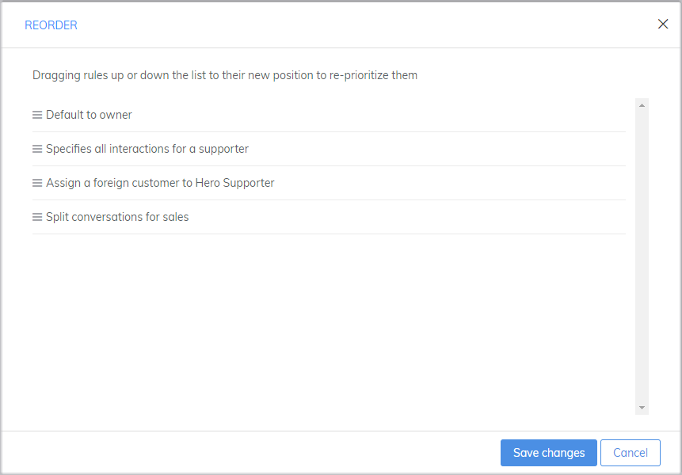
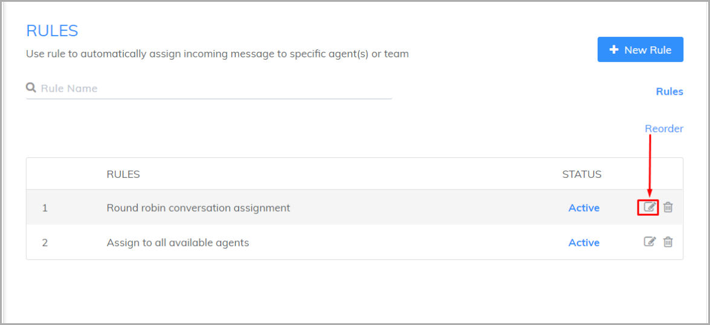
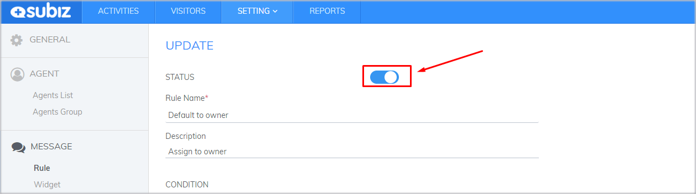
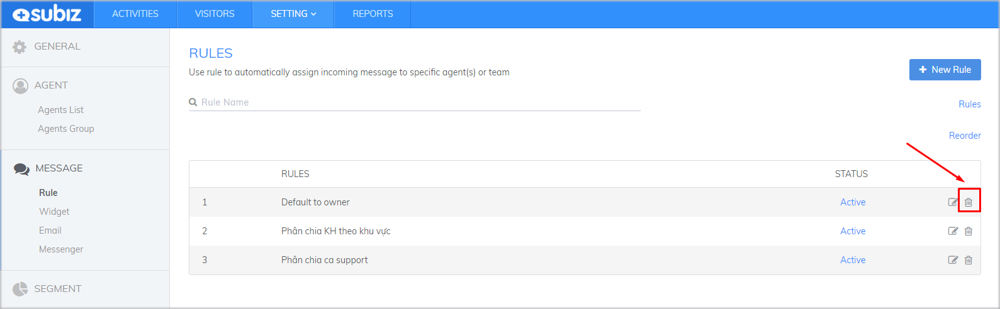
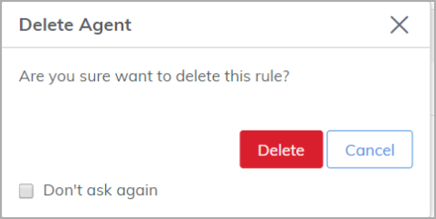

# Managing rule's lists

When there are changes in the **number of agents, products or channels**, you should adjust the rules to assign conversations more suitably. Avoid overload for working process or assignment for a agent who not in charge that field.

You can **reorder rules, edit existing rules** and **remove rules** that no longer match the current requirements of your business.

You need pay attention and perform 3 things:

### **1. Reorder rules**

Rules work with the **priority order from up to down**.

For example, you has two rules:

* **Rule 1:** Distributed to the agent with the last interaction with the user.
* **Rule 2:** Distributed Conversation.

When a new conversation occurs, the rule prefers to distribute to agent that has previously interacted, if no corresponding agent exists, the conversation will be assigned to the agent in turn. For the rules to work properly, click **Reorder**.


Only Active rules can work.


To reorder the rules, click **Reorder**.

Dragging rules up or down the list to their new position to re-prioritize them. Then click **Save changes**.

### **2. Edit rules**

Follow below steps to edit rules:

* Select the **edit icon** beside the rule

* Update information

* Click **Update** to complete

You can change the **Active/ Inactive** status for each rule. Inactive rules stay in the list but do not work.

### **3. Delete rules**

* Select the delete icon beside the rule

* Click Delete to confirm

Then click **Save changes**.

