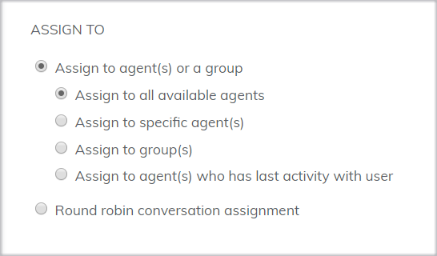

# How to distribute conversations

### What is Rule?

The rule is a feature that allows you to distribute a customer's conversation to the right agent in charge. In Subiz, you can set rules to distribute automatically to agent or multiple agents at the same time.

There are five ways to distribute a conversation to agent: 

* Assign to all available agents: Available agents are the one who that directly connected to Subiz on a computer or mobile app. When the agents do not connect to Subiz, the conversation to the conversation is not distribute. Agents can view and respond to users after reconnecting Subiz.
* Assign to agents: Select the specific agent you want to distribute the user's conversation.
* Assign to groups: Select the agent group you created to distribute the user's conversation.
* Assign to the agent has a lasting interaction with the customer: When the agent has previously supported the user, you will choose to designate the next user conversation for the agent to continue to take care of and consult. 
* Assign conversations are round robins: You have multiple agents and want to divide conversation equally of user for agents.

### Default to owner 

With new accounts, Subiz set up the default rule. This rule distributes all customer conversations to the Agent owner. 

You can see the Rule Default to owner details and customize the settings as follows: Rule Name to easily understand the meaning of setting rules, select the condition and how to Distribute user dialog for Agent. See the [Creating a New Rule instruction](https://help-en.subiz.com/~/edit/drafts/-LTjuaZMXIlZ2Z4qHd5s/getting-started-with-subiz/how-to-use-subiz/distributing-conversations/rule-setting).

