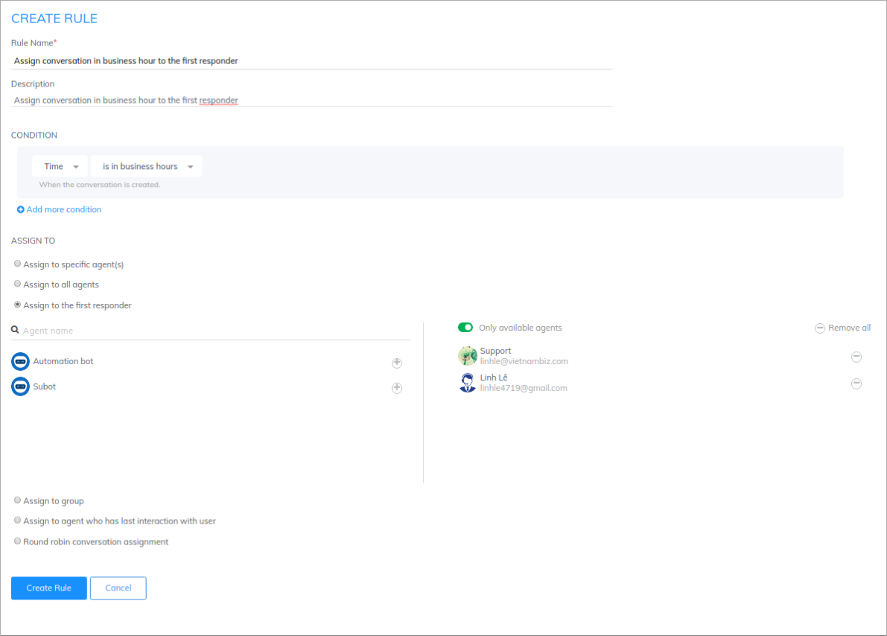
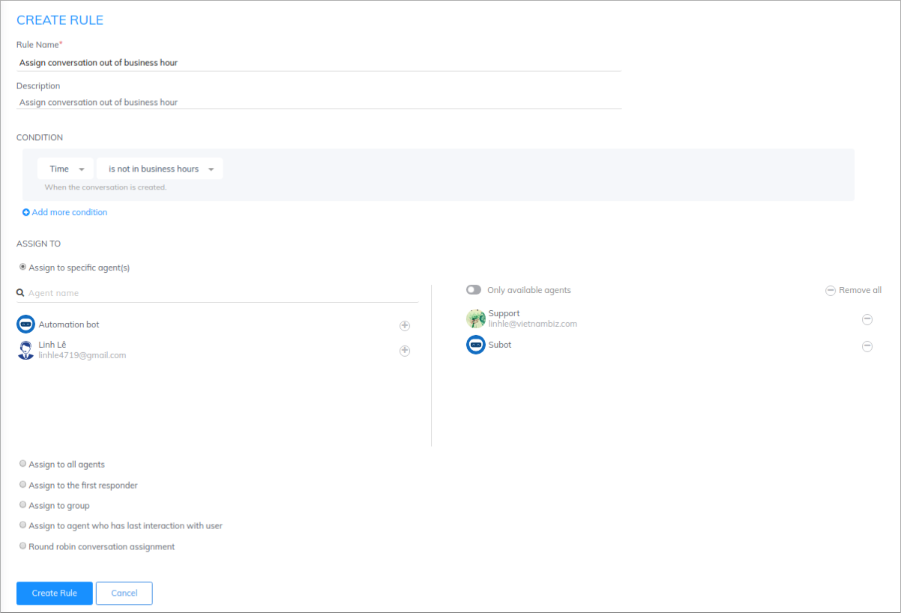
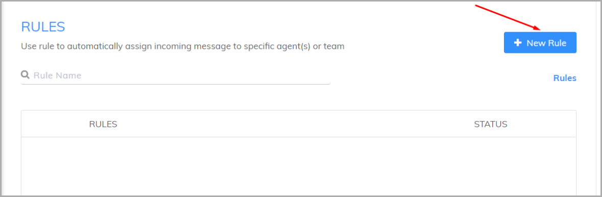
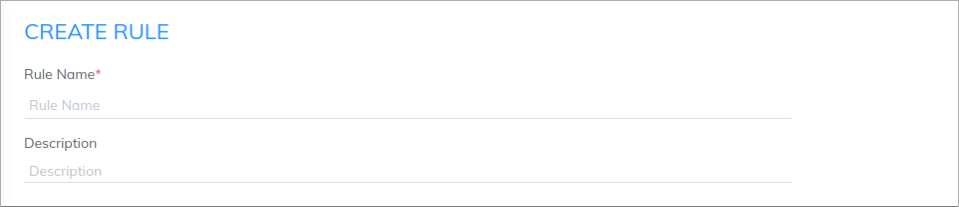
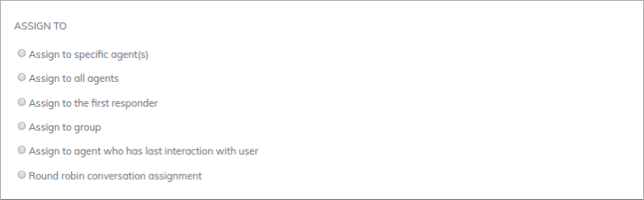
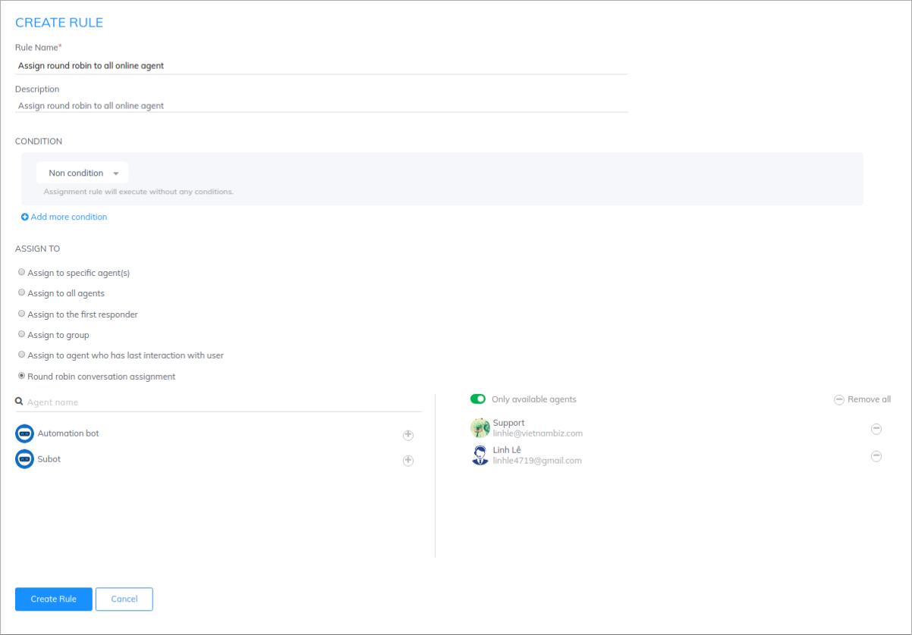

# Create a new rule

### **What is assignment rule ?**

Rule is the important feature of Subiz - helping businesses to distribute customers' conversations. Instead of having to select departments manually and waiting to be connected, you can perform the process automatically, which helps to boost the productivity of the work by quickly connecting to agents.

### How does Rule work ?

Depending on the need for conversation division, you can set up one or many rules. The rule works in order from top to bottom. You can arrange the order of rule in " **Reorder** " part.

For example, your business has 2 sale agents who word at the same time during office hours. Beyond working hours, if you want to inform customers that you are not online and invite them to leave messages and contacts, you can install 2 rules as follows:

* During business hours: Apply competitive distribution - anyone who answers first will take care of that customer. 

* Out of business hours: Assign to one agent and Subot 

### Create a new rule

To set up a new rule, [log into your account](https://app.subiz.com/login) and go to [**Setting&gt; Account&gt; Message&gt; Rule**](https://app.subiz.com/settings/rule-setting) **&gt;** Select **New rule.**

Then start to set up a new rule.

### **Step 1: Enter rule name and description**

* **Rule Name:** Enter rule name so that you can easily manage in the rule list
* **Description**: Describe the condition and purpose of the rule

### **Step 2: Select conditions for the rule**

You can set up one or more conditions:

* Click **Add more condition** to combine multiple conditions in a rule.
* Select **And / Or** to determine the relationship between the conditions.

For example: Here is the rule to distribute conversations from customers in Vietnam or visit Subiz.com

You can set one or more conditions based on **List of rule condition**.

<table>
  <thead>
    <tr>
      <th style="text-align:left"><b>CONDITION</b>
      </th>
      <th style="text-align:left"><b>USAGE</b>
      </th>
      <th style="text-align:left"><b>EXAMPLE</b>
      </th>
      <th style="text-align:left"></th>
    </tr>
  </thead>
  <tbody>
    <tr>
      <td style="text-align:left">Any condition</td>
      <td style="text-align:left">By selecting this condition, <b>all conversations</b> will always be assigned
        to agents set up in the rule.</td>
      <td style="text-align:left">Condition: Any condition</td>
      <td style="text-align:left"></td>
    </tr>
    <tr>
      <td style="text-align:left"><b>General Condition</b>
      </td>
      <td style="text-align:left"></td>
      <td style="text-align:left"></td>
      <td style="text-align:left"></td>
    </tr>
    <tr>
      <td style="text-align:left">Non condition</td>
      <td style="text-align:left">When you select this condition, all conversations will be distributed
        to Agents</td>
      <td style="text-align:left">You can select: Non condition</td>
      <td style="text-align:left"></td>
    </tr>
    <tr>
      <td style="text-align:left">Agent offline</td>
      <td style="text-align:left">You can use this condition to distribute conversations when no Agent is
        online.</td>
      <td style="text-align:left">Select Agent Offline condition, distribute the conversation to Subot and
        an Agent in charge of answering customers when he is online again.</td>
      <td
      style="text-align:left"></td>
    </tr>
    <tr>
      <td style="text-align:left"><b>Conversation  created time</b>
      </td>
      <td style="text-align:left">&#x200B;</td>
      <td style="text-align:left">&#x200B;</td>
      <td style="text-align:left"></td>
    </tr>
    <tr>
      <td style="text-align:left">Time</td>
      <td style="text-align:left">When you want to assign conversations to agents based on time (hour) of
        the day, business hours....</td>
      <td style="text-align:left">After you have installed the Business Hours, you can create two rules
        as follows:
         Rule 1: Time - during working hours
         Rule 2: Time - out of working hours</td>
      <td style="text-align:left"></td>
    </tr>
    <tr>
      <td style="text-align:left">Day of week</td>
      <td style="text-align:left">When you want to assign conversations to agents based on days in week.</td>
      <td
      style="text-align:left">You can create 2 Rules to distribute conversations according to Agent&apos;s
        working days:
         Rule 1: Day of the week - is any oD &#x200B;&#x200B;- Monday, Wednesday,
        Friday, Sunday.
         Rule 2: Day of the week - is any of &#x200B;&#x200B;- Tuesday, Thursday,
        Saturday.</td>
        <td style="text-align:left"></td>
    </tr>
    <tr>
      <td style="text-align:left"><b>Channels</b>
      </td>
      <td style="text-align:left">&#x200B;</td>
      <td style="text-align:left">&#x200B;</td>
      <td style="text-align:left"></td>
    </tr>
    <tr>
      <td style="text-align:left">Channel</td>
      <td style="text-align:left">Use when you want to distribute conversations according to user interaction
        channels. For example Subiz chat on the website, Fanpage, Subiz Email.</td>
      <td
      style="text-align:left">
        

        
You create 3 rules dialog box conversations on 3 channels Subiz chat,
          Fanpage, Email as belows: Condition:
           1. Channel - is - Subiz chat

        
2. Channel - is - Subiz Email

        
3. Channel - is - Fanpage

        </td>
        <td style="text-align:left"></td>
    </tr>
    <tr>
      <td style="text-align:left">Page URL</td>
      <td style="text-align:left">Each URL typically focuses on a specific product or service, Subiz can
        identify which URL customers are viewing and assign the conversation to
        each Agent.</td>
      <td style="text-align:left">
        
Visitors to Subiz&apos;s website will be distributed to Agent A

        
Condition: Page URL - contains - Subiz.com

      </td>
      <td style="text-align:left"></td>
    </tr>
    <tr>
      <td style="text-align:left">Page title</td>
      <td style="text-align:left">Purpose of page title are almost the same as page URL. You can use it
        to assign conversations from specific pages to suitable agents.</td>
      <td
      style="text-align:left">
        
Visitors to the page titled &quot;Camera&quot; will distribute the conversation
          to Agent A.

        
Condition: Page Title - Contains - Camera

        </td>
        <td style="text-align:left"></td>
    </tr>
    <tr>
      <td style="text-align:left">Channel Source</td>
      <td style="text-align:left">Use when you want to assign a conversation agent to a specific Fanpage
        or email address</td>
      <td style="text-align:left">Distribute conversations from specific Fanpage or Emails:
         Source of conversation - is any of &#x200B;&#x200B;- Subiz, support@subiz.com</td>
      <td
      style="text-align:left"></td>
    </tr>
    <tr>
      <td style="text-align:left"><b>Location and Language</b>
      </td>
      <td style="text-align:left"></td>
      <td style="text-align:left"></td>
      <td style="text-align:left"></td>
    </tr>
    <tr>
      <td style="text-align:left">Country code</td>
      <td style="text-align:left">Use when you want to rely on the country code of the visitor to distribute
        the conversation. Country code based on ISO Code (2 characters), capitalized
        both letters. Refer to the list of country codes For example: Vietnam =
        US, US = US, China = CN, South Korea = KR, Japan = JP</td>
      <td style="text-align:left">
        
Distributing foreign customer dialogue for international agents

        
Condition: Country code - not is - VN

      </td>
      <td style="text-align:left"></td>
    </tr>
    <tr>
      <td style="text-align:left">City</td>
      <td style="text-align:left">Use when you want to rely on your city&apos;s address to distribute the
        conversation. As the English name of the city, only capitalize the first
        letters of the word. Refer to the name of each country. For example: Hanoi,
        Ho Chi Minh City, New York, Hong Kong.</td>
      <td style="text-align:left">
        
Distributed dialogue for user from Hanoi for agent Hanoi

        
Condition: City - is - Hanoi

      </td>
      <td style="text-align:left"></td>
    </tr>
    <tr>
      <td style="text-align:left">Timezone</td>
      <td style="text-align:left">Deliver the conversation based on the user&apos;s time zone. Timezone
        code is based on UTC. Refer to the timezone zone list. Example: Vietnam
        and Southeast Asia - UTC +7 G</td>
      <td style="text-align:left">Distributed dialogue for customers from South East Asia for Agent A South
        East Asia. Condition: Time zone - is - UTC +7 G</td>
      <td style="text-align:left"></td>
    </tr>
    <tr>
      <td style="text-align:left">Browser language</td>
      <td style="text-align:left">Look up codes of browser language in <a href="http://www.lingoes.net/en/translator/langcode.htm">ISO Language Code</a>,
        for example, vi-VN, en-US. Assign the conversation to agents who can use
        the language that customers use in their browser.</td>
      <td style="text-align:left">
        
Customers using the English language on the program will distribute the
          dialogue to the international agent group.

        
Condition: Browser language - is - en - US

      </td>
      <td style="text-align:left"></td>
    </tr>
    <tr>
      <td style="text-align:left"><b>Traffic</b>
      </td>
      <td style="text-align:left"></td>
      <td style="text-align:left"></td>
      <td style="text-align:left"></td>
    </tr>
    <tr>
      <td style="text-align:left">Device</td>
      <td style="text-align:left">Use when you want to rely on customer access device: Personal Computer,
        Phone, Tablet</td>
      <td style="text-align:left">Assign conversations of customers using personal computers Condition:
        Device - is any of &#x200B;&#x200B;- Personal computer</td>
      <td style="text-align:left"></td>
    </tr>
    <tr>
      <td style="text-align:left">Number of Sessions</td>
      <td style="text-align:left">Use when you want to base on the number of visits to your website.</td>
      <td
      style="text-align:left">Distributing conversations of customers who have visited the site more
        than 3 times Condition: Number of sessions - is greater than - 3</td>
        <td
        style="text-align:left"></td>
    </tr>
    <tr>
      <td style="text-align:left">Total conversations</td>
      <td style="text-align:left">This condition will be based on the total number of customers&apos; conversations
        taking place on Subiz</td>
      <td style="text-align:left">You want customers who have chat to more than 3 times will be supported
        by support department Condition: Total conversations - is greater than
        - 3</td>
      <td style="text-align:left"></td>
    </tr>
    <tr>
      <td style="text-align:left"><b>User</b>
      </td>
      <td style="text-align:left">&#x200B;</td>
      <td style="text-align:left">&#x200B;</td>
      <td style="text-align:left"></td>
    </tr>
    <tr>
      <td style="text-align:left">Name</td>
      <td style="text-align:left">Identify name of customers and assign conversation to a specific agent.</td>
      <td
      style="text-align:left">
        
The customer&apos;s conversation delivery has the name of the Service
          Agent

        
Condition: Name - Not empty

        </td>
        <td style="text-align:left"></td>
    </tr>
    <tr>
      <td style="text-align:left">Email</td>
      <td style="text-align:left">Identify email of customers and assign conversation to a specific agent.</td>
      <td
      style="text-align:left">Deliver the user&apos;s conversation who has email address to consultant.
        Condition: Email Address - Not empty</td>
        <td style="text-align:left"></td>
    </tr>
    <tr>
      <td style="text-align:left">Phone</td>
      <td style="text-align:left">Identify phone number of customers and assign conversation to a specific
        agent. Phone numbers are a set of numbers, not contain special characters</td>
      <td
      style="text-align:left">Deliver the user&apos;s conversation with an email address to the Agent
        who in charge Call Center. Condition: Phone number - Not empty</td>
        <td
        style="text-align:left"></td>
    </tr>
    <tr>
      <td style="text-align:left">Address</td>
      <td style="text-align:left">Use when you want to rely on the visitor&apos;s address to distribute
        the conversation</td>
      <td style="text-align:left">Distribute of Hanoi customer conversations for Hanoi branch Conditions:
        Address - contains - Hanoi</td>
      <td style="text-align:left"></td>
    </tr>
    <tr>
      <td style="text-align:left">Time on page</td>
      <td style="text-align:left">Use when you want to rely on customer time on your website</td>
      <td style="text-align:left">
        
Distribute conversations of customers who have been on the web more than
          15s for Sale Agent

        
Condition: Time on page - isgreater than - 15

      </td>
      <td style="text-align:left"></td>
    </tr>
    <tr>
      <td style="text-align:left">Website</td>
      <td style="text-align:left">Use when you want to rely on visitors&apos; website to distribute conversations</td>
      <td
      style="text-align:left">
        
Your business manages customers based on websites. To distribute the conversation
          according to the website of the guest you create the following conditions:

        
Condition: Website - is - Subiz.com

        </td>
        <td style="text-align:left"></td>
    </tr>
  </tbody>
</table>### **Step 3: Set up how to assign conversations to agents**

Select Agent\(s\) who will receive and take over conversations that meet the conditions set above.

* _**Assign to all available agents:**_ Available agents are the one who that directly connected to Subiz on a computer or mobile app. When the agents do not connect to Subiz, the conversation to the agents is not distribute. 
* _**Assign to specific agent\(s\):**_ assign conversations to one or several agents. Click \(+\), \(-\) to select/deselect Agent. 
* _**Assign to the first res-ponder:**_ This rule aims to promote competitiveness for businesses that have multiple agents. All selected agents will receive notifications of new conversation, and the one who respond first will join this conversation.
* _**Assign to group\(s\):**_ assign conversations to a group which is created before. 
* _**Assign to agent\(s\) who has last activity with user:**_ assign conversation to agent\(s\) who have the latest conversation with user
*  **Assign to agent\(s\) round robins:** You have multiple agents and want to divide conversations equally to agents.


**Note**: In addition, with each of the above distribution ways, you can also select option assign to **Only available Agents**. The purpose of this option is to support businesses with many agents and work in fixed shifts. Agents who are not online will not be distributed and receive notifications for the conversation


For example: Assign round robin conversation to all online agents:

**Note:**

* Rule is a necessary setting for each account to distribute conversations to the right agents to reduce the time customers have to wait and improve interaction efficiency. In case you do not set up any Rule, the system will by default distribute the conversation to all agents in the account. 
* You can create multiple rules and change rules over time to suit the number of agents and how your business works.

