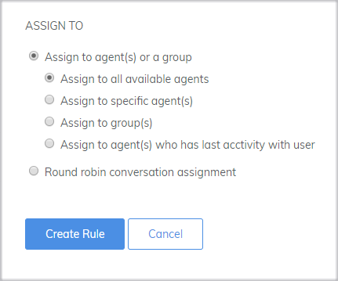
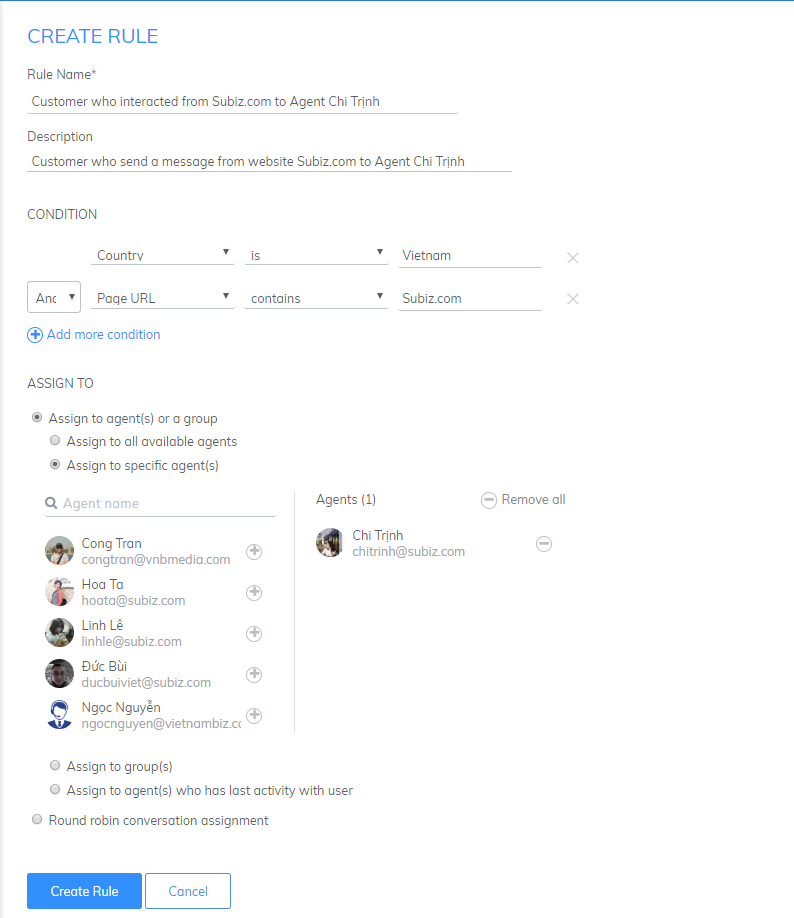

# Rule setting

**Rules are used to automatically assign incoming messages to specific agent\(s\) or team.** You need to set up rules right after creating account so that you can get conversations from your customers.

To set up a new rule, [log into your account](https://app.subiz.com/login) and go to [**Setting&gt; Account&gt; Message&gt; Rule**](https://app.subiz.com/settings/rule-setting) **&gt;** Select **New rule.**

Then start to set up a new rule.

### **Step 1: Enter rule name and description**

* **Rule Name:** Enter rule name so that you can easily manage in the rule list
* **Description**: Describe the condition and purpose of the rule

### **Step 2: Select conditions for the rule**

* Click **Add more condition** to combine multiple conditions in a rule.
* Select **And / Or** to determine the relationship between the conditions.

You can set one or more conditions based on **List of rule condition**.

<table>
  <thead>
    <tr>
      <th style="text-align:left"><b>CONDITION</b>
      </th>
      <th style="text-align:left"><b>USAGE</b>
      </th>
      <th style="text-align:left"><b>EXAMPLE</b>
      </th>
    </tr>
  </thead>
  <tbody>
    <tr>
      <td style="text-align:left">Any condition</td>
      <td style="text-align:left">By selecting this condition, <b>all conversations</b> will always be assigned
        to agents set up in the rule.</td>
      <td style="text-align:left">Condition: Any condition</td>
    </tr>
    <tr>
      <td style="text-align:left"><b>Date Time</b>
      </td>
      <td style="text-align:left">​</td>
      <td style="text-align:left">​</td>
    </tr>
    <tr>
      <td style="text-align:left">Hour of day</td>
      <td style="text-align:left">When you want to assign conversations to agents based on time (hour) of
        the day. Hour of day from 0 to 23.</td>
      <td style="text-align:left">You set the two rules accordingly: Day shift for Agent A - Night shift
        for Agent B.
         Condition: Hours of the day - more than or equal to 7 And Hours of the
        day - less than - 12</td>
    </tr>
    <tr>
      <td style="text-align:left">Day of week</td>
      <td style="text-align:left">When you want to assign conversations to agents based on days in week.Note:
        days of week are recorded as numbers from 2-8. Monday = 2, Tuesday = 3…,
        Sunday = 8.</td>
      <td style="text-align:left">You install 2 rules: the first 3 days for Agent A and 3 days for Agent
        B in the weekend.
         Condition: Day of week - is - 2 Or Day of week - is - 3 Or Day of week
        - is - 4</td>
    </tr>
    <tr>
      <td style="text-align:left"><b>Conversation</b>
      </td>
      <td style="text-align:left">​</td>
      <td style="text-align:left">​</td>
    </tr>
    <tr>
      <td style="text-align:left">Page URL</td>
      <td style="text-align:left">Each URL typically focuses on a specific product or service, Subiz can
        identify which URL customers are viewing and assign the conversation to
        each Agent.</td>
      <td style="text-align:left">
        
Visitors to Subiz's website will be distributed to Agent A

        
Condition: Page URL - contains - Subiz.com

      </td>
    </tr>
    <tr>
      <td style="text-align:left">Page title</td>
      <td style="text-align:left">Purpose of page title are almost the same as page URL. You can use it
        to assign conversations from specific pages to suitable agents.</td>
      <td
      style="text-align:left">
        
Visitors to the page titled "Camera" will distribute the conversation
          to Agent A.

        
Condition: Page Title - Contains - Camera

        </td>
    </tr>
    <tr>
      <td style="text-align:left">Message Content</td>
      <td style="text-align:left">When the first message of customer contains a certain content, you can
        assign the conversation to suitable agents.</td>
      <td style="text-align:left">When the user's first message contains the word "price," the conversation
        will be distributed to Agent A. Condition: Message content - contains -
        price</td>
    </tr>
    <tr>
      <td style="text-align:left">Browser language</td>
      <td style="text-align:left">Look up codes of browser language in <a href="http://www.lingoes.net/en/translator/langcode.htm">ISO Language Code</a>,
        for example, vi-VN, en-US. Assign the conversation to agents who can use
        the language that customers use in their browser.</td>
      <td style="text-align:left">
        
Customers using the English language on the program will distribute the
          dialogue to the international agent group.

        
Condition: Browser language - is - en - US

      </td>
    </tr>
    <tr>
      <td style="text-align:left">Channel</td>
      <td style="text-align:left">Use when you want to distribute conversations according to user interaction
        channels. For example Subiz chat on the website, Fanpage, Subiz Email.</td>
      <td
      style="text-align:left">
        

        
You create 3 rules dialog box conversations on 3 channels Subiz chat,
          Fanpage, Email as belows: Condition:
           1. Channel - is - Subiz chat

        
2. Channel - is - Subiz Email

        
3. Channel - is - Fanpage

        </td>
    </tr>
    <tr>
      <td style="text-align:left"><b>User</b>
      </td>
      <td style="text-align:left">​</td>
      <td style="text-align:left">​</td>
    </tr>
    <tr>
      <td style="text-align:left">Name</td>
      <td style="text-align:left">Identify name of customers and assign conversation to a specific agent.</td>
      <td
      style="text-align:left">
        
The customer's conversation delivery has the name of the Service Agent

        
Condition: Name - Not empty

        </td>
    </tr>
    <tr>
      <td style="text-align:left">Email</td>
      <td style="text-align:left">Identify email of customers and assign conversation to a specific agent.</td>
      <td
      style="text-align:left">Deliver the user's conversation who has email address to consultant. Condition:
        Email Address - Not empty</td>
    </tr>
    <tr>
      <td style="text-align:left">Phone</td>
      <td style="text-align:left">Identify phone number of customers and assign conversation to a specific
        agent. Phone numbers are a set of numbers, not contain special characters</td>
      <td
      style="text-align:left">Deliver the user's conversation with an email address to the Agent who
        in charge Call Center. Condition: Phone number - Not empty</td>
    </tr>
    <tr>
      <td style="text-align:left">Country</td>
      <td style="text-align:left">Use when you want to rely on the user's Country to distribute the conversation
        to the agent. Country name by international standard, refer to the list
        of countries. Example: Vietnam, United States</td>
      <td style="text-align:left">User in Vietnam will distribute dialogues for local agents Condition:
        Country - is - Vietnam</td>
    </tr>
    <tr>
      <td style="text-align:left">Country code</td>
      <td style="text-align:left">Use when you want to rely on the country code of the visitor to distribute
        the conversation. Country code based on ISO Code (2 characters), capitalized
        both letters. Refer to the list of country codes For example: Vietnam =
        US, US = US, China = CN, South Korea = KR, Japan = JP</td>
      <td style="text-align:left">
        
Distributing foreign customer dialogue for international agents

        
Condition: Country code - not is - VN

      </td>
    </tr>
    <tr>
      <td style="text-align:left">City</td>
      <td style="text-align:left">Use when you want to rely on your city's address to distribute the conversation.
        As the English name of the city, only capitalize the first letters of the
        word. Refer to the name of each country. For example: Hanoi, Ho Chi Minh
        City, New York, Hong Kong.</td>
      <td style="text-align:left">
        
Distributed dialogue for user from Hanoi for agent Hanoi

        
Condition: City - is - Hanoi

      </td>
    </tr>
    <tr>
      <td style="text-align:left">Timezone</td>
      <td style="text-align:left">Deliver the conversation based on the user's time zone. Timezone code
        is based on UTC. Refer to the timezone zone list. Example: Vietnam and
        Southeast Asia - UTC +7 G</td>
      <td style="text-align:left">Distributed dialogue for customers from South East Asia for Agent A South
        East Asia. Condition: Time zone - is - UTC +7 G</td>
    </tr>
  </tbody>
</table>### **Step 3: Set up how to assign conversations to agents**

Select Agent\(s\) who will receive and take over conversations that meet the conditions set above.

**1. Assign to Agent\(s\) or a group:**

Any agent in the assigned group can participate in conversations simultaneously.

Select one of the methods below:

* _**Assign to all available agents:**_ Available agents are the one who that directly connected to Subiz on a computer or mobile app. When the agents do not connect to Subiz, the conversation to the conversation is not distribute. Agents can view and respond to users after reconnecting Subiz.
* _**Assign to specific agent\(s\):**_ assign conversations to one or several agents. Click \(+\), \(-\) to select/deselect Agent. As the example below, 2 Agent has been selected.
* _**Assign to group\(s\):**_ assign conversations to a group which is created before. As the example below, conversations are assigned to group Sale.
* _**Assign to agent\(s\) who has last activity with user:**_ assign conversation to agent\(s\) who have the latest conversation with user
* **Assign to agent\(s\) round robins:** You have multiple agents and want to divide conversation equally of user for agents.


The rule is a **mandatory** setting for an agent to receive a conversations. When you delete the default rule while do not create a new rule, all agents will not receive the user's interaction. At that time, all conversations will be in the **Unassigned Conversions** segment in the Activities section. You can create multiple rules and change rules over time, to match the number of agents and how to divide the work of the business.


