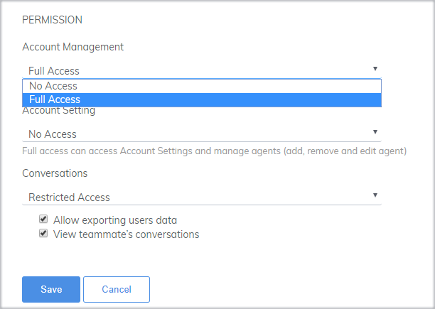
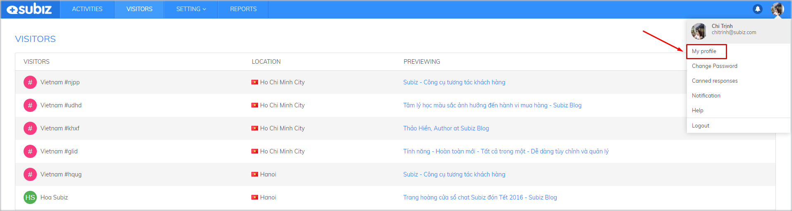
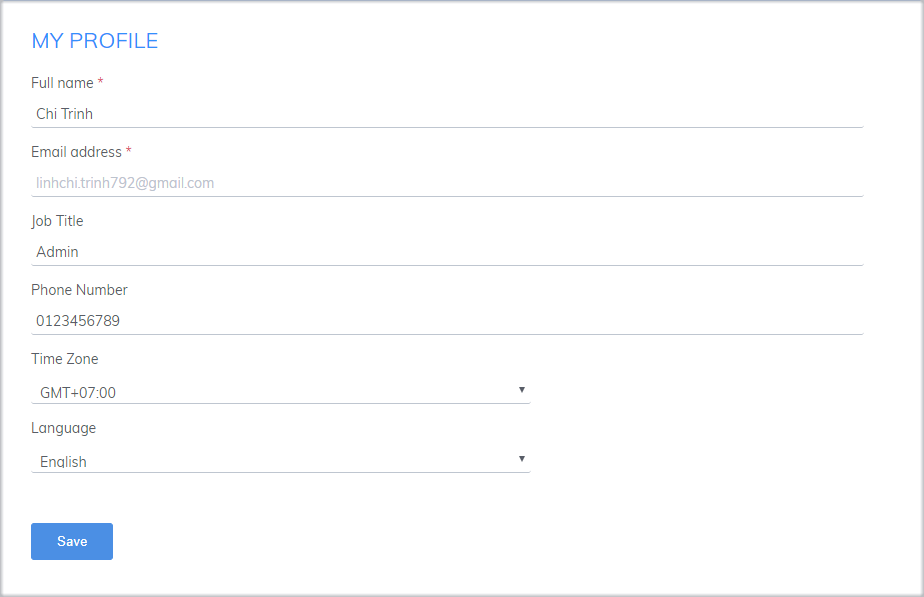
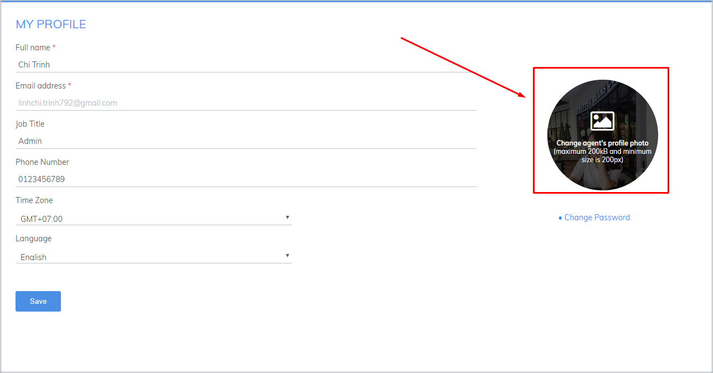
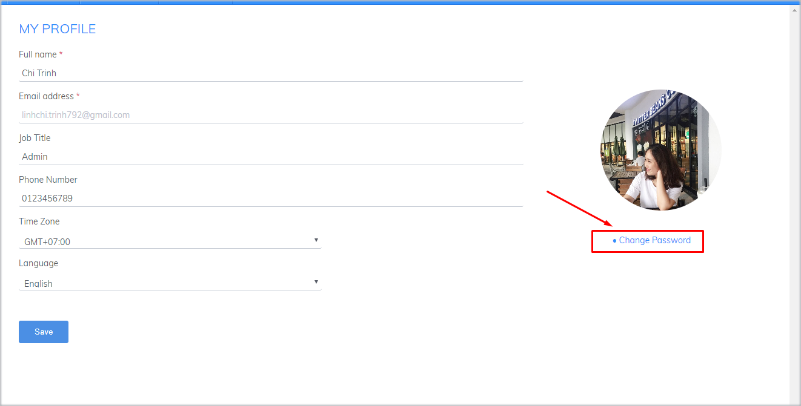
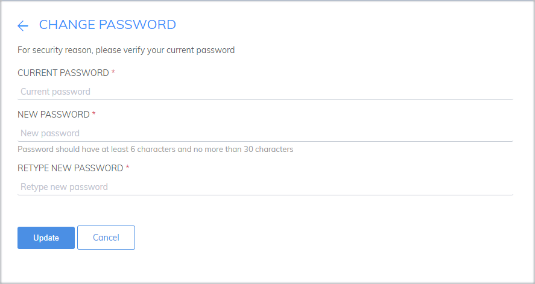

# Agent overview

### What is Agent?

Agent is the person who uses Subiz to work and interact with customers. Agent can be a Manager, a Customer Service Staff, or any Officers in your company. Each Agent has their own Subiz login account.

### **Agent types**

There are two types of Agent:

* **Agent owner** is that initially registered Subiz Account and has full of account permission.
* **Agent member** is that was invited to join Subiz by the Agent owner.

### **Agent Permission**

An Agent will have 3 **rights** when using the Subiz account.

You can choose whether Agent privileges are "**No access**" or "**Full access**."

1. **Account Management**: Full access allows agent management \(Add, Edit, Delete Agent\) and manages service packages, billing.
2. **Account settings:** Full access to custom account settings and Agent management \(Add, Edit, Delete Agent\).
3. **Conversation:** Access allows the user to export user data and view conversations of other agents.

### Agent's private information

The Agent's personal information is your Subiz login information, which will be displayed in the Subiz chat window on your website. When you fully set up the Agent information, your image will be more professional and reputable in the eyes of the customer.

_Personal information customization guide:_ Select **Avatar** on the right corner of the screen&gt; Select **Personal info**

Here you can customize:

* Personal information
* Avatar
* Subiz Login Password



_Customize information:_ **Change the required fields**&gt; select **Save**

* Full Name: Agent's display name in chat window Subiz
* Email Address: Agent's login email, cannot be changed
* Job Placement: The job that the agent is responsible for
* Phone Number: Agent contact number
* Time Zone: The time zone where the agent works. Note the corresponding time zone setting on the computer so that the update data is correct.
* Languages: The language displayed on Agent App.subiz.com




_Image change guide:_ Select **Change avatar**&gt; **Upload photo**&gt; Select **Save**




_Change password:_ Select **Change password**&gt; **Enter new password**&gt; **Confirm**

After successfully changing your password, you will be sent back to the login page of Subiz and logged into the account with a new password.



Agents can manage their own password. You can change your password as well as reset password in case you forget it.

### 1. Change your password

To change your password, follow the steps below:

* Click the avatar at the upper right corner of the screen, select **My Profile**

* In My profile page, select **Change Password**

* Enter the current password, new password and retype the new password.

* Click **Update** to finish

### 2. Reset password

If you forgot your password, you can reset it by following below steps:

* Go to [app.subiz.com/login
  ](https://app.subiz.com/login?redirect=%2Factivities%2F)
* Click on **Forgot your password**

* Fill in your email

* Click **Recover Password**
* Check your email inbox. In the recover password email, click on button **Reset Password**

* Enter new password and click on button **Recover Password**

* Your password has been changed. Click on **Login** to login again

