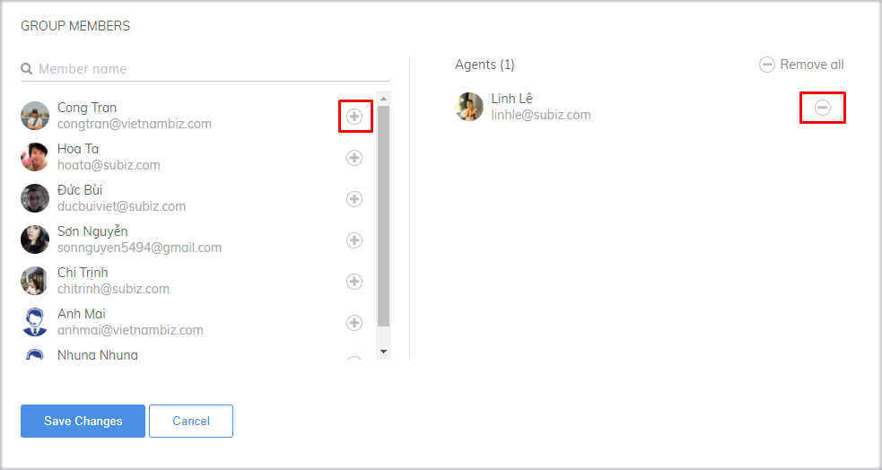
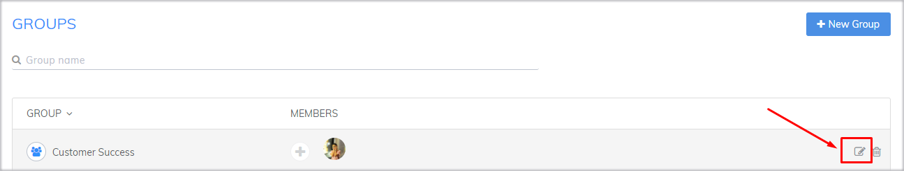

# Agents Group

**The Agent group is set up to form a professional team with customer support.** When creating a customer support team, you will promote the strengths and weaknesses of each individual agent.

You have to rely on the number of agents you have and **especially the need, the scope of work to create different Agent groups,** for example:

* Group Sales Consultant 1 \(including sales consultants and technical consultants ...\)
* Group Sales Consultant 2 \(including sales consultants and technical consultants ...\)
* Customer Support Agent Group 1
* Customer Support Agent Group 2
* Group Agent specializing in products 1
* Group Agent specializing in products 2

### Create an Agent Group

To create an Agent group, go to [**Setting &gt; Account &gt; Agent &gt; Agent Groups, and click Create Group.**](https://app.subiz.com/settings/agents-group)\*\*\*\*

* Enter a name and select an icon for the group

* Click \(+\) or \(-\) to select /deselect Agent as a member of the group

* Click Create Group

### Edit Agent Group Information

To modify information about a group, go to[ **Settings&gt; Accounts&gt; Agent Groups**](https://app.subiz.com/settings/agents-group)&gt; select the group you want to edit&gt; select the edit icon.

On the Edit Group page, make the edit and click **Save Changes**.

