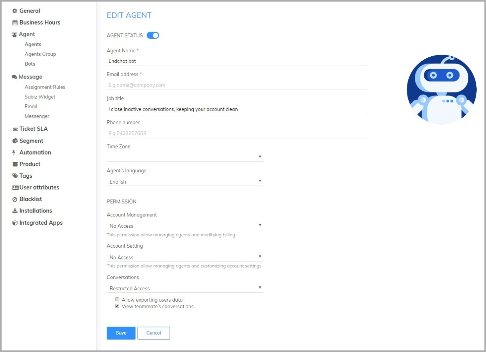
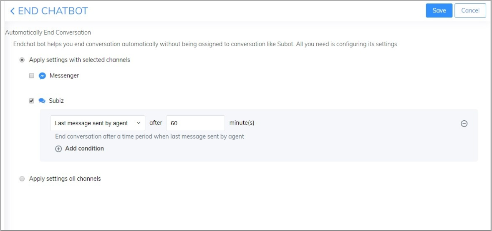
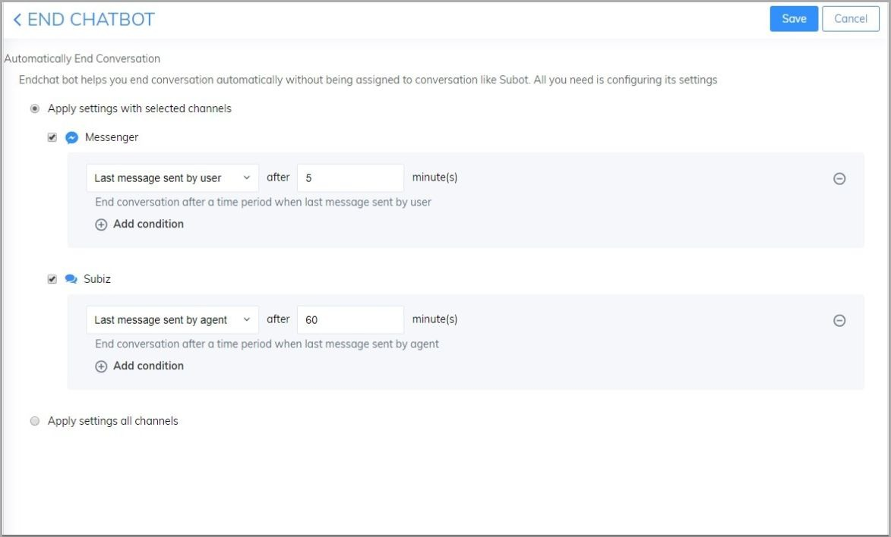
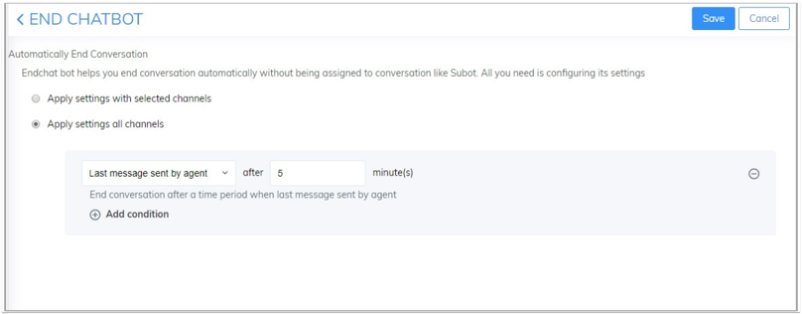
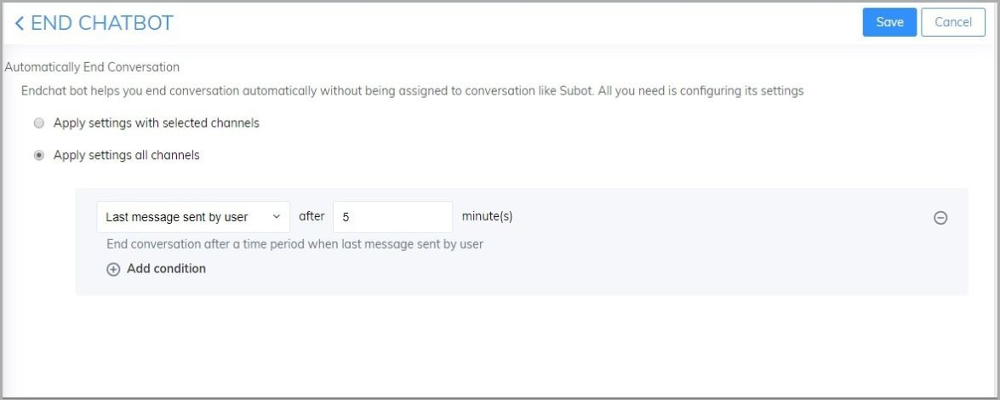
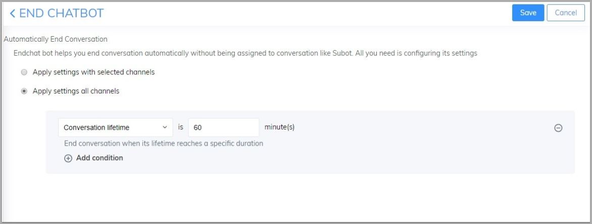
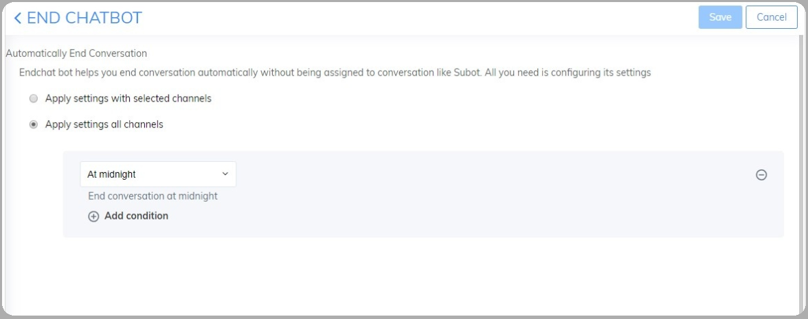

# End chatbot

### What is End chatbot? 

End chatbot is the application on Subiz that helps you automatically close conversations. Instead of manually end the conversation after supporting them, you can automate the process for all conversations. From then on, businesses can reduce missed the user. Users who contact you will be transferred to the online agent to support.

### Activate End chatbot 

In order to start using the End chatbot, you activate and build the operating scenario of the End chatbot as bellows: 

1. **Step 1:** **Activate End chatbot** [Log in to the Dashboard via App.subiz.com-&gt; Settings -&gt; Account -&gt; Agent list](https://app.subiz.com/settings/agents-list) -&gt; End chatbot -&gt; Change status to Active.

**2. Step 2:** **Set up scripts for End chatbot** 

End chatbot operates on two main channels: Subiz chat and Messenger. You can choose to activate the End chatbot on either of the above channels or both of channels as bellows:

* Apply settings with selected channels: Set to end the conversation on 1 of two Messenger channels or Subiz. 

In addition, you can set up the End conversation script for each channel as bellows: 

* Apply settings all channels: Set up end conversation on 2 channels: Messenger and Subiz. 

End chatbot has been installed by default the 4 scenarios end conversation as bellows: 

* The last message was sent by the agent: End conversation after a time period when the last message sent by agent.

**Example:** End conversation automatically after 5 minutes have no new message from the agent.

* The last message was sent by anyone: End conversation after a time period when last message sent by anyone.

**Example:** End conversation automatically after 5 minutes have no new message from the agent or user. 

* The last message was sent by the user: End conversation after a time period when last message sent by user.

**Example:** End conversation automatically after 10 minutes have no new message from user. 

* Conversation lifetime: End conversation when its lifetime reaches a specific duration.

**Example:** End conversation automatically after 60 minutes since starting a conversation. 

* **At midnight:** End conversation at midnight.


* End Chatbot is an agent, you can install for free. 
* End  Chabot helps you end conversation automatically without being assigned to conversation like Subot. All you need is configuring its settings.


