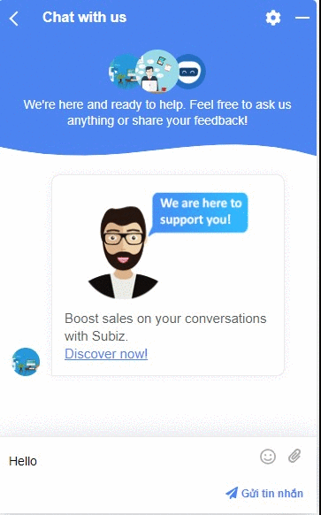
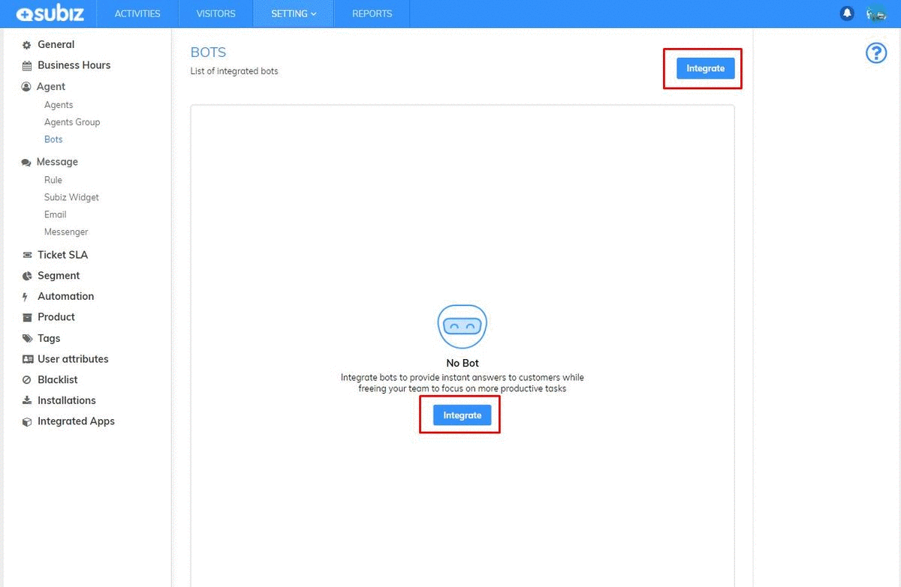
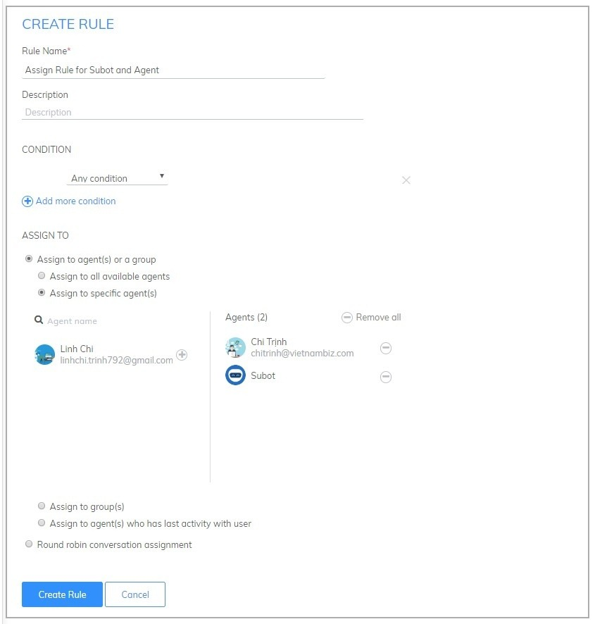
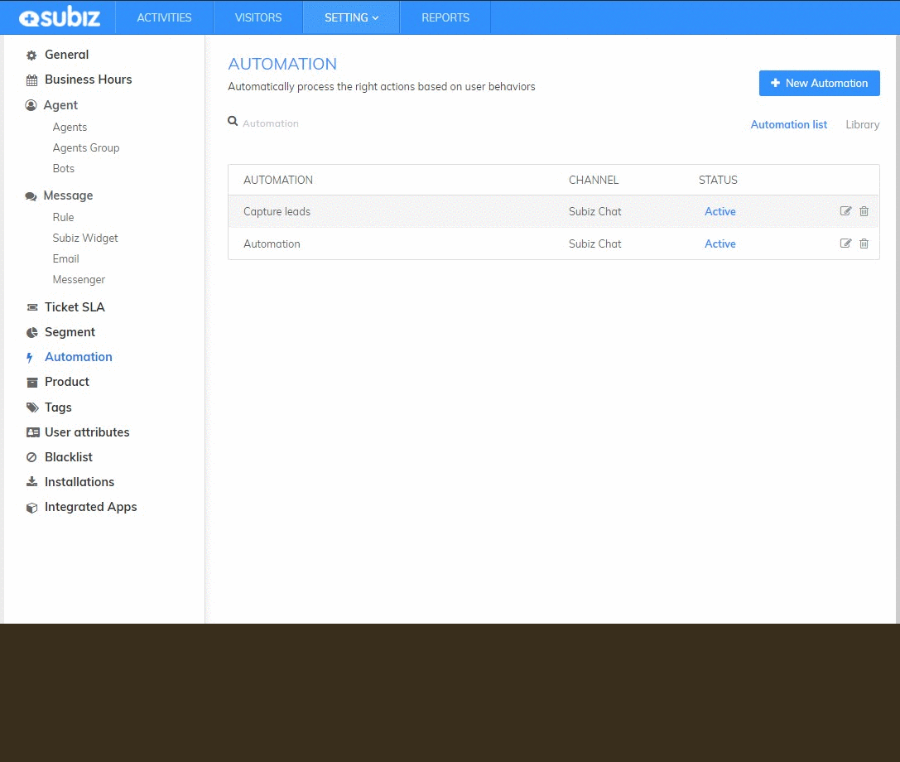

# Subot - Auto Reply and Ask user’s Information

### What is Subot? 

Subot or the Bots on Subiz is an application on Subiz that helps automate reply and Ask users information. Therefore, businesses will increase interaction with users 24/7 without being dependent on people, converting potential users by asking for information and identifying specific requirements. You can build scripts available for Subot to act as: Automatically respond to users; Show "typing..." for at least; invite user to subscribe browser notifications; Ask user contact information. 

### How to integration Subot?

First of all, you need integrate Subot into Subiz and set up the operation scripts for Subot as bellows: 

* **Step 1:** Integrate Subot Access link [https://app.subiz.com/settings/bots&gt;](https://app.subiz.com/settings/bots>) select Integration&gt; select Subot

* **Step 2:** Set up the script for Subot. Subot has been installed by default 4 actions:

+ Automatic reply after 4s texting users.

+ Show typing after 2s.  
+ Please Subscribe notification on the browser and invite customers to leave contact information after the next 4s.  
+ Display buttons Subscribe Notification and Save Contact Info after the next 1s

You can click on Subot to customize Subot actions, message content, runtime of each action or delete / add any action.

* **Step 3:** Distribute the conversation to Subot

Go to Install Rule via [https://app.subiz.com/settings/rule-setting](https://app.subiz.com/settings/rule-setting) to distribute the conversation to Subot.

Subot is designed as an agent, only when customer conversations are distributed to Subot does Subot work.


**Note:**

* Subot is an agent, you can install for free.
* You could change the name and profile picture of Subot via this link [https://app.subiz.com/settings/agents-list](https://app.subiz.com/settings/agents-list)
* Subot only works when you install Rule to distribute conversation for Subot or manually add Subot to the conversation.


### Some application script for Subot

#### **1.** Subot greet and ask user’s request automatically

* **Step 1:** Install the Subot script to greet the user and display in a state of typing the message.

* **Step 2:** Install Rule distribute all conversations for Subot and Agents

#### 2. Subot responds when agent offline / out of business hours

* **Step 1:** Install the script for Subot

+ Greeting user, notification that agent in a state of offline, ask customer requests.

+ Display in a state of typing the message.

+ Invite users to receive notifications and leave contact information.

* **Step 2:** Install 2 rules

+ Rule 1 distributes conversations for available agents when the agent online.

+ Rule 2 distributes the conversation to Subot and Agent who in charge Subiz chat when out of business hours.

