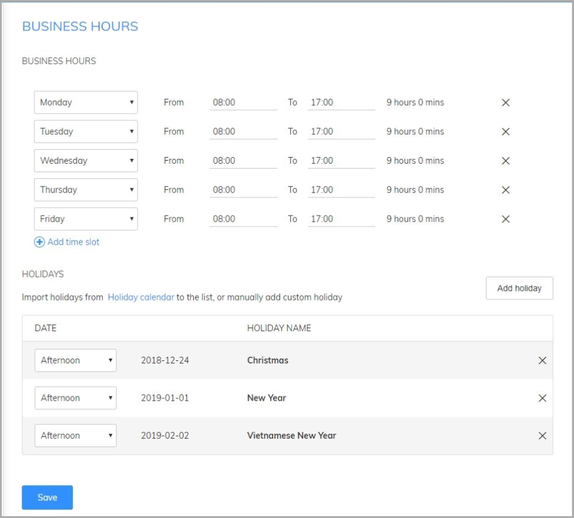
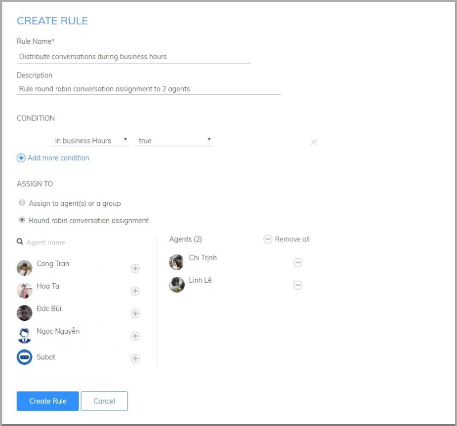
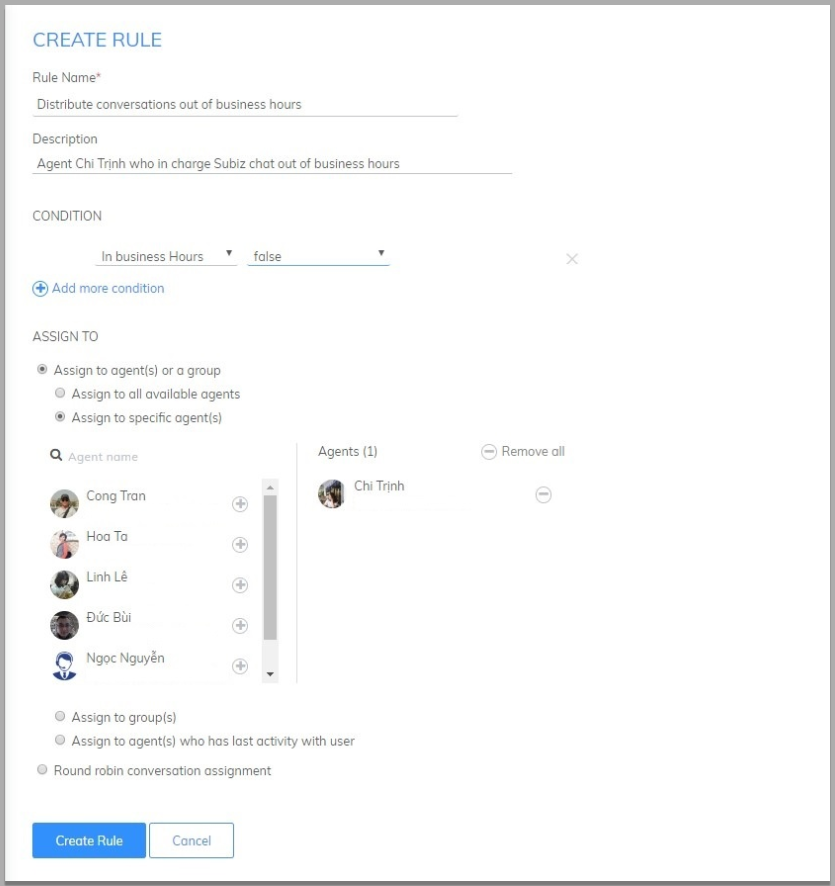
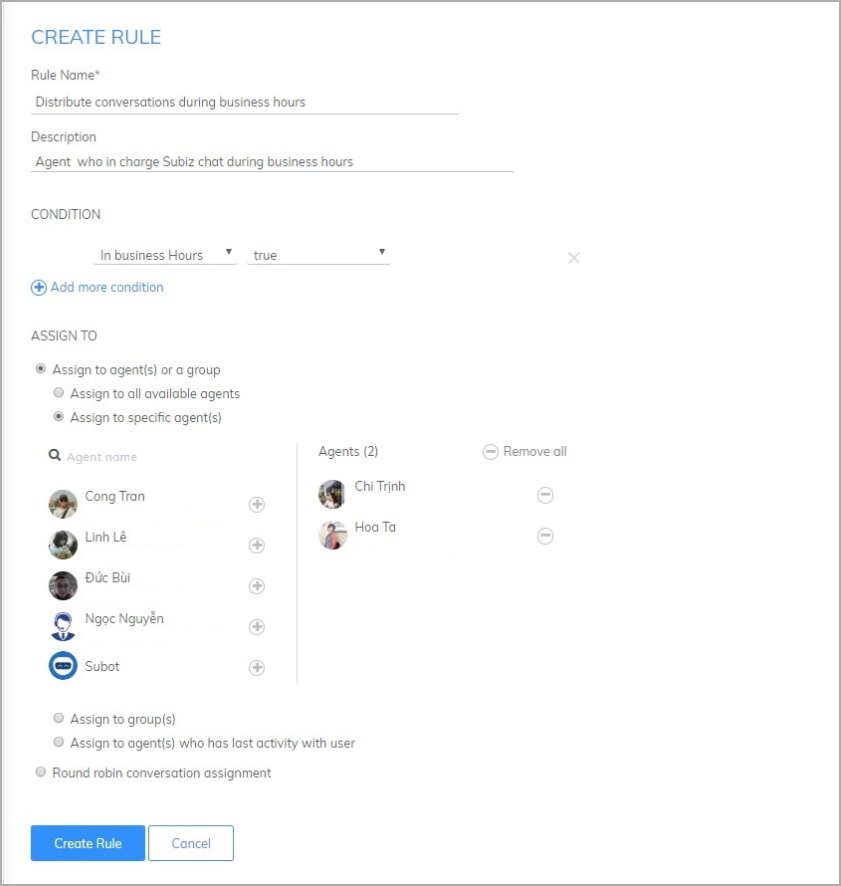
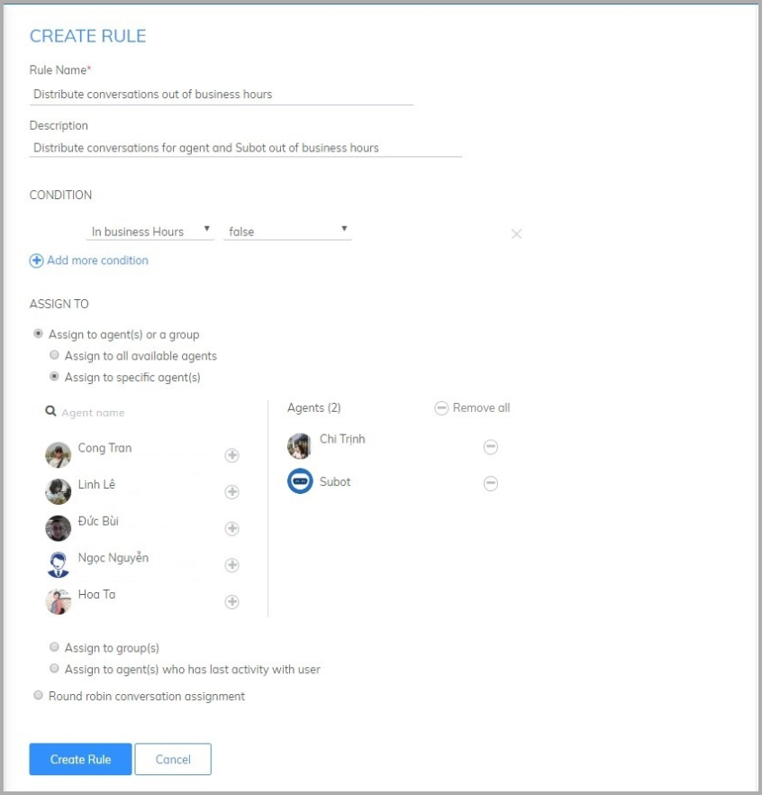

# Set up Business hours

### What are purpose of setting business hours?

Business Hours are functions that allow enterprises to set up working time on Subiz accounts such as working hours of the day, week days and holidays in a year. Purpose of setting up business Hours:

* Notification about the working time to users when agent available to support them. 
* Automatically respond to users out of business hours.
* Distributing for Agents according to business hours.

### How to set up business hours?

**Step 1:** You are required to set up the time zone of your account via [https://app.subiz.com/settings](https://app.subiz.com/settings)

For example: In Vietnam, you have to set up time zone to be GMT + 07:00

**Step 2:** Set up Business Hours at [https://app.subiz.com/settings/business-hours](https://app.subiz.com/settings/business-hours) 

* Select Add time slot for business hours
* Choose Add Holidays in the year
* Select Save to complete


**Note:** Subiz system will save working time slot and automatically identify the time slot out of business hours or holidays.


### Some applications of business hours

#### 1. Set up a Rule to distribute conversations according to business Hours

You will customize and add a new rules for distribution to agents via: [https://app.subiz.com/settings/rule-setting](https://app.subiz.com/settings/rule-setting)

Example: Distribute the work shift for the Agents in business Hours and out of business hours. You have to create two rules as bellows:

* Rule 1: During business hours, Rule round robin conversation assignment to 2 agents

  _**CONDITIONS:**_ select _**In business hours - True**_   
  _**ASSIGN TO:**_ ****choose _**Rule round robin conversation assignment**_

* Rule 2: Out of business hours: Rule distributes conversations for an agent.

  _**CONDITIONS:**_ select _**In business hours - False**_   
  _**ASSIGN TO:**_ select _**Assign to specific agent\(s\)**_

### Subot automatically responds to customers outside working hours

Refer to the instructions for Auto Reply and Ask user’s Information

Example: When user send message out of business hours, Subot will automatically inform about the in state of agent and ask users their contact information.

You will create 2 rules as bellows:

* Rule 1: During business hours: The distribution rule for available agent.

_**CONDITIONS:**_ select select _**In business hours - True**_.  
_**ASSIGN TO:**_ select _**Assign to specific agent\(s\)**_.

* Rule 2: Out of business hours: The distribution rule for Subot and agent who in charge Subiz

_**CONDITIONS:**_ select _**In business hours - False**_   
_**ASSIGN TO:**_ select _**Assign to specific agent\(s\)**_

> If you need any support, don’t hesitate to contact Subiz via our email Support@Subiz.com!

