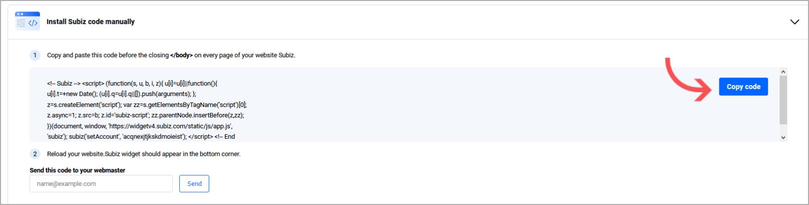
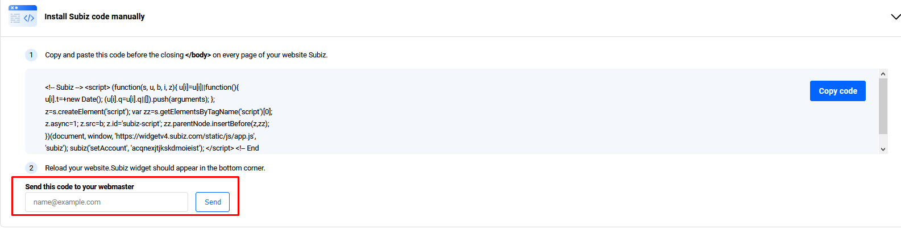

# Installing Subiz on Websites

### What is Subiz Chat?

[Subiz Chat](https://subiz.com/live-chat.html) is a live chat platform that allows you to reach your customers directly from your website. After integrating [Subiz](https://subiz.com/vi/live-chat.html) with your website, you can successfully **communicate, follow** and **convert** visitors into customers. 

### How to integrate Subiz with your website

To add [Subiz](https://subiz.com/vi/live-chat.html) Widget to your website, **you copy the embed code** and **paste it before the closing &lt;body&gt; tag** on the website code. Please carefully follow the 3 steps below:

#### **Step 1: Get the embed code.**

To get the embed code, you sign in Subiz via [**App.subiz.com**](https://app.subiz.com/) &gt; Settings &gt; Channels &gt; Subiz chat &gt; [**Set up website**](https://app.subiz.com/settings/widget-setting/setting-website)**.**

Here you choose **"Copy code**" to place on your website


_**Kindly note**: Should you change your Subiz account, please replace the corresponding embed code  on your website as well._ 


**Step 2: Add the embed code to the website**

You can integrate Subiz easily with most platforms such as Shopify, Wix or Magento.

After copying the code, you place it on any pages where you want the Subiz Widget to display. Subiz code must be pasted before **&lt;/body&gt;** tag.

_**Kindly note:** In case you are not familiar with this, you are recommended to ask for the designer’s support. Simply, you just need to put their email address into **“Send this code to your webmaster”**. Subiz will automatically send them a detailed guide on how to integrate with your website._ 

**Step 3: Check out the widget on your website**

After finishing integration, return to your home page, the Subiz widget will display in the right-hand corner**.**

In case you cannot see the Subiz widget, please double check if the code has been placed in the right position or contact us at **Support@subiz.com.**

### Integrate Subiz via Google Tag Manager

Subiz works closely with Google Tag Manage 

An easy way to add the service to your website is through Google Tag Manager according to the steps below:  

* **Sign in** at [Tagmanager.google.com](https://tagmanager.google.com)
* **Select website account** which will integrate Subiz chat at All account
* **Create new Tag**: At WORKSPACE, select Tags&gt; NEW

* **Untitled Tag**: Label the tag to understand how it works
* **Tag Configuration**: Select tag type: Custom HTML&gt; Copy the embed code Subiz and paste it into the HTML box
* **Tick \(choose\) Support document.write**
* **Triggering**: Select All Pages if you want to display the Subiz chat window on all pages of the website



_**Kindly note:** The Trigger aims to show how the Subiz Tag works. You can customize the Trigger according to your own needs. For examples:_

* _All Pages will display the Subiz chat window._
* _Only some pages will display the Subiz chat window._
* _When visitors have a specific event such as a pageview, a click on a button, a form submission, .... the Subiz chat will be displayed._


* Select **SAVE** &gt; select **SUBMIT** in the right corner &gt; Enter the description in Publish and Create Version &gt; select **PUBLISH** to complete.

Now, go to the website and reload the page \(F5\), then check the display of Subiz chat on your website**.**

> We are here for you help. Let us know if you have any questions via email Support@Subiz.com

