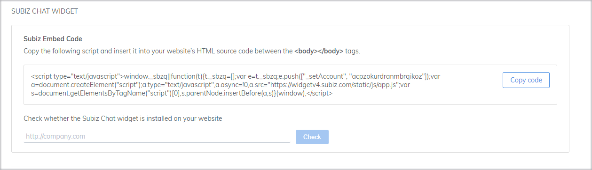
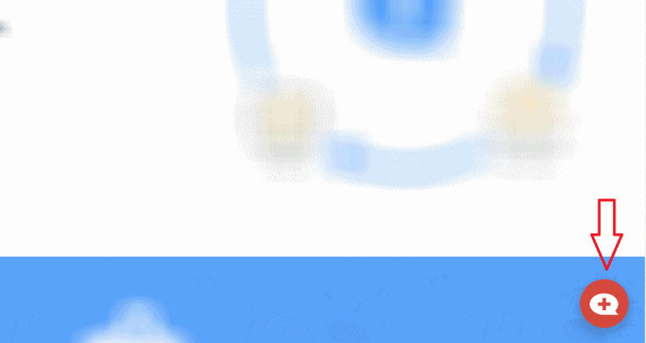
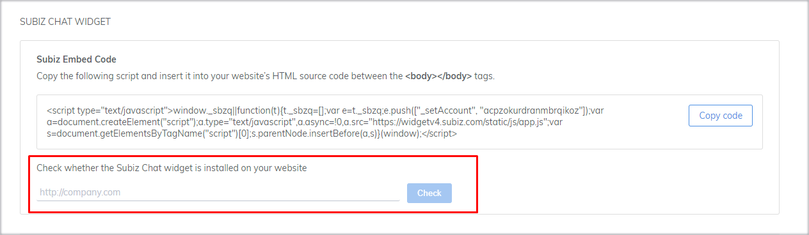
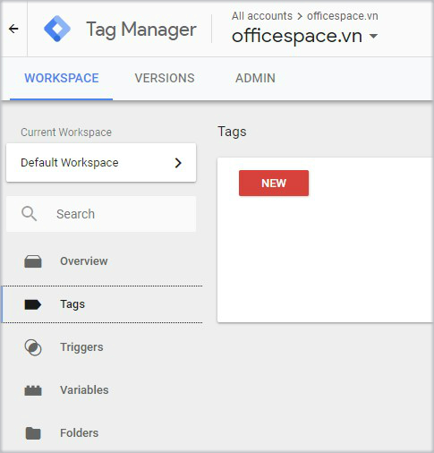
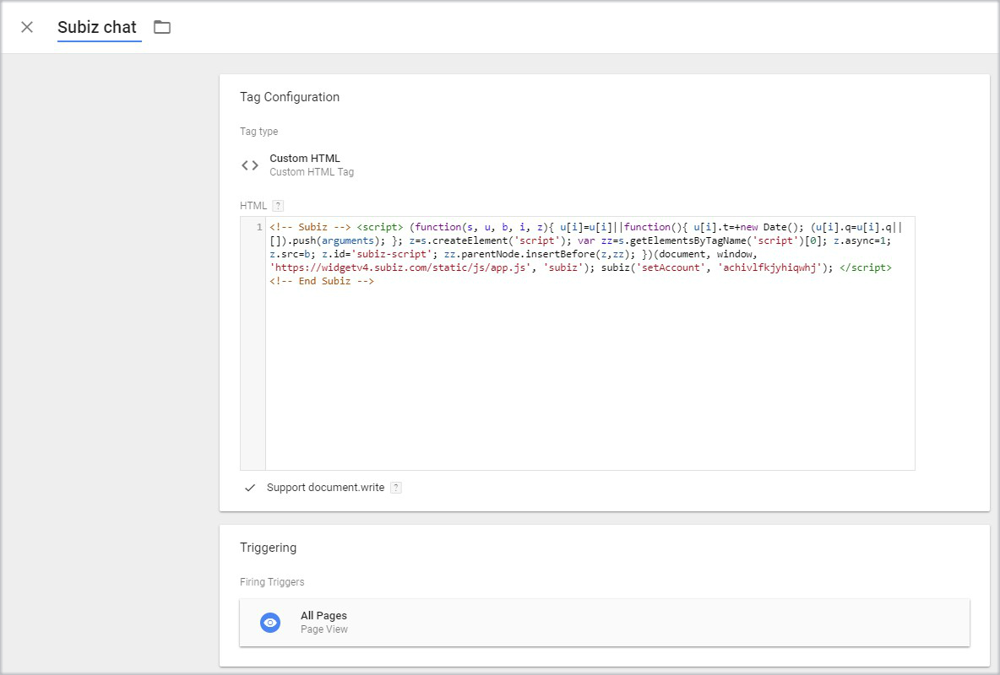

# Installing Subiz on Websites

### What is Subiz Chat?

[Subiz Chat](https://subiz.com/live-chat.html) is a channel for you to interact with visitors on your website.  After integrating Subiz widget into your web, you can **interact, follow and convert visitors into customers.**

### How to integrate Subiz on your website

To integrate Subiz widget into your website, please follow these three steps below:

#### **Step 1: Get Subiz’s embed code**

To integrate [Subiz chat](https://subiz.com/live-chat.html) widget into website, you just need to copy the embed code \(mustn’t change any part of it\) and paste into pages you want to place the chat widget.

To get embed code, follow steps below:

1. Sign in to [app.subiz.com](https://app.subiz.com/)
2. Click **Settings &gt; Account &gt; Installation**
3. At Subiz Chat Widget &gt; **Subiz Embed Code**, click **Copy code** to copy the embed code quickly.


Every single account has different embed code so when you change the account you have to re-install embed code.


#### **Step 2: Place embed code into website**

[Subiz ](https://subiz.com/en)supports almost all platforms so the installation is very simple. Copy the code and Embed into every pages you want to place the chat widget. Subiz code must be pasted before &lt;/body**&gt;** tag.

#### **Step 3: Check Subiz’s widget on website**

After finishing integration, come back to your website and see if the chat widget displays at the bottom of the right corner or not.

If you still don’t see the chat widget, you can take some more steps to check it in Dashboard:

1. Sign in **app.subiz.com**
2. Click into **Settings &gt; Account &gt;** **Installation**
3. Paste your **website’s URL** and click **Check**


If not successfully, check the code again or contact Subiz support center.


### Integrate Subiz via Google Tag Manager

Subiz works with Google Tag Manager 

When you use Google Tag Manager on your website, you can integrate Subiz chat into your website through Google Tag Manager according to the following steps: 

* **Sign in** [Tagmanager.google.com](https://tagmanager.google.com)
* **Select website account** will integrate Subiz chat at All account
* **Create new Tag**: At WORKSPACE, select Tags&gt; NEW

* **Untitled Tag**: Edit Tag name to understand Tag function
* **Tag Configuration**: Select tag type: Custom HTML&gt; Copy the embed code Subiz and paste it into the HTML box
* **Tick \(choose\) Support document.write**
* **Triggering**: Select All Pages if you want to display the Subiz chat window on all pages of the website


Note:  The trigger tells the tag to fire when the specified event like form submissions, button clicks, or page views is detected. For examples:

* All Pages will display the Subiz chat window.
* Only some pages will display the Subiz chat window.
* Visitors have a specific event such as a pageview, a click on a button, a form submission, .... will display the Subiz chat window.


* Select SAVE &gt; select SUBMIT in the right corner of the screen &gt; Enter the description in Publish and Create Version &gt; select PUBLISH to complete.

Now, go to the website and select F5 reload the page, check the display of Subiz chat window Subiz on your website.

> We are here for you help. Let us know if you have any questions via email Support@Subiz.com

