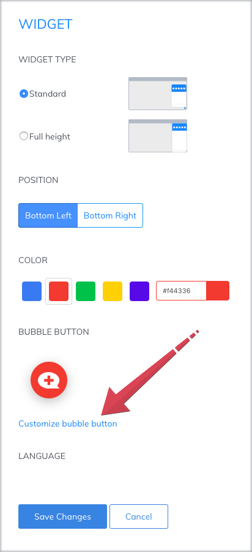
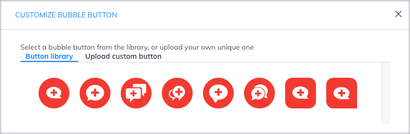
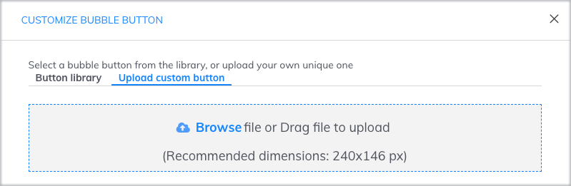
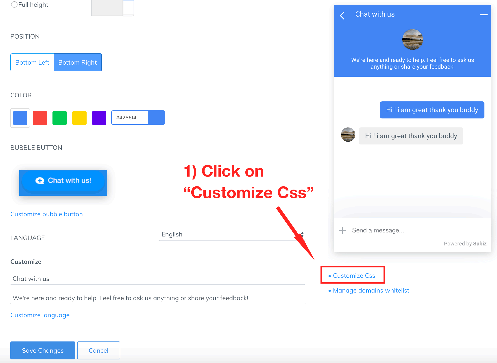

# Customize bubble button

### **1. What is a bubble button?**

Bubble button is the call-to-action image,  it’s easy to let users know you’re available to help and chat online on Subiz widget. When users click on the bubble button, the chat widget will open and start a new conversation.

Every business can actively design their owner bubble button images to convey their own messages and give users exciting experience when visiting websites.

### **2. How to customize bubble button**

How to set up bubble button: Login Subiz via [App.subiz.com&gt; Setting &gt; Account &gt; Widget &gt; Customize bubble button](https://app.subiz.com/settings/widget-setting) 

You can select to use a bubble button from the button library, or upload your own custom button.

###  **2.1. Use the button library**

You select a button from the library and Save changes to finalize.

### **2.2. Upload your custom button**

 ****To use your own custom button, you need a button image of your desire. The standard size of the button image is 240 x 120 px.

3-step guide to using  your own buttons as followings:

**Step 1:** To upload your own button  
              &gt; Select Customize bubble button  
              &gt; Upload custom button  
              &gt; Browse file or Drag file to upload  &gt; Click "**X**" to exit


For some example buttons: [button 1](https://filev4.subiz.com/fiqcgvyhmftekbwjrbmy-button1_en.png) -[ button 2](https://filev4.subiz.com/fiqcgvynxpqgfcrbqgjb-button2_en.png) - [button 3](https://filev4.subiz.com/fiqcgvyqfhiokhwiqmnz-button3_en.png) - [button 4](https://filev4.subiz.com/fiqcgvysbxbykjcrorum-button4_en.png)


**Step 2:** Use CSS to optimize button display  
             &gt; Select Custom CSS  
             &gt; Paste the corresponding CCS code immediately after the code that contains / \* END: BUTTON CHAT \* /  
             &gt; Save changes

| Widget type: Standard | Widget type: Full height |
| :--- | :--- |
| `.widget_mini .close-widget-icon { display: none; }.button-chat .avatar-preview img { display: none; }.button-chat { box-shadow: none; background-color: transparent !important; }.widget-button { bottom: 0; }.widget_mini .widget_body { bottom: 0; }` | `.widget_full .close-widget-icon { display: none; }.button-chat .avatar-preview img { display: none; }.button-chat { box-shadow: none; background-color: transparent !important; }.widget-button { bottom: 0; }.widget_full .widget_body { bottom: 0; }` |


Note:

* You need to determine the correct widget type: **Standard** or **Full height**, to select the corresponding CSS code.
* CSS code only needs to be set once. After that, you can change button image and do not need to customize CSS anymore.
* Once you have installed the CSS code for you custom button, if you want to reuse the button library you need to remove this code in the CSS Customization section.             


### **3. CSS code for button customization**

To modify the look of custom button as your desire, copy the CSS styles from below and feel free to use it on your own as well.

| Function | Widget type: Standard | Widget type: Full height |
| :--- | :--- | :--- |
| Button position  to the foot of screen | `.widget-button {bottom:0px;}` | `.widget-button {bottom:0px;}` |
| Message preview position | `.button-chat .bubble-chat {bottom: 75px;` | `.button-chat .bubble-chat {bottom: 75px;}` |

> [You are here for your help](https://subiz.com/vi/faqs.html). Let us know if you have questions or concern!

  
  
  

