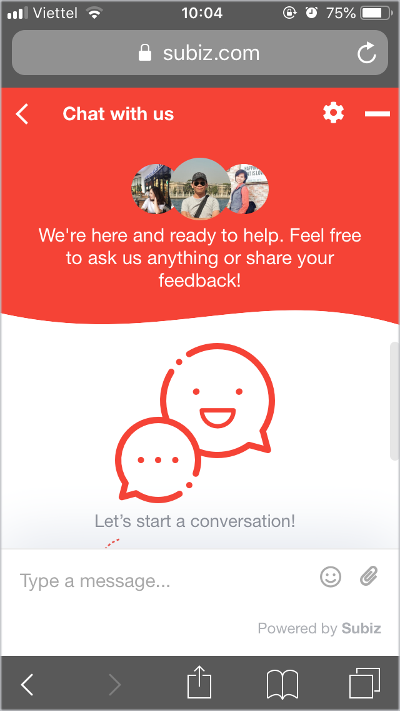

# Customize Subiz chat widget on mobile

On mobile devices, Subiz chat widget is responsively designed to enhances the customer experience while chatting and surfing web.

### 1. Some notes about Subiz widget on mobile devices

* **Chat button** displays on mobile device the same on PC devices. 
* You can customize the **chat button** on your phone with the CSS code. 
* When you click the **chat button**, the chat windown will open full.
* The **chat window** will display about 90% of the mobile screen, not full of screen.
* You can customize the appearance settings of the **chat window** with CSS
* **New message** will be noticed by red number on chat button, not open full chat window.



### 2. How to customize mobile widget with CSS

To customize mobile widget with CSS, [Sign in to App.subiz.com &gt; Setting &gt; Account &gt; Widget](https://app.subiz.com/settings/widget-setting) &gt; Customize CSS &gt; Copy below CSS code and paste it on box of CSS customize:


  
 &gt; Save Changes at box of CSS customize  
 &gt; Save Changes at Widget Setting

### 2.1 CSS for chat widget appearance on mobile

* To change color of widget and chat button, copy the following code and paste on box of CSS customize:

  ```text
  .widget_mobile .color_theme_default {
  background-color: #0000;
  }
  ```

* You can change only color of widget header with CSS code below:

  ```text
  .widget_mobile .widget-header {
  background-color: #0000;
  }
  ```

*  If you wish to personalize your chat widget with your custom color of message body, you can use this CSS code:

  ```text
  .widget_mobile .message-body {
  background-color: #0000;
  }
  ```

* You can change color of button of Start a conversation with the following CSS code:  


  ```text
  .widget_mobile .add-new-conversation {
  background-color: #0000;
  }
  ```

### 2.2 CSS for chat button on mobile

* You want your mobile chat button more eye-catching, use this CSS code:  
  You can change image URL, size of chat button   


  ```text
  .widget_mobile .button-chat {
  background-image: url(https://filev4.subiz.com/fiqcggnqemgkhtwdbyne-button_chat_08.png);
  }
  .widget_mobile .widget-button {
  width: 60px; height: 60px;
  }
  ```

* To move the height of chat button over screen button, you can use this CSS code  


  ```text
  .widget_mobile .widget-button {
  bottom:10px;
  right:10px;
  }
  ```

