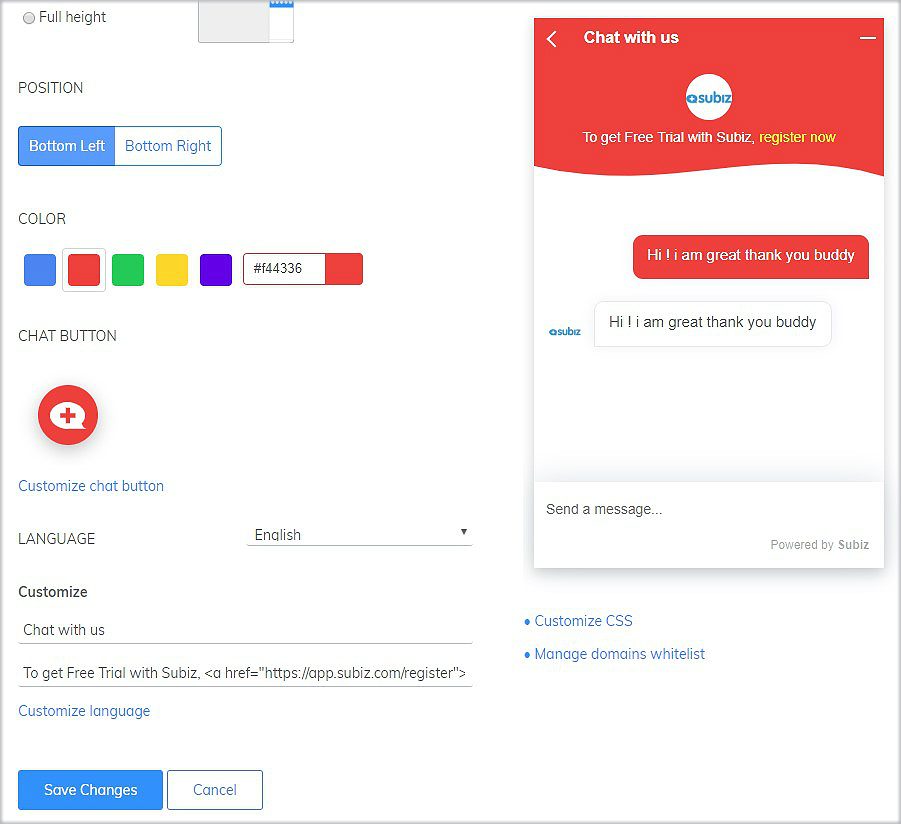
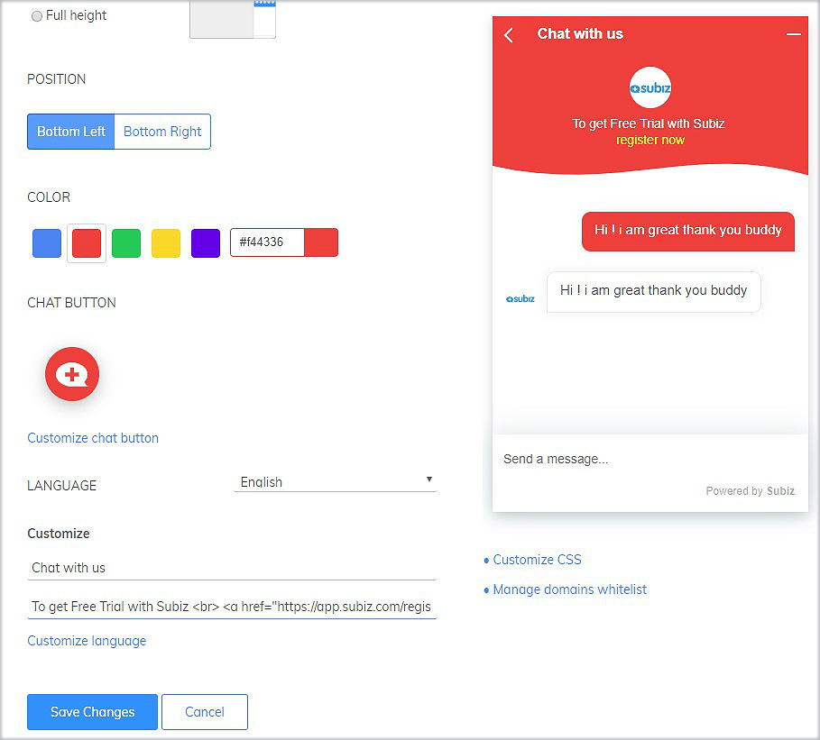
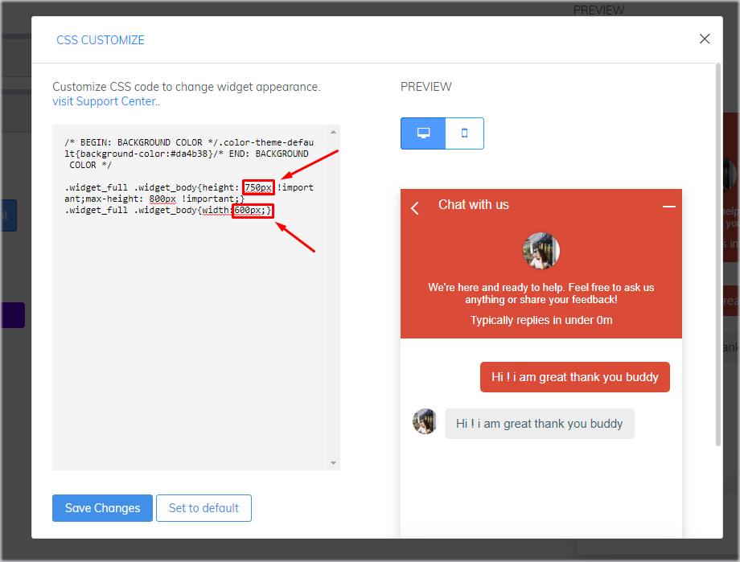
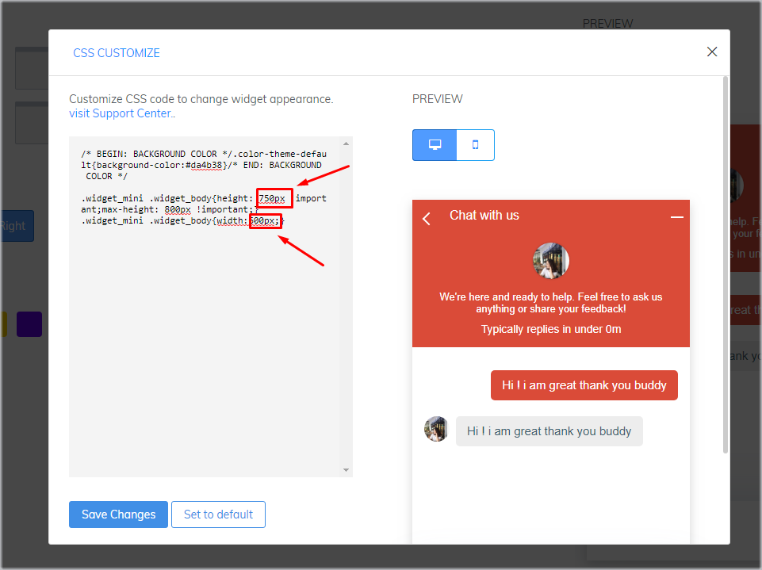
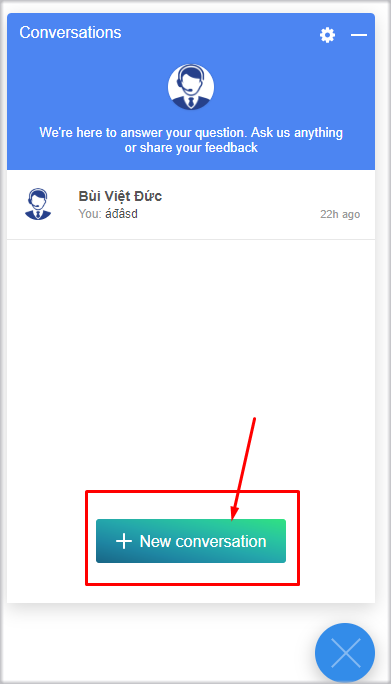
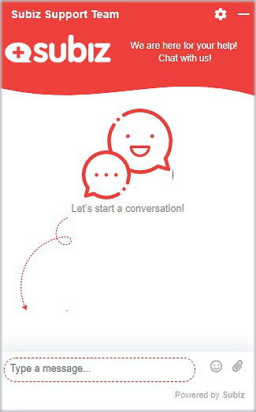

# Creative on Subiz Chat widget

## Creative introductions on the chat widget

On special occasions or when there are promotions, you can change and create business introduction right on the Subizchat window to attract and impress your website visitors.

### Some popular HTML formats

* HTML text formats   
  `<strong>text`: Bold text  
  `<i>text`: Italic text

  `<u>text`: Underline text  

* HTML line breaks `<br>text`: Create a new line  
* HTML colors `<font color="yellow">text</font>`:  Use a specific color name as yellow, red, white, blue.... 
* HTML link `<a href="http://example.com">Text</a>`: Insert a relative URL as http://example.com 
* HTML link of phone number `<a href="tel:02473021368">02473021368</a>`: Insert your phone on 02473021368

### HTML examples 



HTML to link and change text color at the introduction

`<a href="http://example.com"> <font color="yellow">text</font></a>`

Elements can be changed:

* [Http://example.com](http://example.com/): The link URL to the landing page you want the customer to view after clicking on the Linked text.
* **Yellow:** The color you want for Linked text.
* **Linked text:** The text that is linked the link URL the landing page.

**For example:** 
To get Free Trial with Subiz &lt;a href="https://app.subiz.com/register"&gt; &lt;font color="yellow"&gt;register now&lt;/font&gt;&lt;/a&gt;





HTML to break a line and change text color at the introduction

`<br><font color="yellow">Text</font>`

**For example**: To get Free Trial with Subiz &lt;br&gt;&lt;a href="https://app.subiz.com/register"&gt; &lt;font color="yellow"&gt;register now&lt;/font&gt;&lt;/a&gt;





## **Customizing CSS for Chat widget**

Besides using the [chat widget settings](https://app.subiz.com/settings/widget-setting) on the website that Subiz has provided. You can easily customize other components on the [chat widget](https://app.subiz.com/settings/widget-setting) by using CSS code.

CSS stands for “Cascading Style Sheet”. It describes how HTML elements are to be displayed on screen, paper, or in other media. With using CSS, you can customize every single elements in chat widget to make it more attractive or unique.

### How to add customized CSS

Firstly, log in app.subiz.com, come to [**Setting &gt; Account &gt; Message &gt; Widget &gt; Customize CSS**](https://app.subiz.com/settings/widget-setting)\*\*\*\*


Next, **Copy and Paste** the corresponding CSS to customize the component you want, then return to the chat widget settings screen and save the changes.

Here are some examples of possible customizations and instructions on how to achieve them:

### Resize chat widget

You can change the height and width as you like:



* Paste this code for customizing widget's height

```text
.widget_full .widget_body{height: 750px !important;max-height: 800px !important;}
```

* Paste this code for customizing widget's width 

```text
.widget_full .widget_body{width:600px;}
```

  
Change value 750px, 600px to decide the size of chat widget.





* Paste this code for customizing widget's height

```text
.widget_mini .widget_body{height: 750px !important;max-height: 800px !important;}
```

* Paste this code for customizing widget's width 

```text
.widget_mini .widget_body{width:600px;}
```

Change value 750px, 600px to decide the size of chat widget.





### Customizing font size

Custom font size code on chat window Subiz

```text
.message-content{ font-size:20px;}
```

Change value **20**px to decide the font size of chat widget.

### Change color of chat widget




When you choose to customize color of the whole chat widget, you **would not be able** to custom the colors of each component of header, message box, new conversation


You can customize your widget with solid color or gradient colors:

* **Solid color**

```text
.color-theme-default {background-color:#000000;}
```

You can change value **\#00000** to suit your website

* **Color gradient**

```text
.color-theme-default{background-image: linear-gradient(to right top, #056587, #0085a3, #00a6ac, #00c59f, #0be17f);}
```

You can change value **\#056587, \#0085a3, \#00a6ac, \#00c59f, \#0be17f** to suit your website


#### Customize the color of each component on the chat widget



You can customize your widget with solid color or gradient colors:

* **Solid color**

```text
.widget-header {background-color:#00000;}
```

You can change value **\#00000** to suit your website

* **Color gradient**

```text
.widget-header {background-image: linear-gradient(to right top, #056587, #0085a3, #00a6ac, #00c59f, #0be17f);}
```

You can change value **\#056587, \#0085a3, \#00a6ac, \#00c59f, \#0be17f** to suit your website





You can customize your widget with solid color or gradient colors:

* **Solid color**

```text
.message-body {background-color:#00000;}
```

You can change value **\#00000** to suit your website

* **Color gradient**

```text
.message-body{background-image: linear-gradient(to right top, #056587, #0085a3, #00a6ac, #00c59f, #0be17f);}
```

You can change value **\#056587, \#0085a3, \#00a6ac, \#00c59f, \#0be17f** to suit your website:





You can customize your widget with solid color or gradient colors:

* **Solid color**

```text
.add-new-conversation {background-color:#00000;}
```

You can change value **\#00000** to suit your website

* **Color gradient**

```text
.add-new-conversation{background-image: linear-gradient(to right top, #056587, #0085a3, #00a6ac, #00c59f, #0be17f);}
```

You can change value **\#056587, \#0085a3, \#00a6ac, \#00c59f, \#0be17f** to suit your website





### Custom header appearance of chat widget

New custom chat widget and enhanced brand identity with Business logo and information.



You can customize the look and layout of header of chat widget with a combination of the following CSS codes:  
  
`.color-theme-default {background-color:#f44336;}  
  
.list-agents { float:left; width:45%; }  
  
.avatar-team { position:absolute; top:-70%; background: url(`[`https://filev4.subiz.com/fiqeahnixwxjomyxmnnu-logo.png`](https://filev4.subiz.com/fiqeahnixwxjomyxmnnu-logo.png)`);  
  
height: 100px; background-size: 150px; background-repeat: no-repeat; background-position: center; } .full { width:160px !important; }  
  
.avatar-team .avatar-agent{ display:none; }  
  
.team-intro { width:55%; margin-bottom:12px; } .team-intro p{ padding: 0 0 0 0; font-size:13px; }`


Note: Change Business logo at the link  
`https://filev4.subiz.com/fiqeahnixwxjomyxmnnu-logo.png`


> We are here for your help. For further support, email us via Support@subiz.com!


