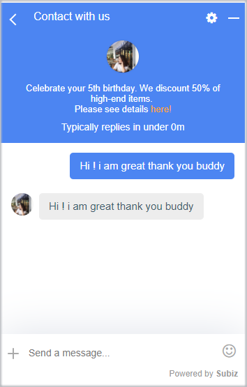
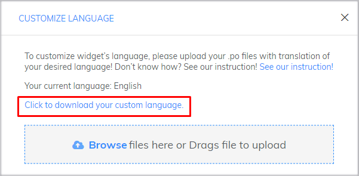
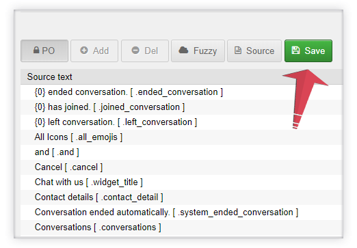
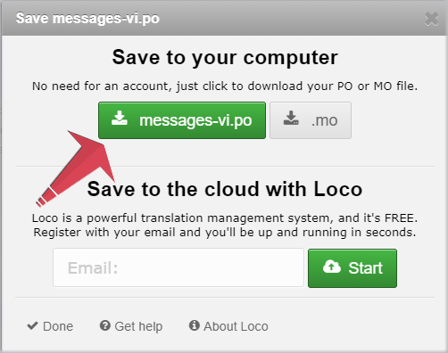
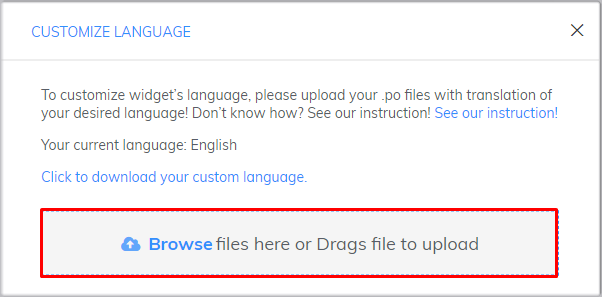
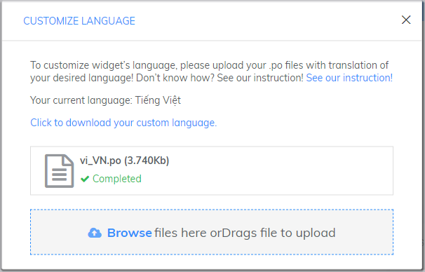

# Creative on Subiz Chat widget

### Creative introductions on the chat widget

On special occasions or when there are promotions, you should change and create business introductions right on the chat window to increase the appeal and impress your website visitors.



The code snippet lets you link the link to the introduction

```text
<p> Normal text <a href="http://example.com"> <font color="yellow">Linked text</font></a></p>
```

Components you can change in the code above:

* **Normal text:** The text you want to present.
* [Http://example.com](http://example.com/): The link to the landing page you want the customer to see after clicking on the Linked text.
* **Orange:** The color you want for Linked text.
* **Linked text:** The text that links the landing page.

**Example:** &lt;p&gt; Celebrate your 5th birthday. We discount 50% on many items. Please see details &lt;a href="http://example.com"&gt; &lt;font color = "orange"&gt; here! &lt;/ font&gt; &lt;/a&gt; &lt;/ p



The code snippet lets you break the line on the introduction

```text
<br>Text
```

Put the code above the text you want it down.

Example: &lt;p&gt; Celebrate your 5th birthday. We discount 50% of high-end items. &lt;br&gt;Please see details &lt;a href="http://example.com"&gt; &lt;font color = "orange"&gt; here! &lt;/ font&gt; &lt;/a&gt; &lt;/ p&gt;





### **Customizing CSS for Subiz Chat widget**

Besides using the [chat widget settings](https://app.subiz.com/settings/widget-setting) on the website that Subiz has provided. You can easily customize other components on the [chat widget](https://app.subiz.com/settings/widget-setting) by using CSS code.

CSS stands for “Cascading Style Sheet”. It describes how HTML elements are to be displayed on screen, paper, or in other media. With using CSS, you can customize every single elements in chat widget to make it more attractive or unique.

#### How to add customized CSS?

Firstly, log in app.subiz.com, come to [**Setting &gt; Account &gt; Message &gt; Widget &gt; Customize CSS**](https://app.subiz.com/settings/widget-setting)\*\*\*\*


Next, **Copy and Paste** the corresponding CSS to customize the component you want, then return to the chat widget settings screen and save the changes.

Here are some examples of possible customizations and instructions on how to achieve them:

#### Resize chat widget

You can change the height and width as you like:



* Paste this code for customizing widget's height

```text
.widget_full .widget_body{height: 750px !important;max-height: 800px !important;}
```

* Paste this code for customizing widget's width 

```text
.widget_full .widget_body{width:600px;}
```

  
Change value 750px, 600px to decide the size of chat widget.





* Paste this code for customizing widget's height

```text
.widget_mini .widget_body{height: 750px !important;max-height: 800px !important;}
```

* Paste this code for customizing widget's width 

```text
.widget_mini .widget_body{width:600px;}
```

Change value 750px, 600px to decide the size of chat widget.





#### Customizing font size

Custom font size code on chat window Subiz

```text
.message-content{ font-size:20px;}
```

Change value **20**px to decide the font size of chat widget.


#### Customizing colors of the chat widget




When you choose to customize color of the whole chat widget, you **would not be able** to custom the colors of each component of header, message box, new conversation


You can customize your widget with solid color or gradient colors:

* **Solid color**

```text
.color-theme-default {background-color:#000000;}
```

You can change value **\#00000** to suit your website

* **Color gradient**

```text
.color-theme-default{background-image: linear-gradient(to right top, #056587, #0085a3, #00a6ac, #00c59f, #0be17f);}
```

You can change value **\#056587, \#0085a3, \#00a6ac, \#00c59f, \#0be17f** to suit your website


#### Customize the color of each component on the chat widget



You can customize your widget with solid color or gradient colors:

* **Solid color**

```text
.widget-header {background-color:#00000;}
```

You can change value **\#00000** to suit your website

* **Color gradient**

```text
.widget-header {background-image: linear-gradient(to right top, #056587, #0085a3, #00a6ac, #00c59f, #0be17f);}
```

You can change value **\#056587, \#0085a3, \#00a6ac, \#00c59f, \#0be17f** to suit your website





You can customize your widget with solid color or gradient colors:

* **Solid color**

```text
.message-body {background-color:#00000;}
```

You can change value **\#00000** to suit your website

* **Color gradient**

```text
.message-body{background-image: linear-gradient(to right top, #056587, #0085a3, #00a6ac, #00c59f, #0be17f);}
```

You can change value **\#056587, \#0085a3, \#00a6ac, \#00c59f, \#0be17f** to suit your website:





You can customize your widget with solid color or gradient colors:

* **Solid color**

```text
.add-new-conversation {background-color:#00000;}
```

You can change value **\#00000** to suit your website

* **Color gradient**

```text
.add-new-conversation{background-image: linear-gradient(to right top, #056587, #0085a3, #00a6ac, #00c59f, #0be17f);}
```

You can change value **\#056587, \#0085a3, \#00a6ac, \#00c59f, \#0be17f** to suit your website





### Customize Language with P.O file

Currently, [Subiz](https://subiz.com/en) supports 2 languages: Vietnamese and English. On [Subiz widget](https://subiz.com/live-chat.html), you can [c**ustomize the widget**](https://subiz.com/live-chat.html) **title and team introduction according to each language.**

Besides, you can use another language other than these supported languages. Supposed that you want to replace English with German, or you want to edit language in other section of the widget, you can customize the language by .po file following the steps below:

**Step 1: Download custom language file**

Go to [Widget setting](https://app.subiz.com/settings/widget-setting) &gt; **Language**. Select 1 language and click **Customize language**.


Click to download custom language file.



**Step 2:** Edit .po file

* Go to [https://localise.biz/free/poeditor](https://localise.biz/free/poeditor), upload the .po file you have downloaded.


* Translate from source text. For example, in German: Email and Name = Email und Name.


* Click **Save** to finish editing.



* Click to save file to your computer.



**Step 3:** Upload .po file to Subiz

Go back to [Widget setting](https://app.subiz.com/settings/widget-setting) &gt; Language &gt; Customize language. Upload file, then new language will overlap the chosen language.



  After uploading successfully, back to widget setting. You do not need to save this upload




