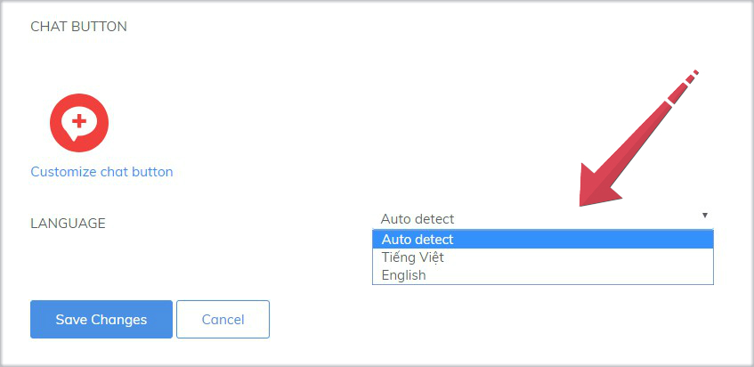
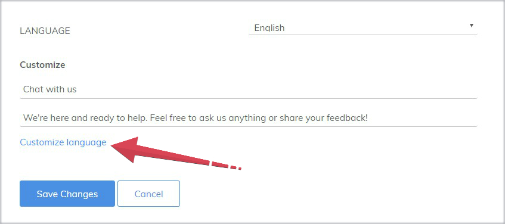
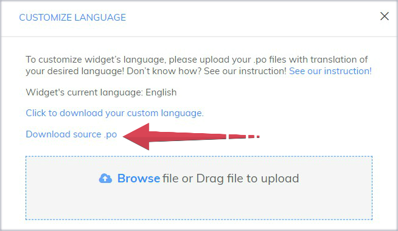
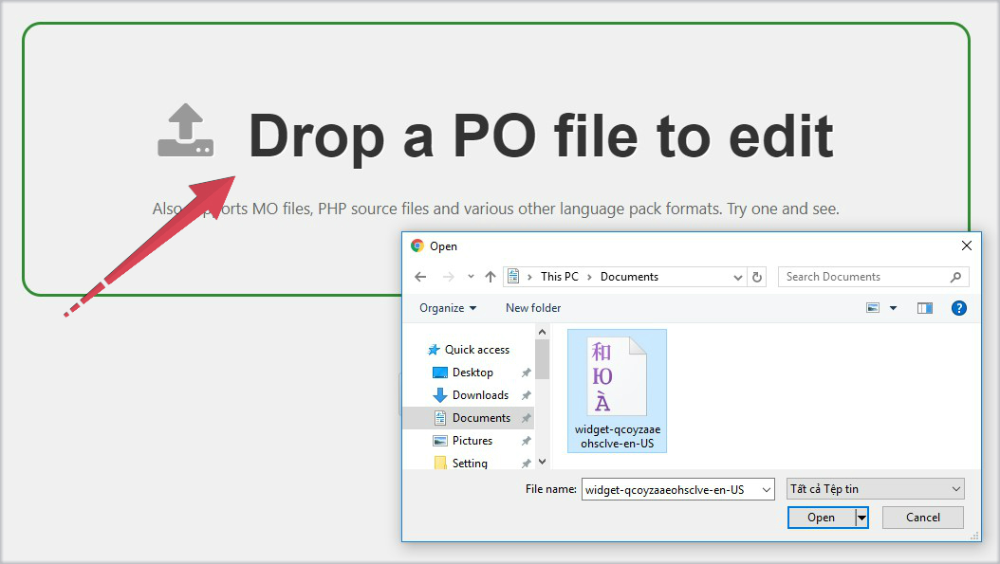
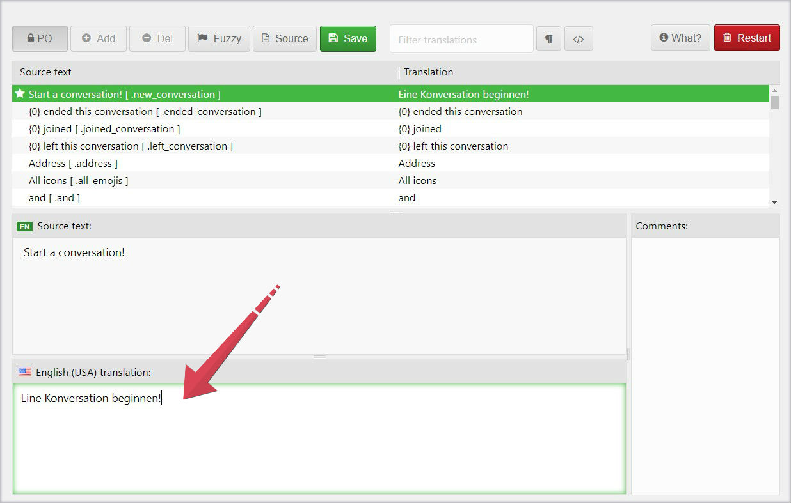
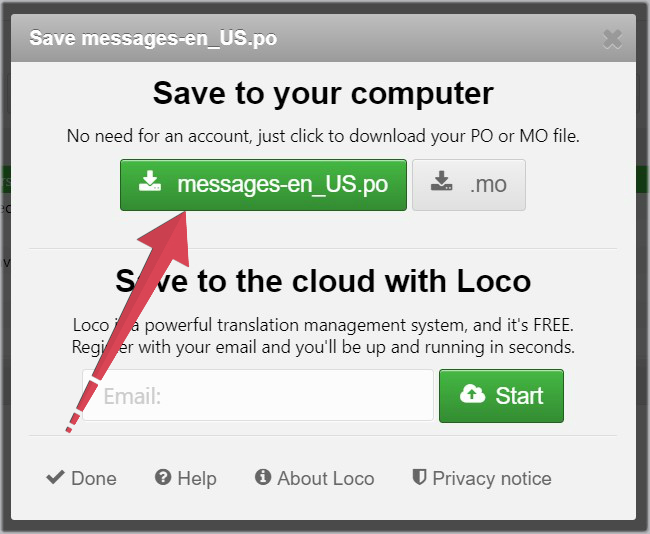
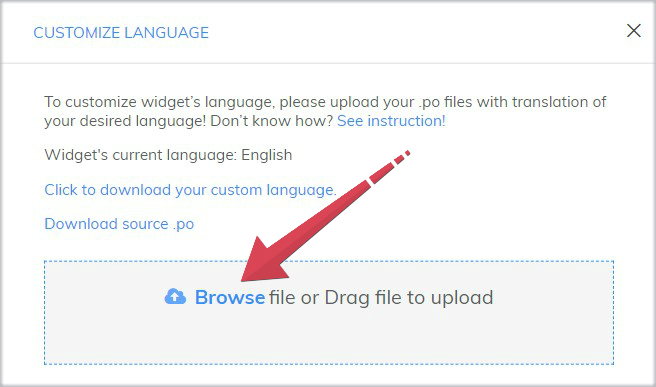
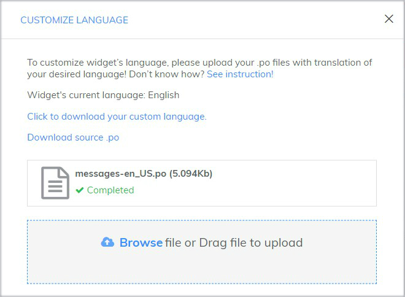

# How to customize language of chat widget

Language customization of chat widget is a very important step to attract users to come and chat online.

Currently, the Subiz chat widget supports two default languages: Vietnamese and English. Below is a list of language names and API codes:

| Language name | API code |
| :--- | :--- |
| English | en |
| Tiếng Việt | vi |

### 1. Customize default languages of chat widget

 To change the language of your chat widget, you need to log in [App.subiz.com &gt; Setting &gt; Widget](https://app.subiz.com/settings/widget-setting)



By default, the chat widget language is as below:

* **Auto detect**: Subiz widget automatically identifies and displays appropriate English or Tiếng Việt language according to users IP address.
* **Tiếng Việt**: Select when your Business only serves Vietnamese users and website supports only Vietnamese language.
* **English**: Choose when your Business doesn't server Vietnamese users and website supports only English language.

### 2. Changing the chat widget language via API

Your website is supported in both English and Vietnamese. The Subiz chat widget will be automatically changed to display English or Vietnamese language in corresponding website language. 

It's simple, just put the API code of language behind the embed code in your website’s HTML source code.

* **API code for English language**

```text
<script>
subiz('setLanguage', 'en');
</script>
```

* **API code for Vietnamese language**

```text
<script>
subiz('setLanguage', 'vi');
</script>
```

###  3. Customize language of chat widget with .po file

Currently, [Subiz](https://subiz.com/en) supports 2 default languages: Vietnamese and English to customize widget title and team introduction.

Additionally, Subiz provides source .po files for your own language customization as:

* Use another language except for English or Vietnamese. Example: German, Japanese, ..
* Customize the language translation of many other parts on the chat widget. For example: Message in Automation Capture Lead, ...

**3 steps to customize the chat widget language with the .po file as followings:**

**Step 1: Download source .po file**

* Go to [Widget setting](https://app.subiz.com/settings/widget-setting) &gt; **Language &gt;** Select **English** and click **Customize language**.



* Click **download source .po** to save to your computer



**Step 2: Edit and translate .po file**

* Go to [https://localise.biz/free/poeditor](https://localise.biz/free/poeditor), upload the .po file you have downloaded.



*  Translate from source text. For example, in German: Start a conversation! = Eine Konversation beginnen!



*  Click **Save** to finish editing &gt; Save .po edited-file to your computer.



**Step 3:  Upload edited-file to Subiz**

*  Go back to [Widget setting](https://app.subiz.com/settings/widget-setting) &gt; Language &gt; Customize language. Upload file, then new language will overlap the chosen language.



*  After uploading successfully, Exit to finish. You do not need to Save Changes for this upload



> Do you need help? Just click on [Subiz.com](https://subiz.com/en) and chat with us!


