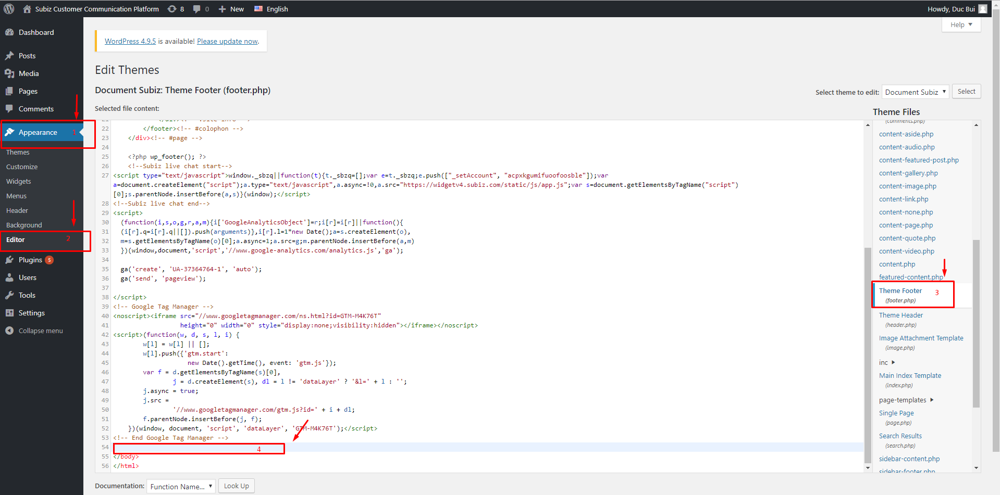
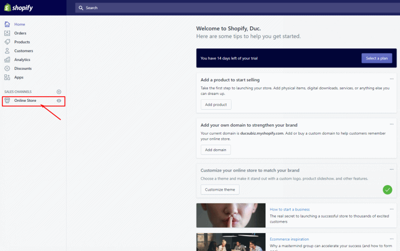
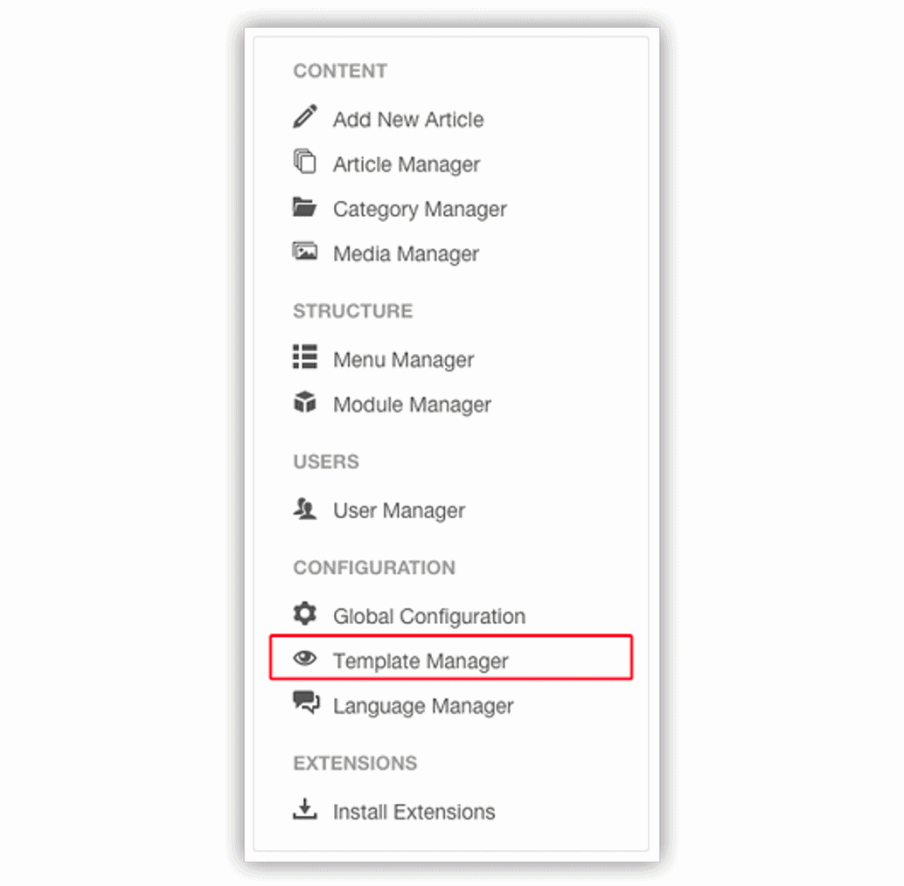

# Integrate Subiz on some website platforms

### Using plugin on WordPress \(upcoming\)

* **Install Plugin Subiz** [Log in](https://login.wordpress.org/?locale=en_US) to your Wordpress account &gt; Open Admin Panel &gt; Plugins &gt; Add New &gt; Find Subiz plugin and click on Install Now 
*  **Add License ID**  \([see your Subiz License ID](https://app.subiz.com/settings/)\) ****After installing Subiz plugin &gt; Go to Settings &gt; Subiz &gt; Installations &gt; Enter your License ID &gt; Save Note: You can also change to new Subiz account by filling a new license ID &gt; Save changes 
* **Customize Subiz widget** You can choose the widget color and the chat button that match your website &gt; Save changes ****
* **Set up Push Notifications**  
  Select the style of Push Notifications on the browser, there are 3 styles for you to choose &gt; Select Notification style &gt; Save changes

  Note:

  * Style 1: you can change the logo image and content message to get more accepts
  * Styles 2 and 3: you can choose the image type \(CTA notification icon\) that are appropriate for the website and your require.

### Embedding code on WordPress

* Open WordPress Admin Panel &gt; Appearance &gt; Editor
* Go to footer.php file in the right column &gt; Open it
* Paste [Subiz embed code](https://app.subiz.com/settings/install) into footer.php \(Right before &lt;/body&gt; tag\)

### Integrate on Shopify

* From your Shopify, go to Online Store &gt; Themes.
* Find the theme you want to edit and click the Actions button for the theme. Select Edit code
* Find theme .liquid file on the side menu &gt; Paste [Subiz embed code ](https://app.subiz.com/settings/install)before the &lt;/body&gt; tag. Click Save.

### Integrate Subiz on Joomla

* Open Joomla Admin &gt; Template Manager &gt; Choose your Template and Filter by site.
* Choose your templte &gt; Open Index.php file.
* Paste[ Subiz embed code](https://app.subiz.com/settings/install) right before &lt;/body&gt; tag &gt; Finish

### Integrate on Wix

* From your Dashboard, go to Manage & Edit Site
* Click Edit Site &gt; Add button &gt; More &gt; HTML iframe. Dragging the newly added iframe to the footer \(can adjust the position of the iframe\)
* Click Add code and paste [Subiz embed code](https://app.subiz.com/settings/install) &gt; Click Save

### Integrate on Magento

To embed Subiz code on your Magento, go to your Magento them files and check if the file indicated exists or not, so please refer two options below:

**Option 1**

1. Look for your Magento tempale in app/design/frontend/{template}/page/html/head.phtml. If this file doesn’t exist, then you will need to check if the app/design/frontend/{template}/default/page/html/head.phtml file exists.
2. Paste [Subiz embed code](https://app.subiz.com/settings/install) right before the &lt;/head&gt; section of the file.

**Option 2**

You only need to do this option if the template files described in the option 1 don’t exist. This situation due to some custom Magento templates might not have a head.phtml file and the template would be using the base template file.

1. Copy the app/design/frontend/default/page/html/head.phtml file from your default base template to your custom template folder at app/design/frontend/{template}/page/html/head.phtml.
2. Open the file and paste [Subiz embed code](https://app.subiz.com/settings/install) before the &lt;/head&gt;

### 

