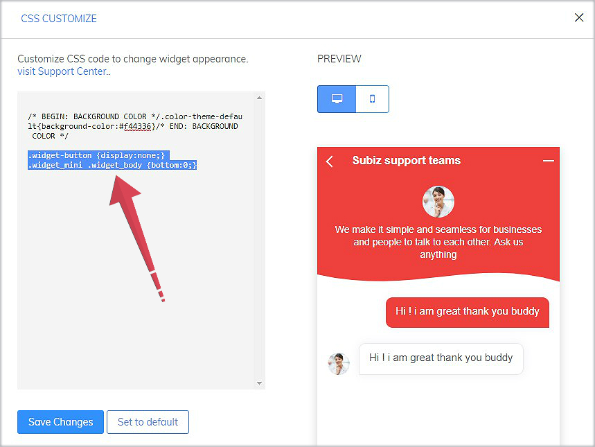

# Link chat widget on a text or an image on website

Subiz chat button is displayed by default on the right or left side of the website after integration. Subiz chat widget will open when clicking on this chat button.

With Subiz, you have more than one way to place your chat button in a easy-to-reach and visible place, that fits your website design.

You need to do 2 steps as followings:

### Step 1: Hide the default chat button with CSS code

You will use the CSS code in app.subiz.com to hide the default chat button: [Sign in to App.subiz.com&gt; Setting &gt; Account &gt; Widget &gt; Customize CSS](https://app.subiz.com/settings/widget-setting)

The Subiz widget has two types: Standard and Full height

Here are two CSS codes that hide the chat button corresponding to each type of widget. You copy and place this CSS code in the CSS Customize box and then save changes.

| Widget type: Standard | Widget type: Full height |
| :--- | :--- |
|  `.widget-button {display:none;}  .widget_mini .widget_body {bottom:0;}` |  `.widget-button {display:none;}` |


Note: CSS just for hiding Subiz widget on mobile version  
 `.widget_mobile .button-chat { display: none; }`




### Step 2: Link chat widget to a text or an image on website

After hiding the default chat button, put API into website HTML code will help you link the Subiz chat widget to an image or a text on website which is also called chat button.

Then the chat widget will pop up at your website only after the visitor clicks on the chat button.

* Common API links Subiz chat widget in the container of website HTML code  `<script type="text/javascript">window.subiz('expandWidget') </script>` 
* API links the Subiz chat widget to an image

```text
<a href="#nogo" onclick="subiz('expandWidget')"></a>
```

* The API links the Subiz chat widget to a text

```text
<a href="#nogo" onclick="subiz('expandWidget')">your text</a>
```


Note: You need to put this API into your website HTML code. If you do not understand the code, you can send this guide to the website designer to install it quickly.


> ​[We are here for your help](https://subiz.com/vi/faqs.html). Let us know if you have questions or concern!

  


