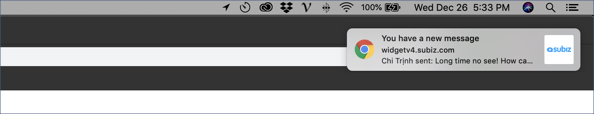
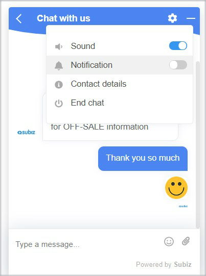

# Push notifications to user

### What are Push Notifications?

When there is a new message on Subiz widget, Users will receive notifications on their browser even if they exited your website. When users click on the message notification, they will come back to your website again and from there, they can continue a conversation through Subiz chat widget. If users have turned off their browser, then the browser opens and the message notification will be displayed.

Push Notification help Bussiness:

* Keep users back when they have exited the website.
* Build users list who receive automatically information from Business.
* Create stronger connection between users and Busines.

### How to set up Push Notifications

####  Call users to Agree to receive notifications.

Subiz widget is designed with function Notification for users to subscribe to notifications.

Alternatively, you can use Subiz API Javascript to call users. This is the API Guide. You can optionally place on the Menu bar or ask visitors to subscribe to notifications as soon as they enters the website.

#### How to send notifications to users

On a conversation: For users who have agreed to receive notifications, when they are no longer online, agents can still reply to the conversation and that message will be displayed by the Browser Notice on the users screen.

Automation - Send automatic messages when agents are offline \(upcoming update\).

### Supported browsers

| Browser | Operation system |
| :--- | :--- |
| Chrome phiên bản 42+ trở lên | Windows, Mac OS X, Linux and Android |
| Firefox \(V 44+ cho desktop; 48+ cho mobile\) | Windows, Mac OS X, Linux và Android |
| Opera \(v 42+ cho desktop; 37+ cho mobile\) | Windows, Mac OS X, Linux và Android |
| Safari \(version 7.1+\) | Mac OS Mavericks onwards desktops |
| Edge \(version 42+\) | Windows 10 |

### Report of subscribed users

You can manage the number of users who subscribed notifications via Report. Or you can filter users with the `desktop_notify_subscribed` attribute as True.

### Frequently asked questions

* Is no-https web supported? _Yes, Subiz supports all types of web including no-https web. But we recommend you to use https for the website._
* Can user refuse to receive Notifications? _Yes, user can decline on Subiz widget or on the browser settings._
* Is Image displayed on Notifications? _The logo you set up on Subiz_.
* URL on Notifications? _The last url that users visited and had a conversation._

