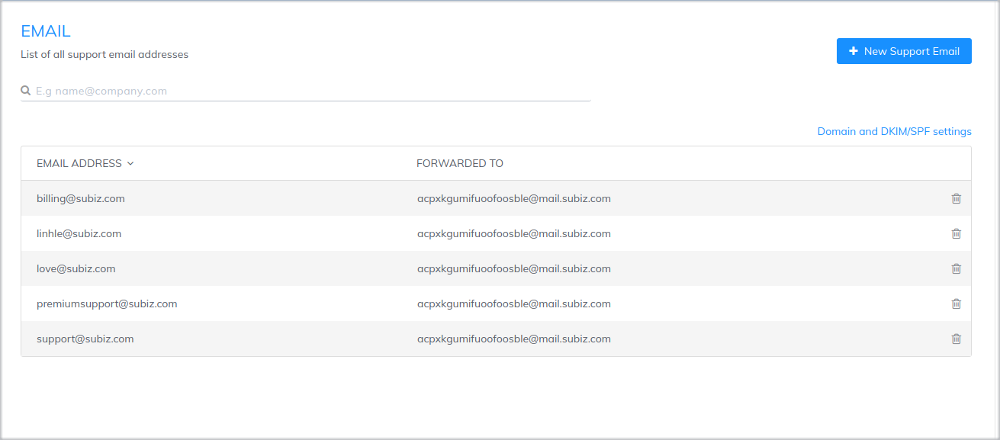
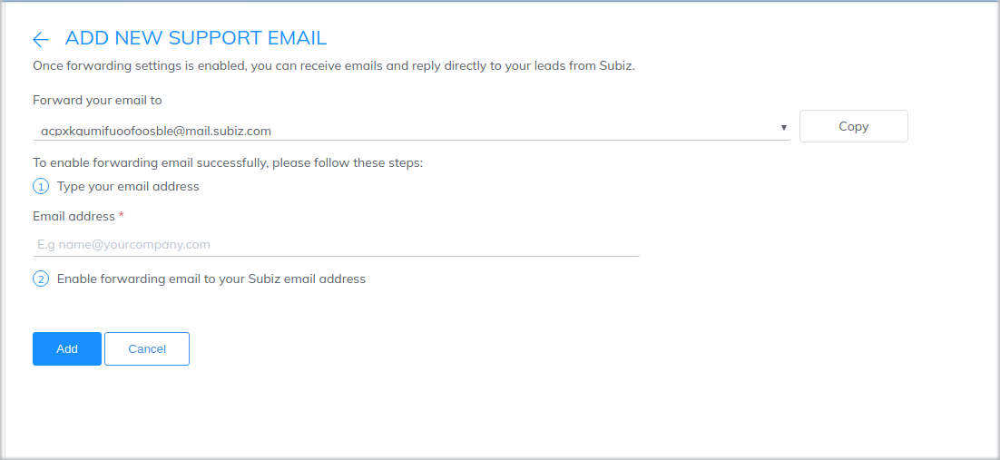
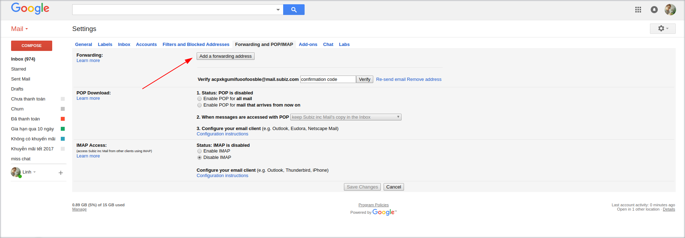
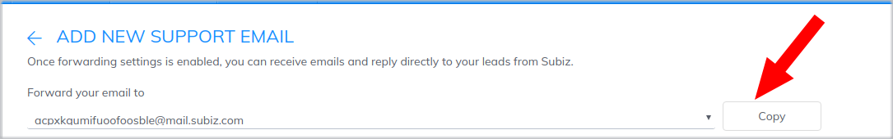
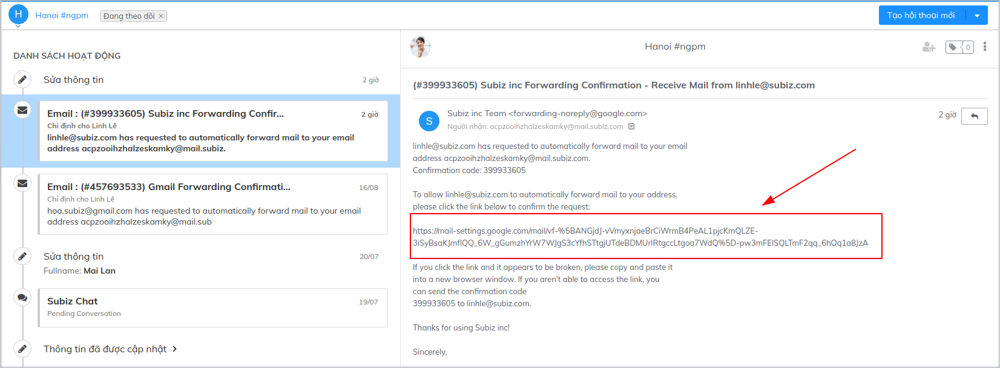

# Integrating Email on Subiz

With email integration, Subiz will act as a mailbox so you can receive, respond, and send emails to your customers quickly and conveniently without having to log into another email management tool.

### **How** Subiz Email works

You should note  two types of Email addresses during the integration process:

* **Income Email:** When creating an Subiz account, you will be provided with an email address with the form abc@mail.subiz.com. All emails sent to this address will be regarded as a conversation on Subiz.

In the Email Integration page, you will manage the list of support email addresses that you want to forward emails to abc@mail.subiz.com so that you can receive emails on Subiz.


**Note:** This list is only for data management \(adding and removing email addresses \).  You cannot base on this list to check whether an email is set up to forward emails or not.  


* **Outcome Emails :** That is sender email address displayed in your user's email box when you send an email from Subiz account


**Note:** An email can be used as an outcome email if it has already been set up to forward emails to your Subiz Account.


### **Intergrating Email on Subiz**

To make sure that you can receive and send emails via Subiz Account, you have to follow 2 steps as below:

**Step 1: Create list of support email addresses**

List of support addresses is all email addresses you want to use to work with customers on [Subiz](https://subiz.com/en). To add a new support email, follow below steps:

* ​[Sign in](http://app.subiz.com/login) and go to **Setting &gt; Account &gt; Message &gt; Email**
* Click **New Support Email**
* Enter email address in **Type your email address**
* Click **Add**

**Step 2: Enable forwarding email to your** [**Subiz email**](https://subiz.com/email.html) **address**

This step will help you forward all emails sent to your email to Subiz account so that you can receive and reply emails directly via Subiz.

**Forwarding email with Gmail**

If you are using gmail account, following instructions below to enable forwarding email:

* **Sign in** the email account that you entered in Income Email
* Click on the wheel icon and select **Setting**
* In Settings, choose **Forwarding and POP / IMAP**
* Click on **Add a forwarding address**

* Enter the email address given by Subiz \(click the **Copy** button in Email Settings page to copy the email address\)

* Select **Next&gt; Proceed**
* You will receive a confirmation email. Check this email right at the Activities page of the app.subiz.com as a new conversation. Click on confirmation link in email.

* Go back to the Settings page in your Gmail account and reload
* Select **Forward a copy of incoming mail to**
* Select **Keep Gmail’s copy in the Inbox** if you want to keep incoming emails in your inbox \(recommended\)

After finishing two above steps, your emails will be forwarded to [Subiz](https://subiz.com/en) as a new conversation. You can reply and send emails right on [Subiz](https://subiz.com/en).

### Install DKIM / SPF for the domain to optimize email delivery

DKIM \(Domain Keys Identified Mail\) is the email authentication method by the electronic signature of the sending domain. Install DKIM / SPF for your domain to optimize email delivery and avoid spam mailboxes.

In order to send email on Subiz effectively, you should set up DKIM and SPF on your domain.

* [Sign in](https://app.subiz.com/login?redirect=%2Factivities%2F) to your [Subiz account](https://app.subiz.com), go to [**Settings&gt; Accounts&gt; Messages&gt; Email**](https://app.subiz.com/settings/email)\*\*\*\*
* Select **Configure DKIM**
* Enter your mailbox domain name \(company.com\)
* Contact the domain manager of the company to set up DKIM and SPF for the domain

