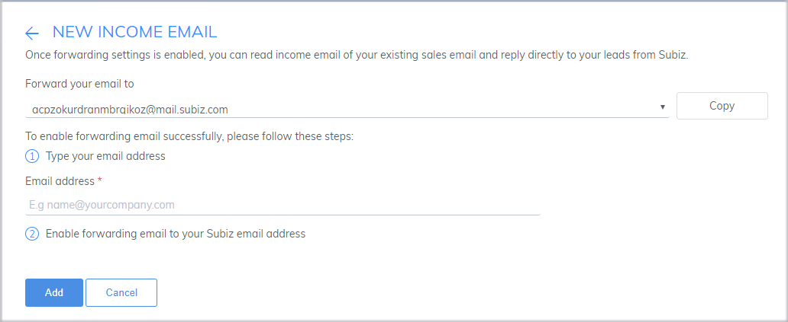
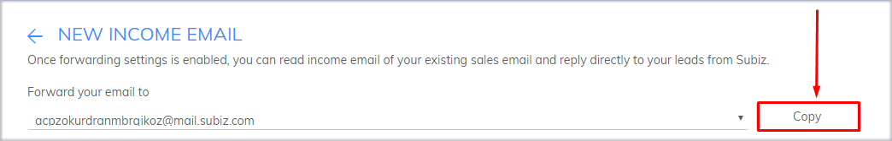

# Integrating Email on Subiz

### Email Forwarding settings on Subiz

Along with [Subiz account](https://app.subiz.com), you are provided an email address in form of abc@mail.subiz.com. All the emails sent to this address are considered as conversations on [Subiz](https://subiz.com/en).

If you forward emails to abc@mail.subiz.com, you also get these emails on [Subiz](https://subiz.com/en). So, you should set up to forward emails automatically from email address you are using. Then you can work with email right on Subiz. Follow 2 steps below:

**Step 1: Create list of income email addresses**

List of income addresses is all email addresses you want to use to work with customers on [Subiz](https://subiz.com/en). To add a new income email, follow below steps:

* ​[Sign in](http://app.subiz.com/login) and go to **Setting &gt; Account &gt; Message &gt; Email**
* Click **New Income Email**
* Enter email address in **Type your email address**
* Click **Add**

**Step 2: Enable forwarding email to your** [**Subiz email**](https://subiz.com/email.html) **address**

**Forwarding email with Gmail**

If you are using gmail account, following instructions below to enable forwarding email:

* **Sign in** the email account that you entered in Income Email
* Click on the wheel icon and select **Setting**
* In Settings, choose **Forwarding and POP / IMAP**
* Click on **Add a forwarding address**
* Enter the email address given by Subiz \(click the **Copy** button in Email Settings page to copy the email address\)

* Select Next&gt; Proceed
* You will receive a confirmation email. Check this email right at the Activities page of the app.subiz.com as a new conversation. Click on confirmation link in email.
* Go back to the Settings page in your Gmail account and reload
* Select **Forward a copy of incoming mail to**
* Select **Keep Gmail’s copy in the Inbox** if you want to keep incoming emails in your inbox \(recommended\)

After finishing two above steps, your emails will be forwarded to [Subiz](https://subiz.com/en) as a new conversation. You can reply and send emails right on [Subiz](https://subiz.com/en).

### Install DKIM / SPF for the domain to optimize email delivery

DKIM \(Domain Keys Identified Mail\) is the email authentication method by the electronic signature of the sending domain. Install DKIM / SPF for your domain to optimize email delivery and avoid spam mailboxes.

In order to send email on Subiz effectively, you should set up DKIM and SPF on your domain.

* [Sign in](https://app.subiz.com/login?redirect=%2Factivities%2F) to your [Subiz account](https://app.subiz.com), go to [**Settings&gt; Accounts&gt; Messages&gt; Email**](https://app.subiz.com/settings/email)\*\*\*\*
* Select **Configure DKIM**
* Enter your mailbox domain name \(company.com\)
* Contact the domain manager of the company to set up DKIM and SPF for the domain

