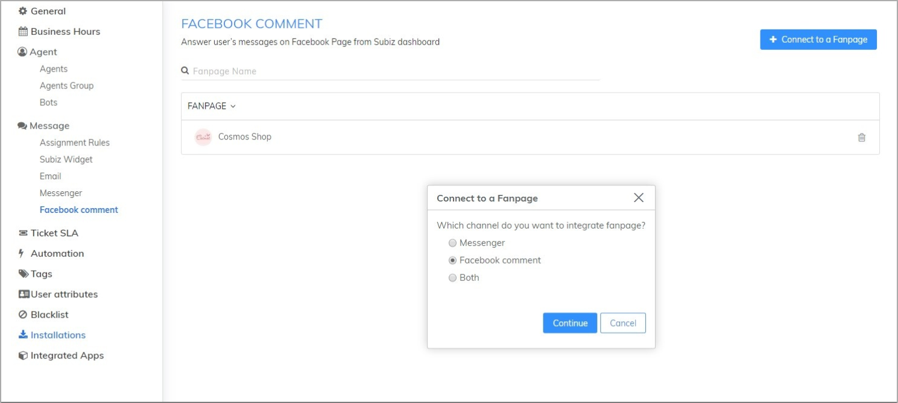
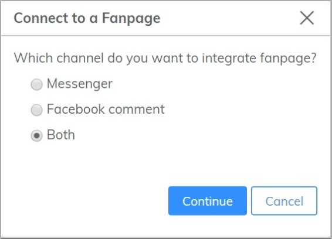
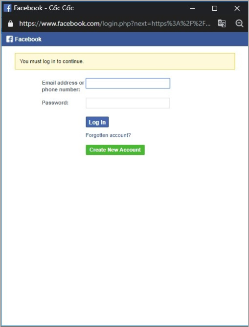
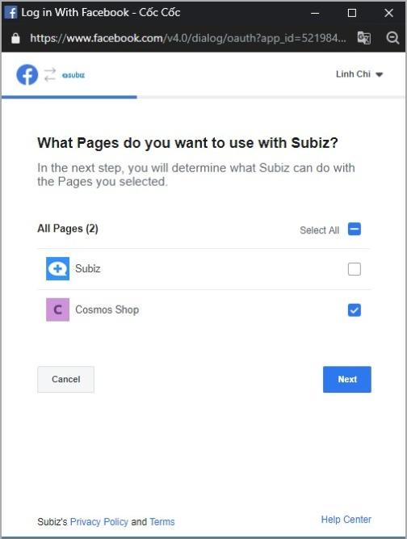
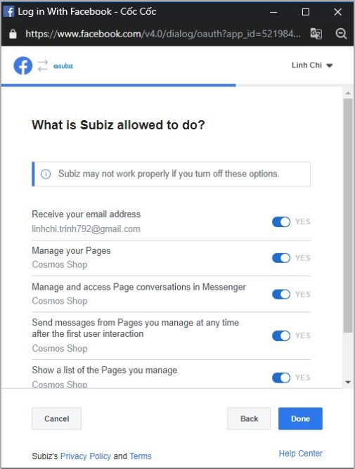
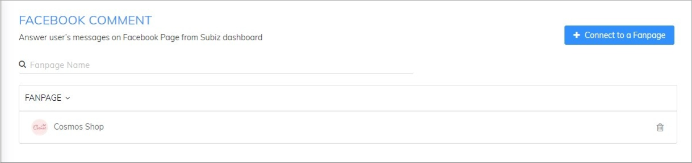
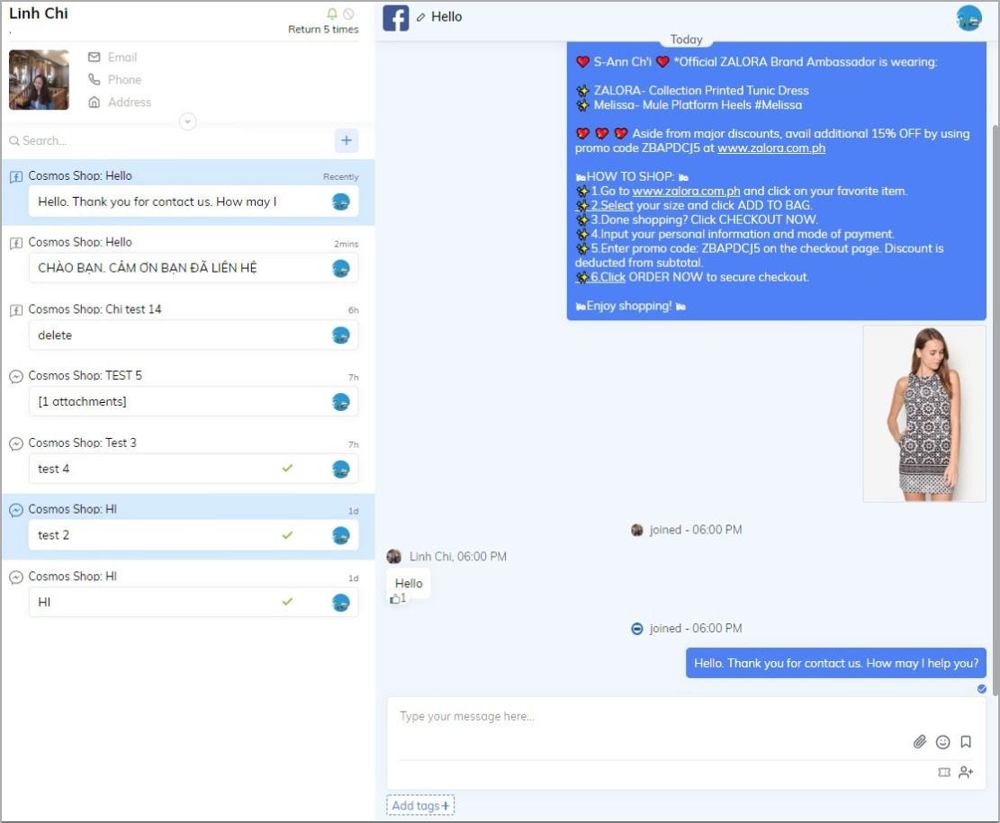
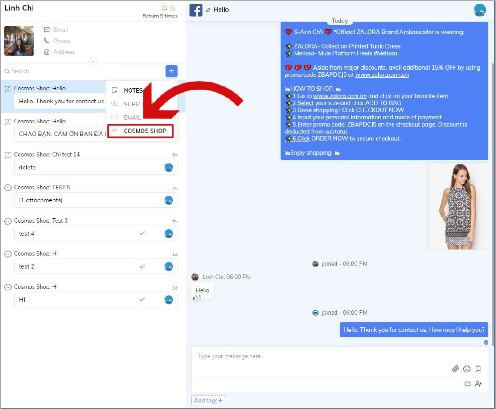
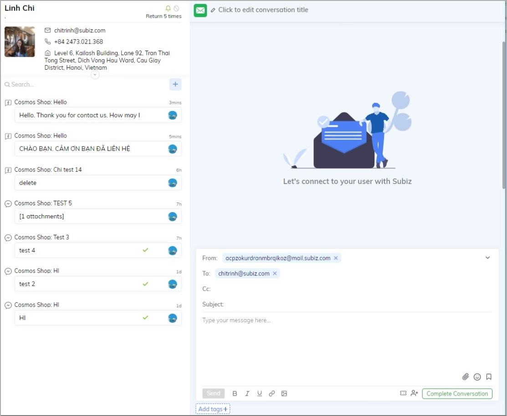

# Integrating Facebook Comment on Subiz

​With feature Integrating Facebook Comment on Subiz, Subiz will run as the professional Fanpage management software. From then on, you could focus on management on hundreds of Fanpage, an unlimited number of messages, comments and speed up the interaction with users. 

Now, you will no longer need to work on many sites at the same time. You also could limit confusion and omission when the number of users is overloaded. All interactions with your website, Fanpage and email will focus on Subiz, help you easy to work on Dashboard. 

The following article will guide how to integrate Facebook Comment on Subiz.

### Integrating Facebook Comment on Subiz 

You will access via this link: [Settings -&gt; Facebook Comment -&gt; Connect to a Fanpage](https://app.subiz.com/settings/facebook-comment). 

In case you would like to integrate both channels: Messenger and Facebook Comment, you will choose Both:

You have to log in to the right admin account of your Fanpage to be able to complete the integration step: 

After that, you could choose the Fanpage that you would like to manage in Subiz: 

And authorize Subiz: 

After click **Done**, you could integrate all of your Fanpage on Subiz.

### Manage Facebook Comment on Subiz 

Now you will work in the Dashboard on the new interface: 

You could also use automated interactions such as: **Automatically like comments, hide comments automatically, automatically respond to comments** by setting Automation on Subiz: Instructions 

In addition, you can also actively message users: 

More than Fanpage management software, you could ask for the user’s information and save in a Dashboard. In addition, you could interact with users via other channels such as email. 

If you have any question, feel free to contact us via [Subiz.com](https://subiz.com/).


Note: 

* You could interact with an unlimited Fanpage on Subiz. 
* Each message sent from Subiz will be equivalent to 1 comment on the Fanpage.


