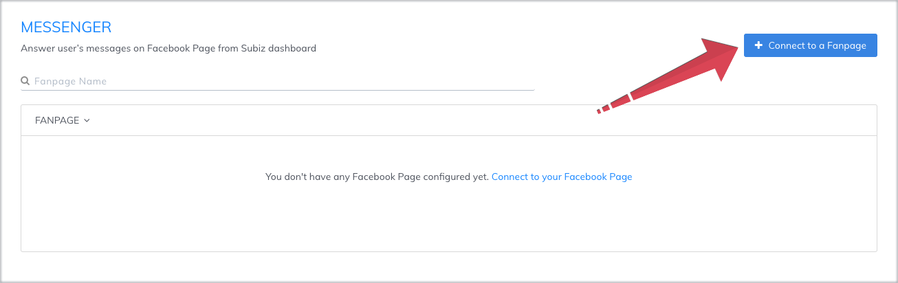
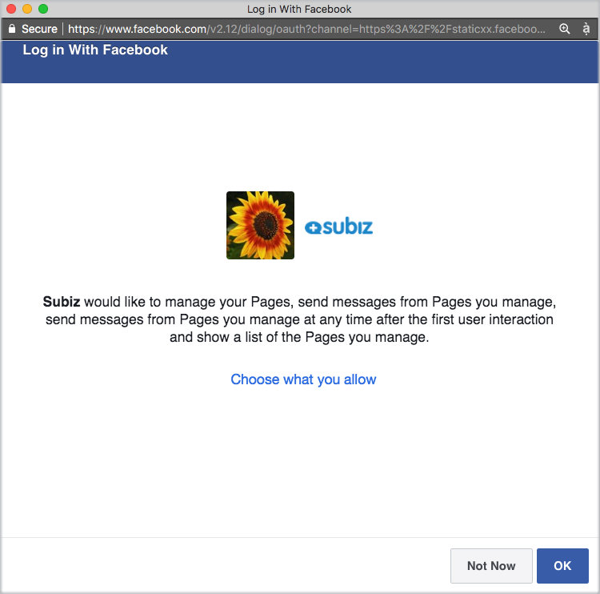
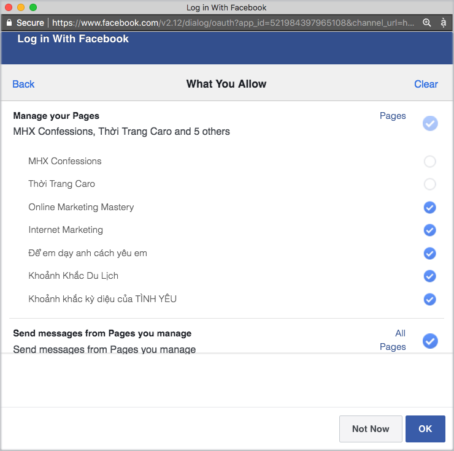
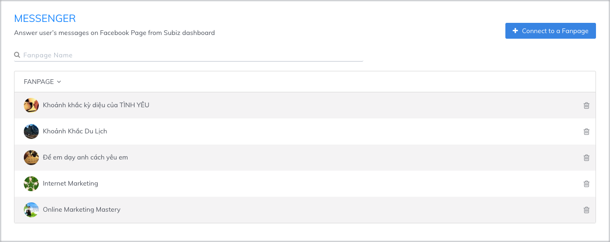
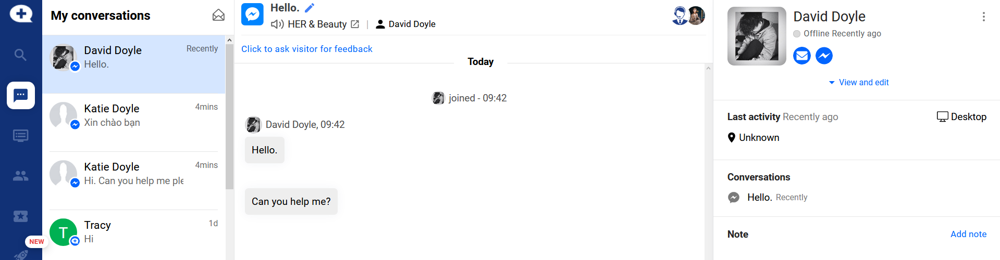
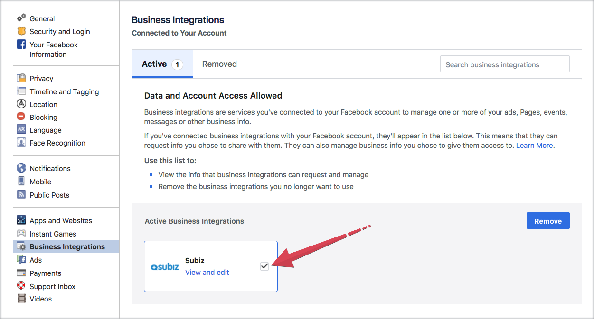
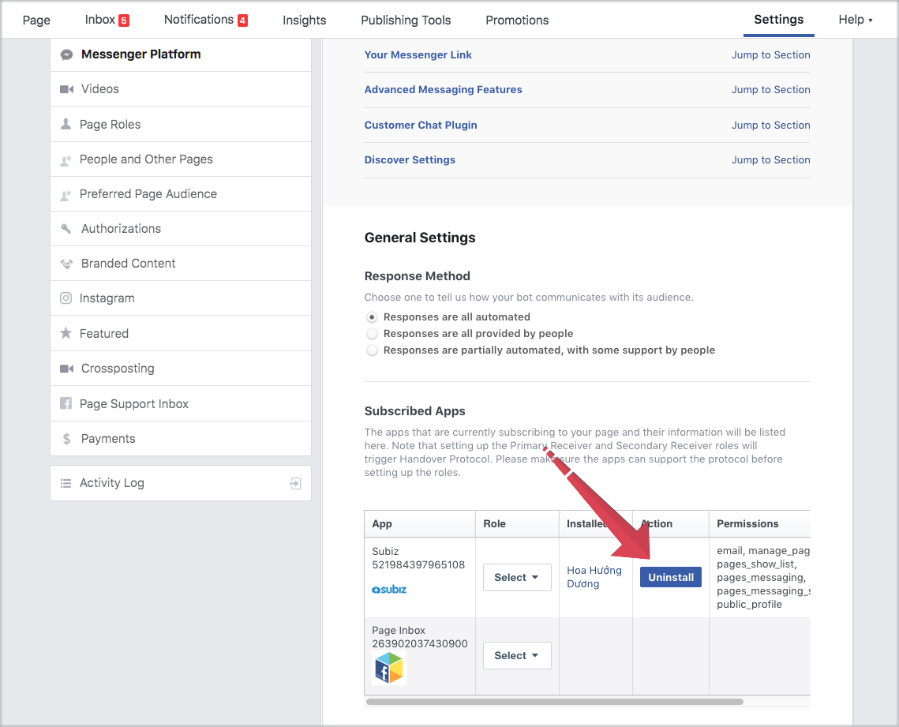

# Integrating Facebook Messenger with Subiz

Facebook Messenger is one of the channels of Subiz. After integrating Messenger with Subiz, you can receive and reply to messages from Fan Page\(s\) right on Subiz Dashboard..


Kindly note:

* You can add **multiple fan pages** to Subiz at the same time, which is convenient to reply to users’ messages and manage the data. 
* You can choose one or any fan pages to integrate with Subiz.


## 3 Steps to integrate Messenger with Subiz**:**

### **Step 1: Connect to a Fan page**

Login [App.subiz.com &gt; Settings &gt; Channels &gt; Messenger &gt; Connect to a Fan page](https://app.subiz.com/settings/messenger)

## Step 2: Login your Facebook account

Log in your Facebook account in which you are the admin of the fan pages.


Kindly Note: Only those who play the role as Admin, Moderator or Writer are allowed to connect to the Fan page with Subiz.


## Step 3: Choose the Fan page you want to integrate with Subiz

Subiz is allowed to manage your pages, send messages from your pages at any time since the first message and show the page lists you manage. 

You are granted to integrate some or all fan pages with Subiz:

* To connect all pages with Subiz, you just need to select OK

* To connect some out of your pages with Subiz, you click “Choose what you allow” &gt; All pages &gt; Tick the ones you want to integrate with Subiz &lt; then Save

#### Integrate Facebook messenger successfully

Once Messenger has been successfully integrated, the list of Fan Pages connected to Subiz will display as below:

## Some tips using Facebook Messenger on Subiz

### **1. How to receive and reply to messages from the Fan page.**

You will receive and reply to messages from the Fan page on the [**CONVERSATIONS**](https://app.subiz.com/convo).

Rapidly, you will see a couple of information including the first message, the fan page name and conversation history \(if have\).

See more at [Instruction of managing Facebook messenger on Subiz](https://help.subiz.com/bat-dau-voi-subiz/lam-viec-tren-subiz/quan-ly-tin-nhan-messenger-va-binh-luan-fanpage)

### 2. **Connect to a new Fanpage on Subiz**

To integrate more Fan pages with Subiz, you go to [Messenger](https://app.subiz.com/settings/messenger) Settings &gt; click **Connect to a fan page** &gt; **Continue** &gt; **Edit Settings** to select the fan pages connected to Subiz &gt; **Continue** to complete.

### **3. Remove Fan pages connected to Subiz**

You have 2 options to completely remove the fan pages which have been added to Subiz and you will no longer receive any new messages from those pages.  

Option 1: Remove Facebook page\(s\) from Subiz

Option 2: Remove Subiz from Facebook page

* Case 1: If you want to delete all Facebook Pages on Subiz, please follow these steps: 

   &gt; Log in your Facebook account 

   &gt; Settings &gt; click Business Integrations &gt; Remove Subiz.

* Case 2: If you just want to delete some the Fan pages on Subiz, please follow these steps: 

    &gt; Log in your Facebook account 

     &gt; Go to the Fan page you want to delete 

     &gt; Settings &gt; Messenger Platform 

     &gt; Uninstall Subiz &gt; Confirm

  

> Let's know if you have any questions or concerns. Chat online on [Subiz.com](https://subiz.com/vi/feature.html) or email to Support@Subiz.com.

