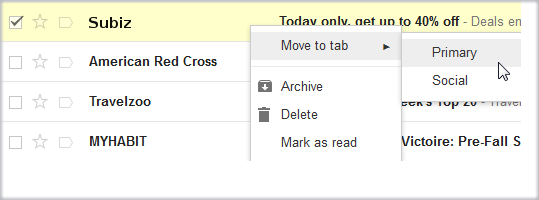

# I haven't received any Subiz Emails

Subiz uses the big messaging system \( [AWS SES](https://aws.amazon.com/ses/); [Sendgrid](https://sendgrid.com/); [Mailgun](https://www.mailgun.com/)\) to ensure consistency and send large amounts of emails throughout the day. For some reason you did not receive Subiz's email, you should follow the below instruction:

### Check your email box

Subiz email content can contain transactional chats. There are many words that can be related to price, quotation, etc., which make mail systems think that is promotional mail or spam. So check the Spam or Promotions.  
You should confirm that Email is not Spam to ensure next time you can receive emails from Subiz.

 If it is in Promotions, move it to the primary.

You should also note the email filters you create. Subiz emails may be moved to a separate category. Now you need to search for the keyword Subiz in the mailbox to determine its location.

Here are some common causes:

*  **Your domain is considered as spam**

Tools to check: [MxToolbox](https://mxtoolbox.com/blacklists.aspx). The solution is to contact the organization that lists your domain as Spam to ask them to remove.

* **Email does not exist**

* **Email server is not stable**

Your email server is not stable \([soft bounce](http://kb.mailchimp.com/delivery/deliverability-research/soft-vs-hard-bounces)\) and interrupt at the time Subiz send email to you. After 3 consecutive unsuccessful attempts, the system will stop sending to that email. To resolve this, you need to tell us to open it again and notify your email provider to ensure more stability.  
  
We recommend that if you have more than 30 chats per day, you should disable the chat history via email. It makes your mail are full of unread email. These chats have been saved by Subiz so that you can read at any time.

### Contact Subiz for support

After doing the above steps, you still do not see Subiz's email. So maybe it was not sent to your mailbox. Contact Subiz via email  [support@subiz.com](mailto:support@subiz.com) or the chat window at  [Subiz.com](https://subiz.com/vi/) for direct support.

