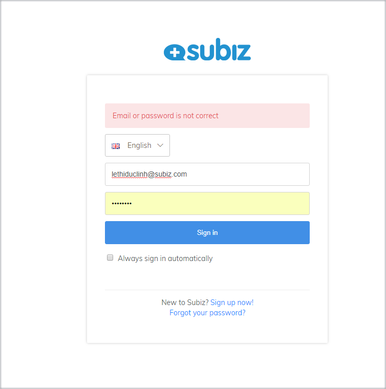
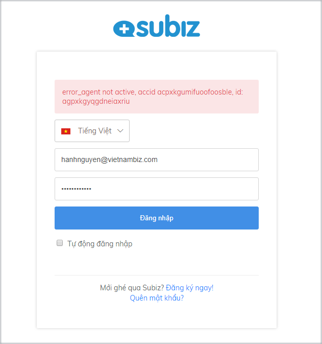
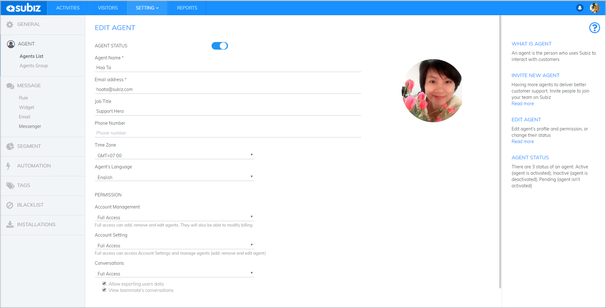
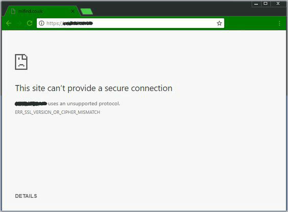

# Problems with Dashboard logging

 When [login Dashboard](https://app.subiz.com/login), you might face to some notifications about verifying your account information that prevents you logging successfully. In this article, [Subiz](https://subiz.com/en) will show you some cases and solutions.

### **Incorrect user or password**

**Cause:** You entered the wrong information Email or password.

**Solution:**

In this case, you have to check whether your [login](https://app.subiz.com/login) information such as email, username has been right or not?

If you are not sure about password, reset your password follow [instruction](https://docs.subiz.com/manage-password/#resetPassword)

### **The agent is Inactive**

**Cause:** Agent is inactive

**Solution:**

To active agent, you need to contact the owner or agent has permissions to set up account: [**Settings&gt; Account&gt; Agent list&gt; Select Agent and enable Active status**](https://app.subiz.com/settings/agents-list)\*\*\*\*

### **The agent has been suspended**

**If you are owner account**

Your account has been suspended automatically from Subiz system because you didn’t verify via [Subiz email](https://subiz.com/email.html) within 24 hours from the moment you signed up.

Subiz allows each email to register only one account in system. So, you have to [re-register ](https://dashboard.subiz.com/signup.html)by another email and remember to confirm your account via email.

**If you are not owner account**

Your account was deleted by administrator. You can contact them to add new agent for you from Dashboard.

Action:

**Dashboard &gt;&gt; Agent &gt;&gt; Invite Agent**


 Note that new agent has to be created by new email and new username


### Browser Error

One of the common browser errors is ERRERR\_SSL\_VERSION\_OR\_CIPHER\_MISMATCH, which will display an error when the system or browser can not establish a Dashboard Subiz connection.

**Causes:**

* Poor Internet Connection
* Browser Cache and Cookies are not cleared
* Needless Add-ons or Extensions are installed in browser
* Website blocked in Firewall
* The Website may be blocked or trashed in the antivirus program.

 **Solution:**

*  Check your internet connection
*  Delete Browser Cache and Cookies
*  Remove Needless Add-ons and Extensions
*  Whitelist website in Firewall and Antivirus Software
*  Enable TLS 1.3
*  Disable QUIC protocol

If you still cannot login after checking all case above, do not hesitate to send email to [support@subiz.com](mailto:support@subiz.com) for perfect support.

