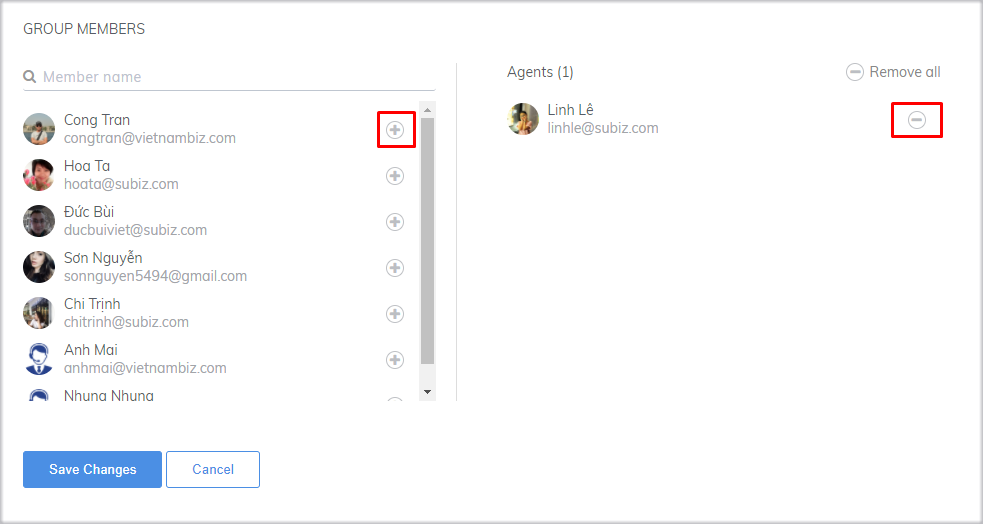

# New message notification settings

In the working time, the agent will have to use a lot of applications, therefore easy to miss the chat with customers from Subiz

Setting up new message notifications will help you display a small pop-up window at the corner of the screen \( including sound notifications\) and also notified when new messages arrive or any changes to your dashboard \(visitor access to the web, guest send chat request, etc.

### There are steps to set up new message notification

* Login account&gt; click on the avatar at the top right corner of the screen&gt; select **Notifications**.

* Select Send new message notification and Save

* After you click Save on the browser will pop-up request Allow new message display. You choose Allow

### Notes when setting up new message notifications on browsers

When you set up the new message notification, it is possible that the browser you are using has set a default blocking message, which you need to set to allow notifications from app.subiz.com.



Click the **Security button** \(1\) and select **Allow** \(2\) or Edit on **Site Settings** \(3\)


With new versions of Chrome and Coc Coc, there may have no a **new message alert tone**, because of which has turned off the automatic opening of Audio and Video. Please try to **log out** and **log back** into app.subiz.com.




Step 1: Access to Safari&gt; Preferences.

Step 2: Allow notification from app.subiz.com




Step 1: Remove Blocked

Step 2: Allow notification from app.subiz.com




