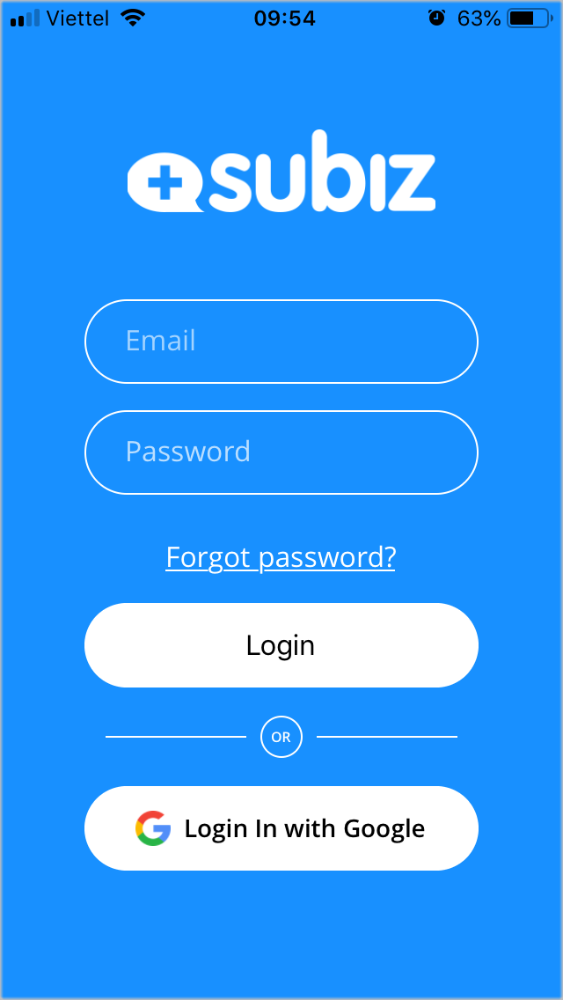
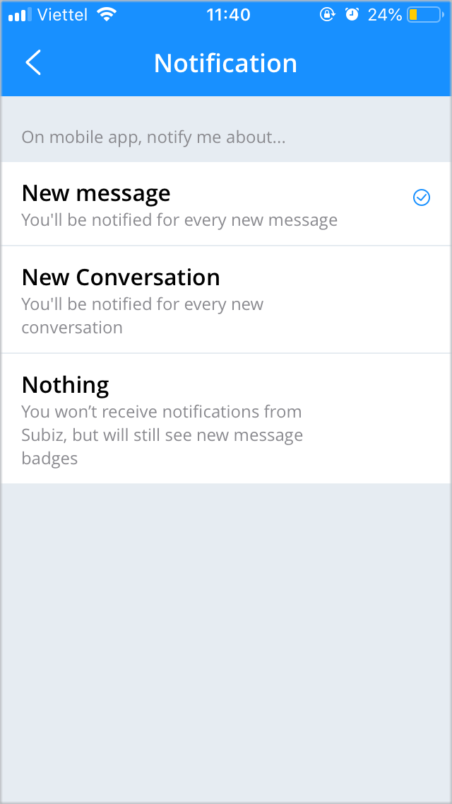
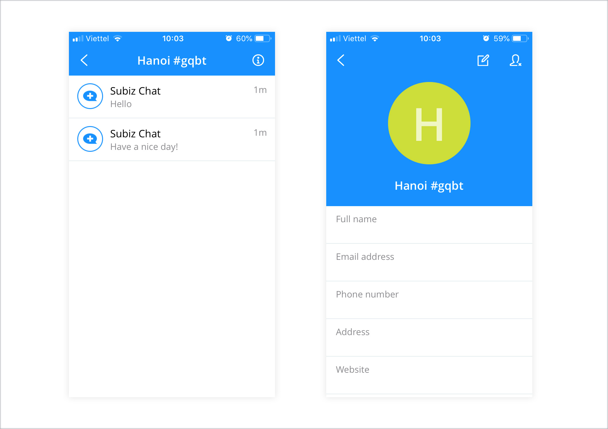

# Stay mobile with Subiz app

You can use Subiz to stay connected on such devices as iPhone, Android.

With Subiz app on your mobile phone, you will be able to instantly update your customers information and reply wherever you are. Anyone with a Subiz account can download and use Subiz app on the mobile phone for free.

### Install Subiz mobile app

To install and use Subiz app on your phone, choose your device and follow the link:

* **Google Play**:  [goo.gl/qo45Xr](https://goo.gl/qo45Xr)
* **App Store**:  [goo.gl/FnYbXg](https://goo.gl/FnYbXg)

Download Subiz app and sign in with your email and password.

### Some available features on Subiz app mobile

### 1. Set up Notification

Subiz notification help you stay on top of a new message or a new email of users.

Every new messages will be instantly notified on your phone screen. You will be in control of whenever there is a visitor willing to chat and respond in time without missing out on any customers interaction opportunities.

You can choose to receive Notification about a new message or a new conversation. Or if you are busy and just want to manage conversations and agents’ work, you can opt Nothing to not receive notification from Subiz.

### 2. Manage and customize user infomation

Users are who visit your website and connect you via Subiz.

The new user will be showed that the default name is City name + user code, Country. You can customize and update the user's information such as name, email address, phone number, etc. to easily search and manage later.

When you select a user, you will see list activities with users from many channels such as Subiz chat, Messenger, Email.

Besides, conversations with unread new messages will display red notification for you to identify and reply users.

### 3. Manage users segment

Users segment are groups of customers divided by certain criteria.

There are 3 default users segments for easy management of users lists and agents workflows.

* **My User**: A list of users who have conversation\(s\) and are assigned to you. Each individual agent will have a user List of your own.
* **Connected users**: A list of all user who have conversation\(s\)and are assigned to all agent\(s\). Managers will actively observe and monitor users list as well as how agents support users.
* **Unassigned conversions**: A list of users whose conversation\(s\) has not been assigned to any agent\(s\). Any agent can reply to this conversation and the user will be directed to the My users segment of that agent.

### Update the latest version of Subiz app

Subiz regularly updates the mobile app version to enhance the user experience and new features.

Also, Subiz has an update notification of new version when you sign in to the Subiz app on your mobile phone.

Or, you can actively find the latest version of the Subiz app by visiting the app store on your mobile phone \(e.g., App Store, Google Play\). From here, you can see what's new with the app and select to update latest version.  

> Let's know if you have any questions or concerns. Chat online on [Subiz.com](https://subiz.com/vi/feature.html) or email to Support@Subiz.com.

