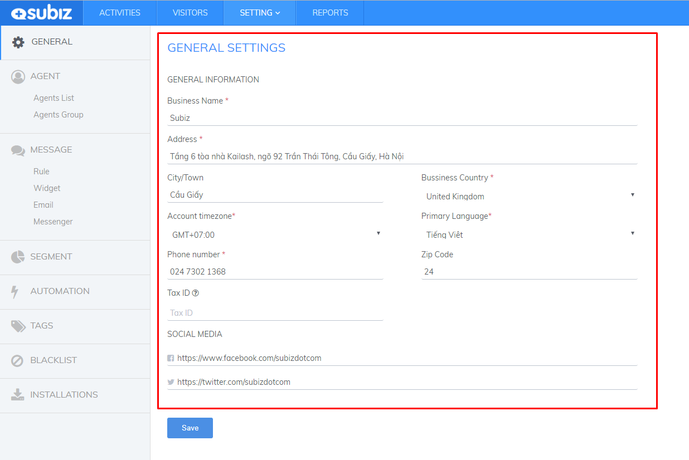

# Business information

**Business information is the basic information, helping** [**Subiz**](https://subiz.com/en) **to easy to contact and support you better.**

To provide and edit the basic information of your company, please [log into your Subiz account](https://app.subiz.com/login), go to [**Settings**&gt; **Accounts**&gt; **General settings**](https://app.subiz.com/settings/). 

After that, please fill in the Business’s information below:

* **Business Name:** The brand name of the business
* **Address:** Business address
* **City / Town:** Enterprise City is located
* **National:** National enterprises are doing business
* **Time Zone:** The business time zone, which helps the system determine the business time frame
* **Primary language:** The primary language of the account, which is automatically defined when the account holder subscribes to [Subiz](https://subiz.com/en). Help [Subiz](https://subiz.com/en) determine the language of the email sent to the business
* **Phone number:** Business contact phone number
* **Zip Code:**  The postal code of the locality of the business
* **Tax ID:** The tax code of the enterprise
* **Social Network:** Enter links that associate to your social networking sites.

After filling in the information, click **Save** to save changes.

