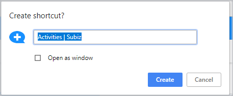
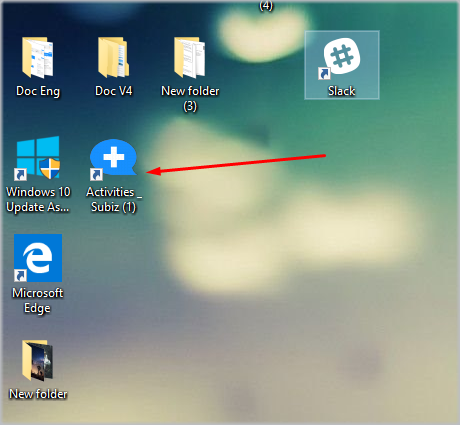
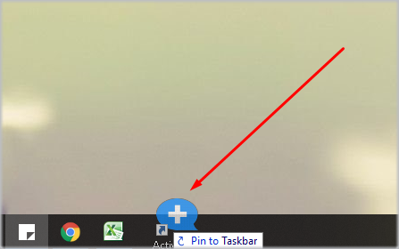

# Utilizing App Subiz

### Create App Subiz on Desktop

Everyday agents need to log in their Subiz account to manage their interaction and support their customers. Instead of having to sign up their account on [App.subiz.com](https://app.subiz.com), Agents can create App Subiz on their desktop so that they can sign up quickly.  
First of all, you need to login to your Subiz account at[ App.subiz.com ](https://app.subiz.com)on your browser, then create a Subiz app as follow:

On the Chrome browser, click the three dots icon on the right side of the screen, then select **More tool&gt; Create Shortcut**

Then, the computer screen will display a dialog to confirm, just click on Create

Your desktop will display the app Subiz as follows:

For convenience, you can pin the Subiz App to the Taskbar at the bottom of your desktop by right-clicking on the Subiz app and dragging down the Taskbar:

From now on, you just need to click on the Subiz icon to quickly login and interact with customers.

### Utilizing Mobile App

For the convenience of receiving new message notifications, interacting with customers and being online often, you can completely use the Subiz App on your phone.  
  
You visit the mobile app store and search for App Subiz, then download and sign in with your Subiz login account. Besides,you can download directly at the following link:

* **Google Play:** [goo.gl/qo45Xr](https://goo.gl/qo45Xr)​
* **App Store:** [goo.gl/FnYbXg](https://goo.gl/FnYbXg)​

