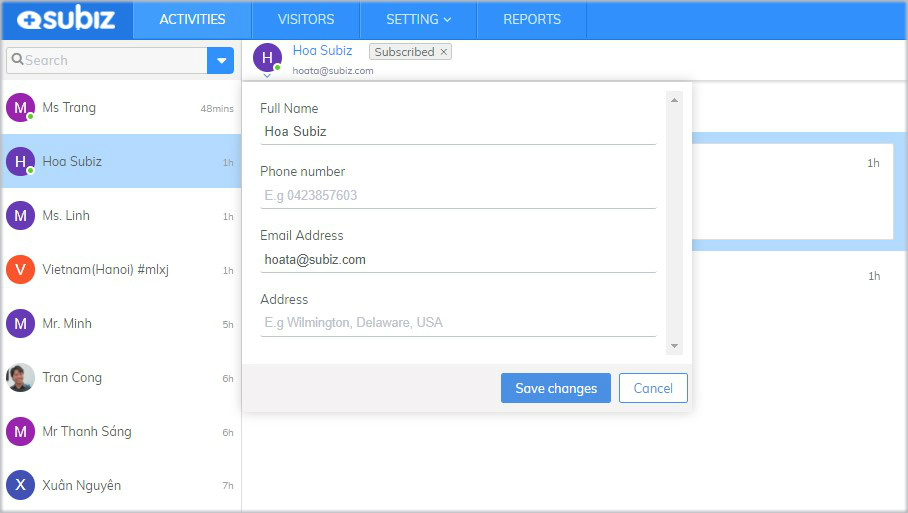
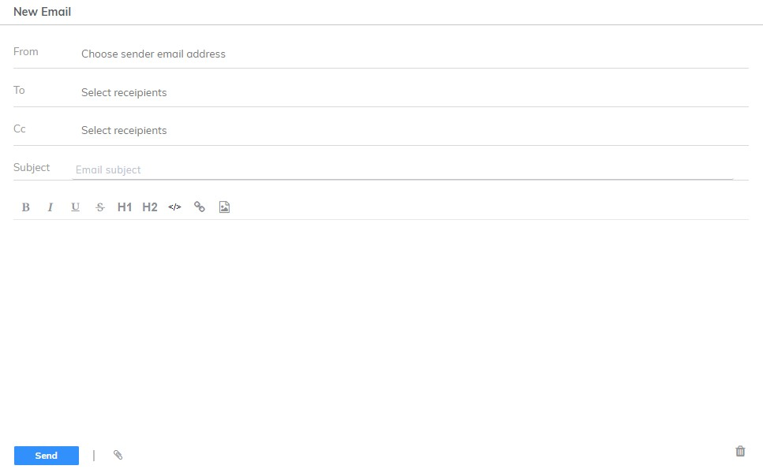
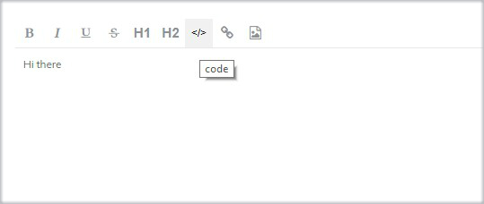
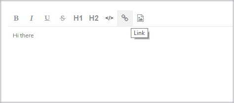

# Working on Subiz

**Once Email forwarding settings is enabled, you can read income email and reply directly to your leads from app.Subiz.com.**

### How to send email to user

The User email must be updated in User Information, then you will be able to proactively send a email to user \(create a new conversation on Email channel\)



Choose **User** &gt; Click **New Conversation** &gt; Choose **Email**




Email opens &gt; Choose email address **From, To, CC** &gt; **Add Subject** &gt; **Enter message** &gt; Click **Send**




### **How to reply user’s email**

On **LIST ACTIVITIES** of User, you will know Email conversation via Icon Email and Email Subject  

To reply to a single email: select **Email unread** &gt; click **Reply button** &gt; **Type message** &gt; Click **Send**  

### **Some Useful Functions On Subiz Email**

1.**Support HTML Email**

   **2. Customize the text font**

   **3**. **Insert the link directly into the text or image**

   **4. Attach a document or image file**

   **5. Tag Email conversation**

