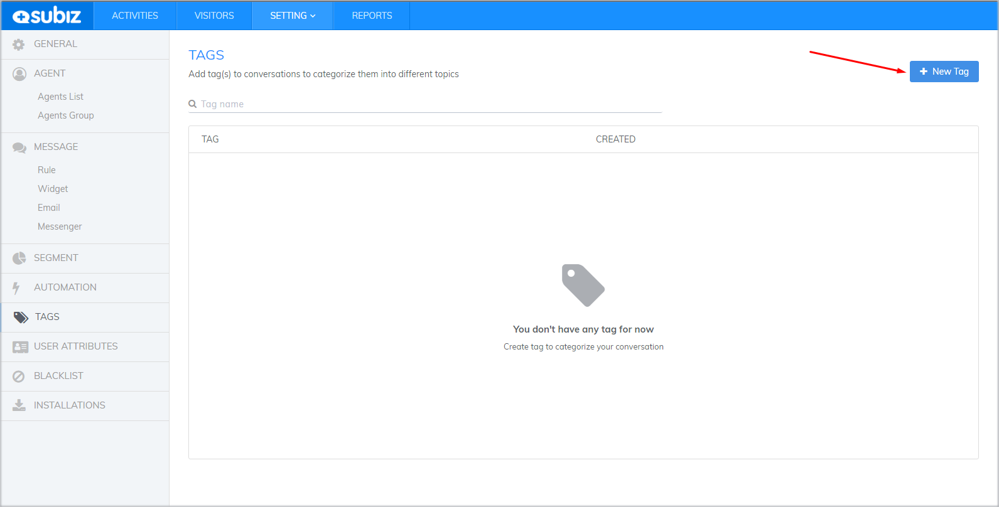
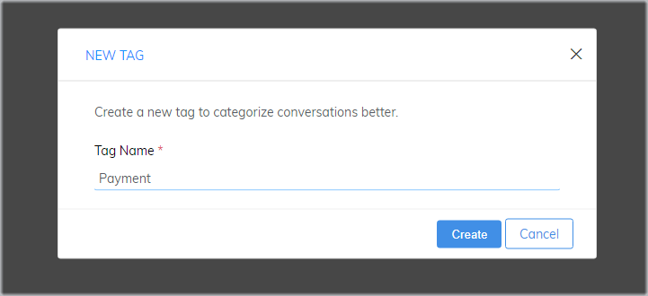
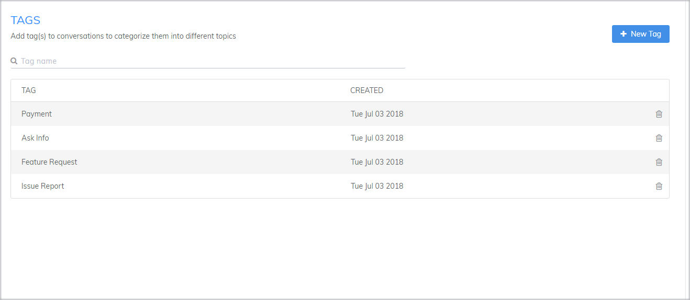
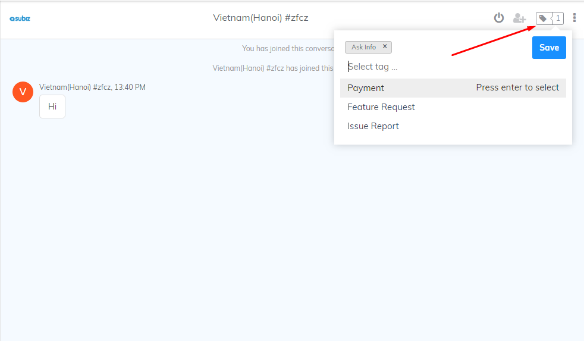
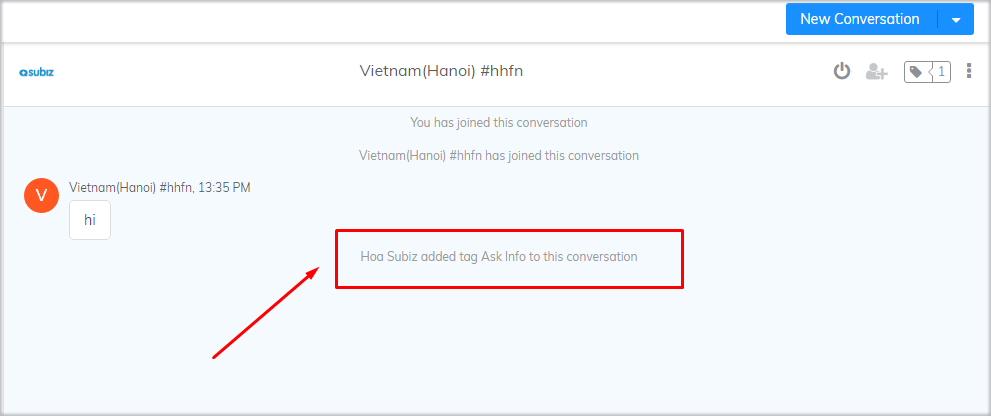

# Add Tags to a conversation

Subiz Tag is a feature that enables Agents to add Tags to a conversation, which help them to manage, follow and classify all conversations.

This instruction will help agent know how to create and utilize this feature.

### Create a new Tag

To create a new Tag, go to[ Setting &gt; Account &gt; Tag &gt; New Tag](https://app.subiz.com/settings/tags)

Agents can Add more Tags to classify conversations efficiently.

Tags are displayed in the Tag list as follow:

### Add a Tag

In a conversation, to add a tag, Agent click to the Tag symbol, select a Tag in the Tag list and save

After successfully tagging, the bottom of the conversation will display the following message:


**Notes:**

* Agents can  add Tags to a conversation in all channels
* Agent can add more than one Tag in a conversation
* Agent can tag even when the conversation is ended


### Remove a Tag

To remove a Tag, click on "x " symbol of the selected Tag and save

### Tag Report

Agent can count the number of tags according to channel, time, Tag name ... in Reports

To manage Tags efficiently, you can read more on [Tag report Instruction  ](https://help-en.subiz.com/~/edit/drafts/-LGTMe3kWcd8O8J6yyVR/general-reports#tags-statistics)

