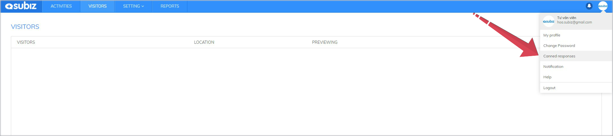
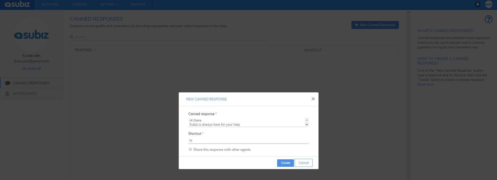
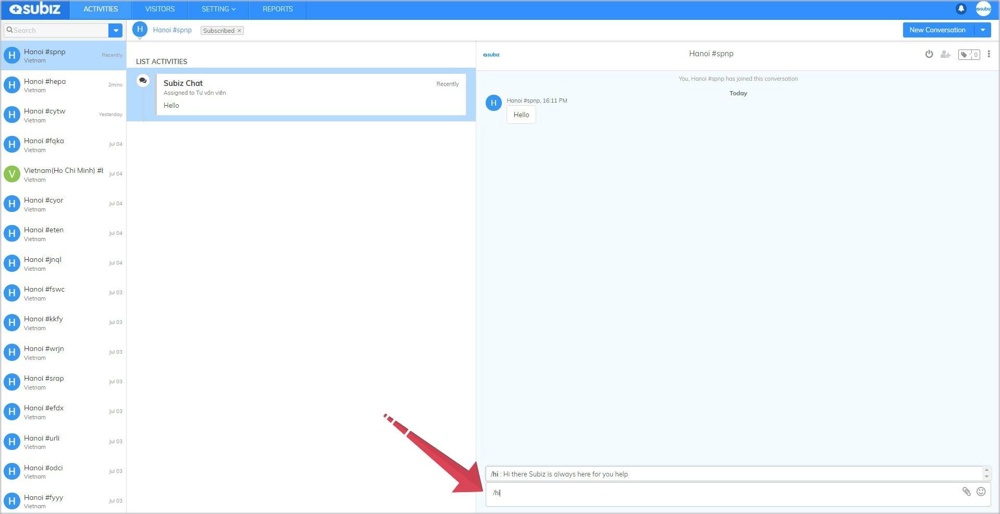
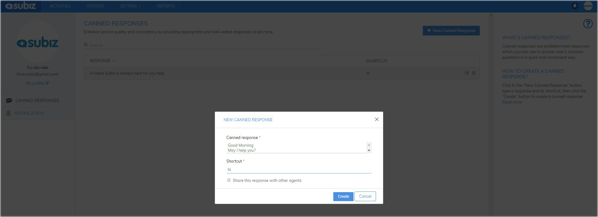
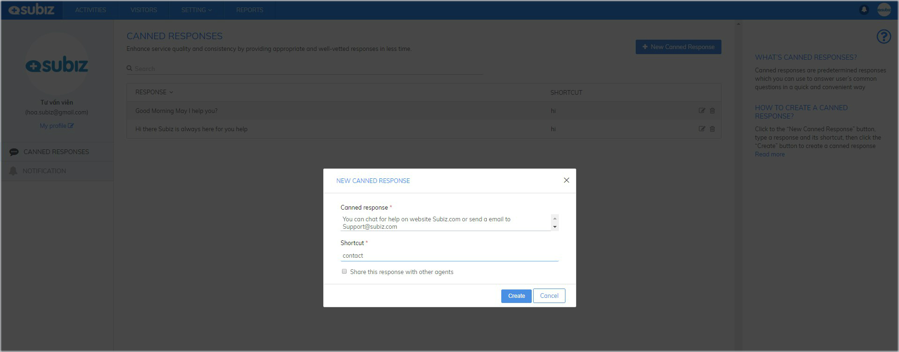
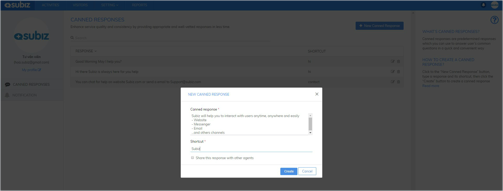
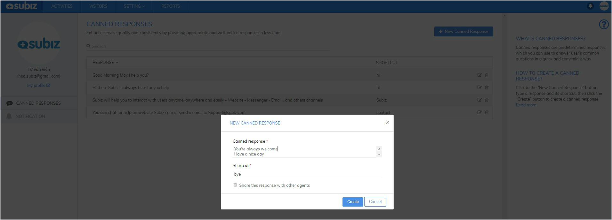
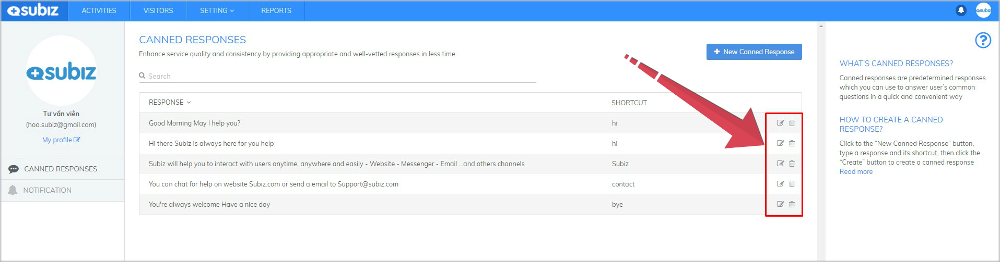

# Canned responses

Canned responses is a set of ready-made messages that are created by you. By using a shortcut to send this ready-made message, you’ll speed up your response time to many users efficiently.

Each Agent is allowed to create and manage canned responses of your account.

### **Create a new canned response**

**Step 1:**[ **Log in App.subiz.com &gt; Select agent's avatar &gt; Select Canned responses**](https://app.subiz.com/profile/canned-response)**​**

**Step 2:** Select New Canned Response &gt; Fill a canned response with a shortcut &gt; Create

### **Reply with a canned response**

In conversation box, start with  "**/**" + “**Shortcut**” &gt; select canned response &gt; Enter

### **Some tips for using canned responses**

**1.Use easy-to-remember shortcuts**

Canned responses are often used in certain cases such as greetings, thanks, quotes a price, request to wait, promotional information, contact information.

Create short and easy-to-remember shortcuts that make it easy for you to use when needed.

**2. Create a straight-to-the-point canned response**

Users always want you to solve their problems as quickly as you can. Please send them short answer that is straight to the point.

**3. Do line break in a canned response**

One canned response can be divided into several lines to help users easily see and read.

To break down a line, let ENTER

**4. Keep canned responses personalized**

Even when you're using a canned response, it's always a good idea to add a short personalized note at the beginning or end of the message to stay connected to your users.

**5. Regularly update canned responses**

Changes to development. With each canned response, you can edit and renew it better to deliver to your users.

  
  

  
  
  
  

