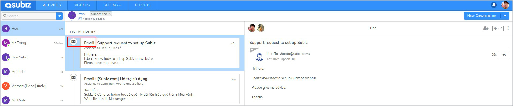
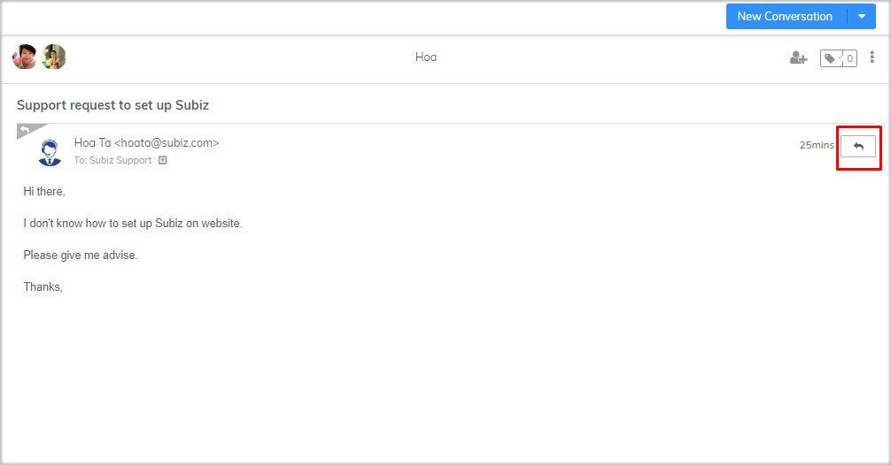
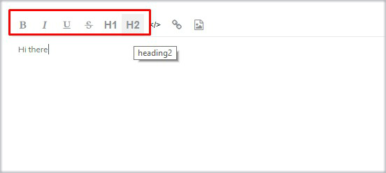
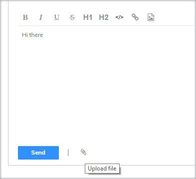
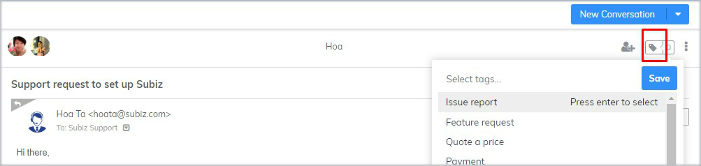

# Interact on Email

**Once Email forwarding settings is enabled, you can read income email and reply directly to your leads from app.Subiz.com.**

### How to send email to user {#how-to-send-email-to-user}

 You will be able to proactively send a email to user \(create a new conversation on Email channel\) as the following guide:



Choose **User** &gt; Fill **Email Address** &gt; **Save changes**




Choose **User** &gt; Click **New Conversation** &gt; Choose **Email**




Email box opens &gt; Choose email address **From, To, CC** &gt; **Add Subject** &gt; **Enter message** &gt; Click **Send**




### **How to reply user’s email** {#how-to-reply-users-email}

On **LIST ACTIVITIES** of User, you will know Email conversation via Icon Email and Email Subject

To reply to a single email: select **Email unread** &gt; click **Reply button** &gt; **Type message** &gt; Click **Send**

### **Some Useful Functions On Subiz Email** {#some-useful-functions-on-subiz-email}

**1.Support HTML Email**

 **2. Customize the text font**

 **3**. **Insert the link directly into the text or image**

 **4. Attach a document or image file**

 **5. Tag Email conversation**

Subiz Tag allows you to add tags for each conversation, which makes it easy for agents to categorize and manage customers interactions.

How to add tag to Email Conversation: Click **Tag button** &gt; Select **Tag name** &gt; **Save**


Note: See more Tag Setting [at this link](https://subiz.gitbook.io/subiz-document-english/getting-started-with-subiz/working-on-subiz/interact-on-subiz-chat#tag-conversation)


