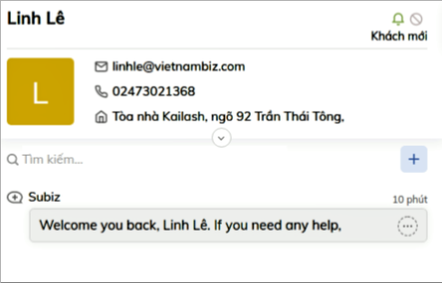
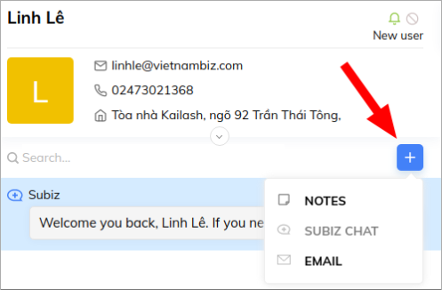

# Interact on Email

Customers interact with you via Subiz and leave their information so that you can send them more models, price lists, promotion policy or company's profile through emails. Instead of log in Gmail to send email to customers, now you can integrate email on Subiz so that you are able to receive and send emails right on Subiz dashboard. As a result, you can completely  follow the transaction history with customers and take a limit on managing information in too many tools.

This instruction will help you to dig deeper on how to work on Email channel.

First of all, don't forget to integrate your email on Subiz : [Click here](https://help-en.subiz.com/getting-started-with-subiz/setting-up-interaction-environments/integrating-email-on-subiz)

### How to send [email](https://subiz.com/email.html) to user 

To send email to users, first of all, you need to fulfill user information with email address on your dashboard. Email addresses can be selected while chatting with users or by using Automation capture leads \( [click here](https://help-en.subiz.com/optimise-the-use-of-subiz/how-to-enhance-interactions/some-common-automations/capture-leads) \)

You can send emails to users by 2 steps as follow:

1. **Create a new conversation on Email channel​**
2. **Compose a new Email to User**



To send email to user, you click to the icon " + " and select Email channel:




Then you import information as follow:

1. **From**: Select send email
2. **To**: Select receive emails.  You can import more than one email addresses.
3. **Cc:** Select CC email \( if needed \)
4. **Subject**
5. **Compose email content** and select **Send** 




### **How to reply user’s** [**email**](https://subiz.com/email.html)\*\*\*\* 

To reply user's email, you take a look at list activities and click at icon email. 

A conversation on email channel is designed as on other channels so that you can easily reply and have an overview of all emails.

### Some useful functions on email channel

**1. Customize the text font:** You can highlight, italicize, underline texts, attach direct link to text, download images

 **2**. **Attach files**

 **3. Attach emoji**

**4. Email  Templates**

This is an extremely useful function on Subiz that saves you time in customer feedback. You can create a list of email templates to respond to customer requirements such as price lists, business profiles, thank you letters ... so that you can quickly send to customers.

To create email templates you can read more : [Here](https://help-en.subiz.com/getting-started-with-subiz/working-on-subiz/message-template)

 **5. Add tags to email conversations**

Subiz tag allows you to add tags for each conversation, which makes it easy for agents to categorize and manage customers interactions.

[Click here ](https://help-en.subiz.com/getting-started-with-subiz/working-on-subiz/add-tags-to-a-conversation)to read more about Subiz tags

 **6. Add tickets to email conversations**

With the use of the Ticket function, you can easily track the processing as well as the status of transactions with customers.

You can read more about Ticket : [here ](https://help-en.subiz.com/getting-started-with-subiz/working-on-subiz/ticket-for-professional-customer-service-on-subiz)

**7. Add Agents to email conversations**

In case you can't be in charge of dealing with customers and want to add colleagues to support you, you can add an agent so that he or she can join this conversation.

**8. Tittle of email conversations**

Composing ****a title for the email conversation will help you easily get an overview of the issue you are talking to. In case you and your customers have exchanged many different issues on email, this function will also help you to observe and quickly find conversations without clicking on each email.

