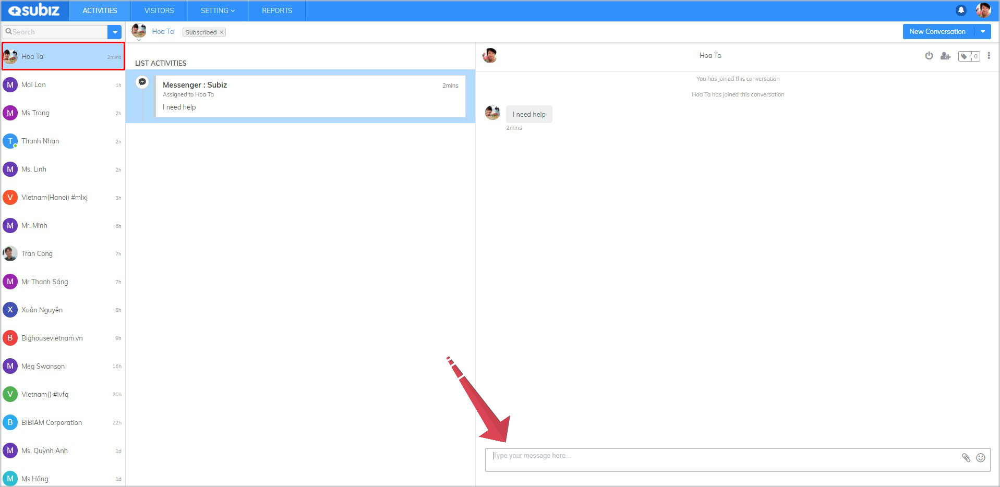

# Interact on Messenger

After successfully  finishing **Facebook Messenger integration**, you will easily answer messages on Fanpage Facebook from App.subiz.com

On **LIST ACTIVITIES**, Subiz will display the Messenger and Fanpage name, helping you to identify where user is from.  


Note: With Messenger channel, only when your Fanpage user proactively sends messages first, you \(Agent Subiz\) can reply messages and then create a new Messenger conversation.


### **How to Interact on Subiz Messnger**



To reply to a new income message from a user: Select **User** &gt; Click **unread message** &gt; Chat window opens and type messages here




End the conversation after supporting User: Select **End Chat** button &gt; Confirm **End** button




Select **User** &gt; Select **New Conversation**&gt; Select **Messenger** &gt; Select **Fanpage name** &gt; Chat window opens and type message here




### **Some useful functions on Subiz Messenger**

### 1. Manage multi-Fanpage on Subiz app

When you are an administrator of several fanpages, Subiz will help you easily interact and effectively manage users on each page.

### 2. **Use canned responses**

Canned responses is a set of ready-made messages templates that helps you to reply your customers quickly and efficiently.

To reply messages with canned responses, type “**/shortcut**” in the chat box and hit **Enter**


Note: Each Agent is allowed to create and manage their own canned responses. [See how to create Canned Response.](https://subiz.gitbook.io/subiz-document-english/~/edit/primary/getting-started-with-subiz/working-on-subiz/interact-on-subiz-chat#use-canned-responses)


