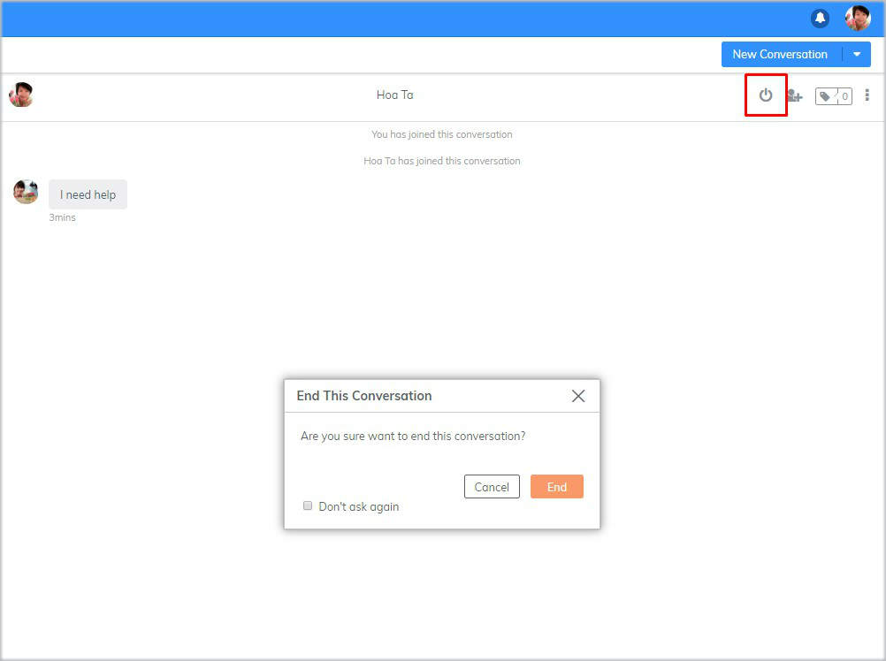
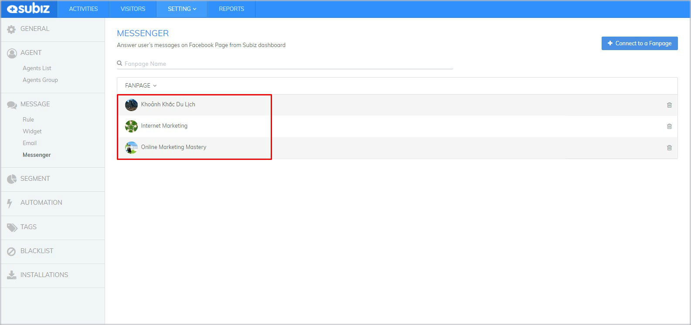
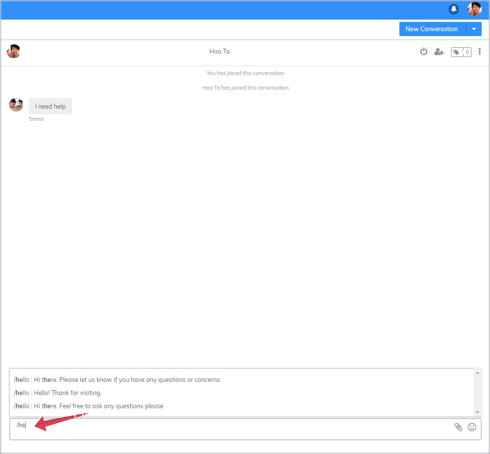
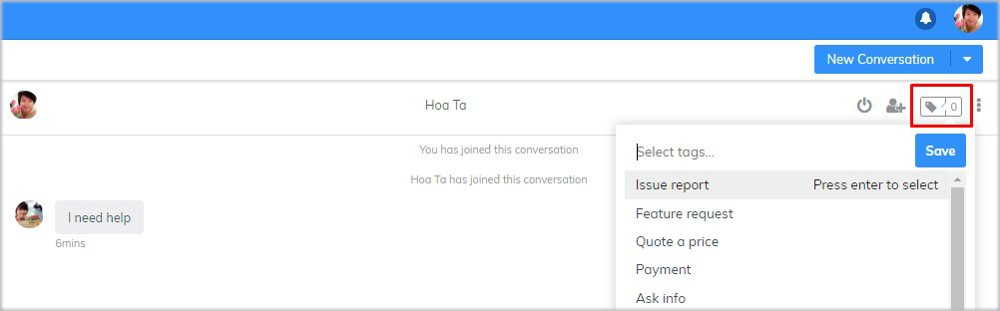
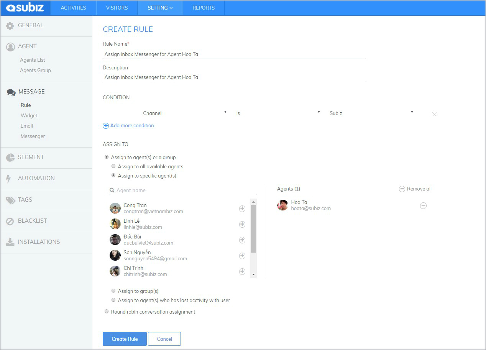
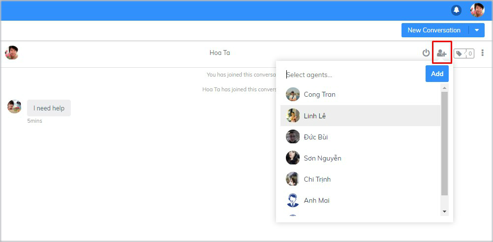
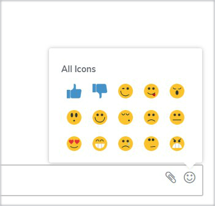

# Interact on Messenger

After successfully  finishing [**Facebook Messenger integration**](https://subiz.gitbook.io/subiz-document-english/~/edit/primary/getting-started-with-subiz/setting-up-interaction-environments/integrating-fanpage-facebook-on-subiz), you will easily answer messages on [Fanpage Facebook](https://subiz.com/facebook-messenger.html) from [App.subiz.com](https://app.subiz.com)

On **LIST ACTIVITIES**, [Subiz ](https://subiz.com/en)will display the [Messenger ](https://subiz.com/facebook-messenger.html)and [Fanpage](https://subiz.com/facebook-messenger.html) name, helping you to identify where user is from.


With[ Messenger ](https://subiz.com/facebook-messenger.html)channel, only when your [Fanpage](https://subiz.com/facebook-messenger.html) user proactively sends messages first, you \(Agent[ Subiz](https://subiz.com/en)\) can reply messages and then create a new [Messenger](https://subiz.com/facebook-messenger.html) conversation.


### **How to Interact on** [**Subiz Messenger**](https://subiz.com/facebook-messenger.html)\*\*\*\*



To reply to a new income message from a user: Select **User** &gt; Click **unread message** &gt; **Chat window opens and type messages here**




End the conversation after supporting User: Select **End Chat** button &gt; Confirm **End**




Select **User** &gt; Select **New Conversation**&gt; Select **Messenger** &gt; Select [**Fanpage** ](https://subiz.com/facebook-messenger.html)**name** &gt; **Chat window opens and type message here**




### **Some useful functions on** [**Subiz Messenger**](https://subiz.com/facebook-messenger.html)\*\*\*\*

#### 1. Manage [multi-Fanpages](https://subiz.com/facebook-messenger.html) on [Subiz app](https://app.subiz.com)

When you are an administrator of several [fanpages](https://subiz.com/facebook-messenger.html), [Subiz ](https://subiz.com/en)will help you easily interact and effectively manage users on each page.

#### 2. **Use canned responses**

Canned responses is a set of ready-made messages templates that helps you to reply your customers quickly and efficiently.

To reply messages with canned responses, type “**/shortcut**” in the chat box and hit **Enter**


Each Agent is allowed to create and manage their own canned responses. [See how to create Canned Response.](https://subiz.gitbook.io/subiz-document-english/~/edit/primary/getting-started-with-subiz/working-on-subiz/interact-on-subiz-chat#use-canned-responses)


#### **3. Tag Messenger Conversation** 

[Subiz](https://subiz.com/en) Tag allows you to add tags for each conversation, which makes it easy for agents to categorize and manage customers interactions.

How to add tag to [Messenger](https://subiz.com/facebook-messenger.html) ****Conversation: Click **Tag** _**button**_ &gt; Select **Tag name** &gt; **Save**


See more Tag Setting [at this link](https://subiz.gitbook.io/subiz-document-english/getting-started-with-subiz/working-on-subiz/interact-on-subiz-chat#tag-conversation)


#### **4. Rule automatically assigns conversation**

Rule is used to automatically assign conversations to a specific Agent or Agent group.

How to create Rule that will assign [Messenger](https://subiz.com/facebook-messenger.html) conversation to one Agent: [**SETTING** &gt; **ACCOUNT** &gt;  **Rule**&gt;       **New Rule**](https://app.subiz.com/settings/rule-setting) &gt; **Fill information as shown in the image** &gt; Click **Creat Rule**

#### 5. **Add Agent to join the conversation**

When you need to involve a teammate in a conversation, you can add Agent to join the conversation and support user.

To Add Agent: Click the **Add Agent** button &gt; Choose **Agent** &gt; Click **Add**


Only assigned agent can add another Agent to the conversation.


#### 6. **Use emoji icon and upload file**

In the chat box, you can choose to send **Emoji icon** or **Upload file**

