# Interact on Subiz Chat

**Interaction on the Subiz Chat channel is to initiate a conversation between Agent and website visitors.** They are customers who are interested in learning about your products, services and Business information.

You need to sign up for [App.subiz.com](https://app.subiz.com) to start online and be ready to chat with your customers.

### Start new conversation

There are 2 ways to have a conversation with visitors:

1. **When Visitor starts a new conversation.**
2. **When Agent starts a new conversation.**



**When Visitor starts a new conversation**

Once you integrate Subiz, visitors can get in touch to ask you questions via Subiz chat widget

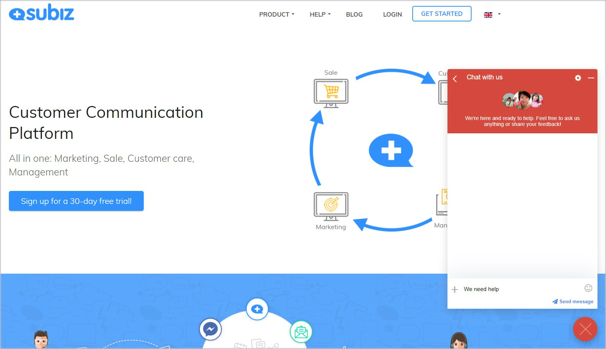

To read and reply to new messages: Click  **ACTIVITIES** tab &gt; Choose **User with unread message** &gt; **Chat window opens to read and reply**

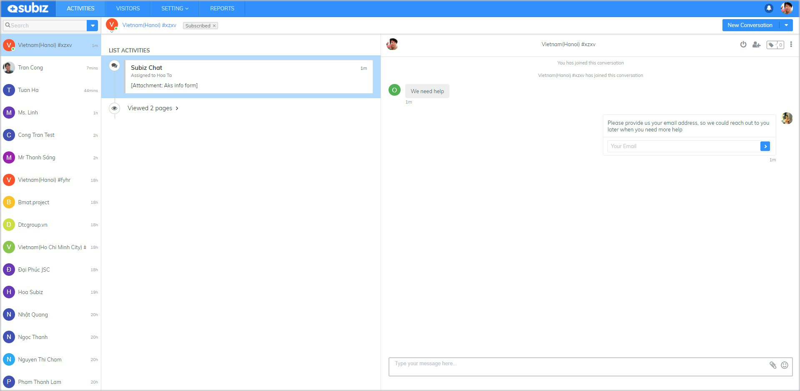


If you do not receive a message from a visitor, review [RULE setting](https://subiz.gitbook.io/subiz-document-english/~/edit/primary/getting-started-with-subiz/how-to-use-subiz/distributing-conversations/rule-distributing-conversations) to automatically assign new messages to you \(Agent\).




Look on tab VISITORS to see what visitors are interested in and then proactively interact with them.

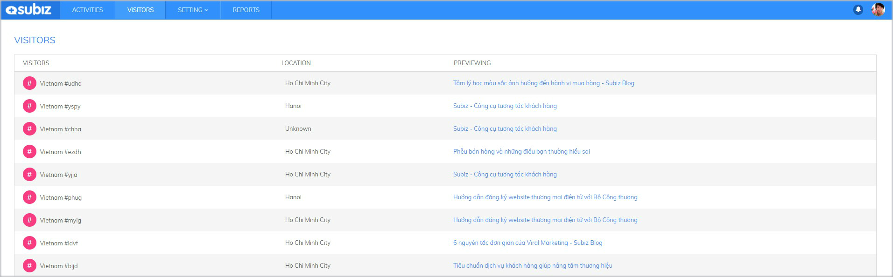

To create a new conversation with a website visitor, follow these steps:

1. Go to tab  VISITORS &gt; Choose a Website Vistor
2. Click  New Conversation &gt; Choose Subiz Chat
3. Chat widget opens and type messages here.

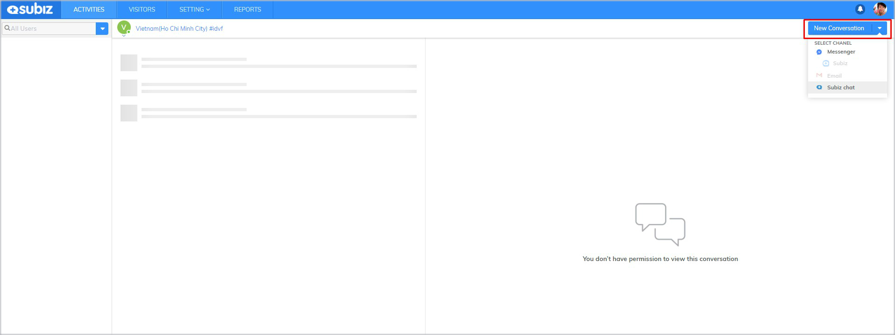



When a visitor or user sends a new message, you will be notified through desktop notification at the right bottom of your screen and sound notification.

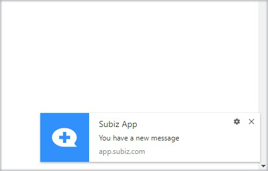


When not receiving the notification, please set up your web browser to allow [Subiz of sound and screen notification.](https://subiz.gitbook.io/subiz-document-english/~/edit/primary/getting-started-with-subiz/setting-up-interaction-environments/optimizing-interactive-channels/managing-business-profiles-business-profile-setting/new-message-notification-settings)


### **Add Agent to join the conversation**

When you need to involve a teammate in a conversation, you can add Agent to join the conversation and support user.

To Add Agent: Click **Add Agent** button &gt; Choose **Agent** &gt; Click **Add**

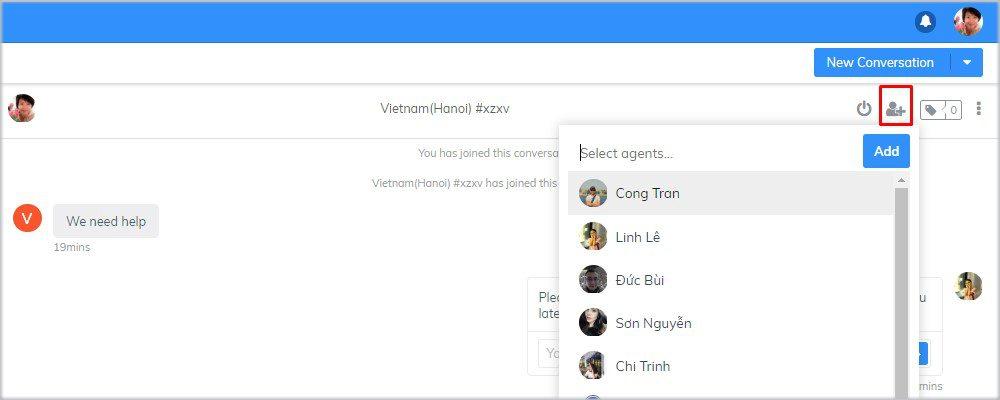


**Note:** Only assigned agent can add another agent to the conversation.


### **Use canned responses**

Canned responses is a set of ready-made messages templates that helps you to reply your customers quickly and efficiently.  
Each Agent is allowed to create and manage their own canned responses



Sample response creation guide:

1. Login **App.subiz.com** &gt; Click **Agent Avatar** at the top right of your screen &gt; Select **Canned Responses**

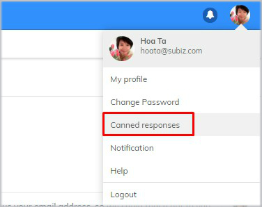

    2. Select **New Canned Response** &gt;  Type **message template** and **Shortcut** &gt; Click **Create** to finish.

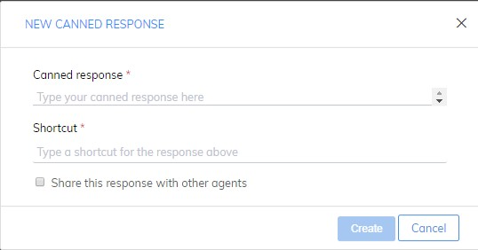


You can check box "**Share this response with other agents**” so that other agents can use this canned response.




**Manual answer library:** To reply with canned responses, type **“shortcut”** in the chat box and **press enter.**

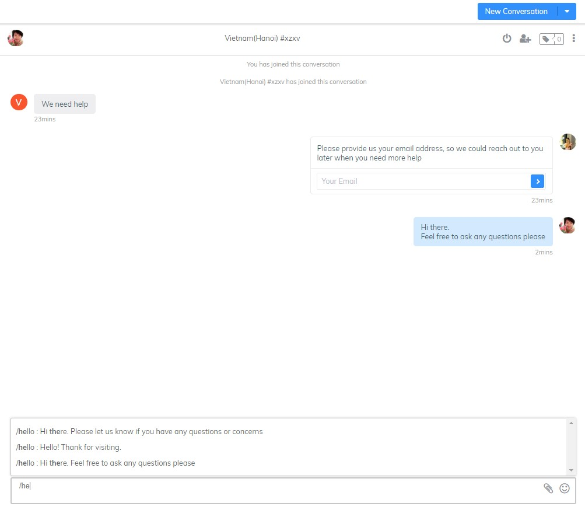



### **Use emoji icon and upload file**

In the chat box, you can choose to send **Emoji icon** or **Upload file.**

### Tag Conversation

Subiz Tag allows you to add tags for each conversation, which makes it easy for agents to categorize and manage users interactions.



1. Go to **Setting**&gt; **Account**&gt; **Tag** &gt;  click **New Tag**

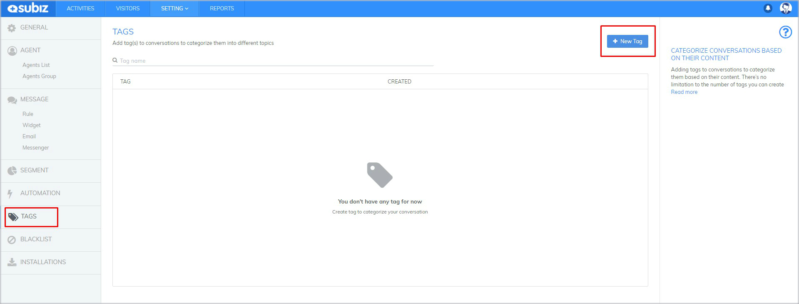

   2.  ****Fill **Tag Name** &gt; click **Create**

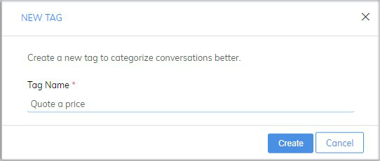



Click **Tag** button &gt; Select **Tag name** &gt; **Save**




Simply click \(**X**\) icon on the **Tags** to remove them from a conversation.

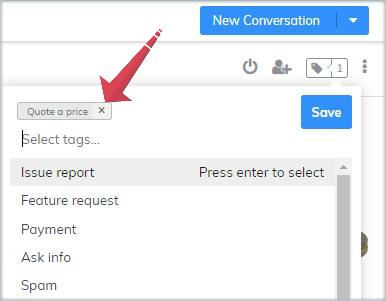



### **End the conversation**

A conversation will be ended by **Visitor** or **Agent.**



**Agent:** Click **End Chat** button  &gt; Confirm **END** to end this conversation. Visitor will receive a notification that the agent has finished the conversation.

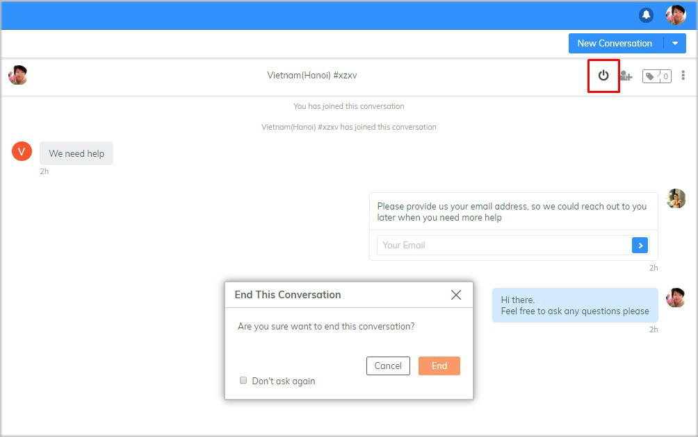


User and Agent will receive a notification of ending conversation. The chat box  will be grayed out and can not be typed. To continue chatting, you need to create a new conversation.


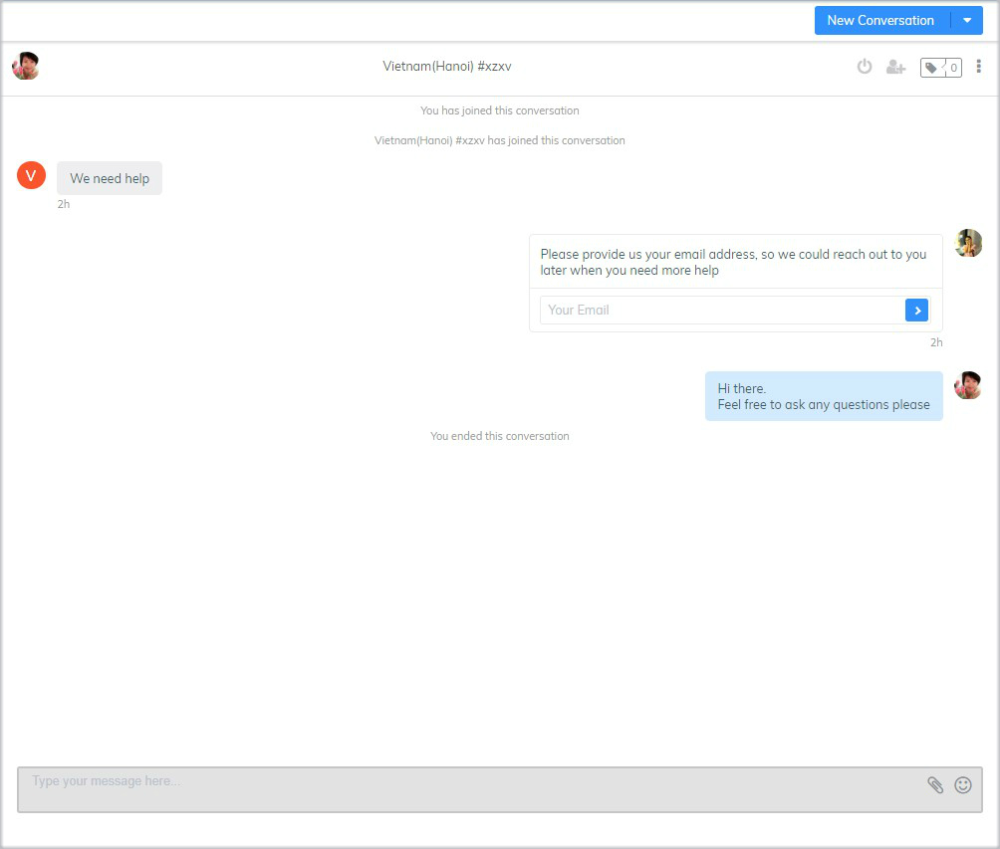



Click “**+**” icon on Subiz widget  &gt; Select **End Chat**

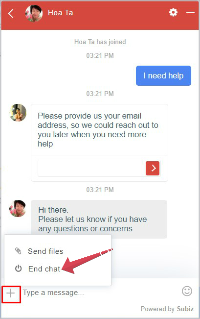



### **Block user**

Agent can block one user as follows: On chat window, select **Block button** &gt; turn **ON** Block this person

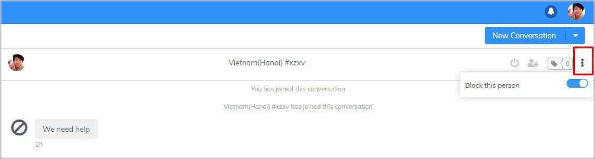


When selecting "**Block this person**" function:

* Blocked user has a slash avatar.
* With the Subiz Chat channel, user cann't see the Subiz chat widget on website.
* With the Email Channel, incoming email of user will not show to the Agent Inbox.
* With the Messenger channel, user's messages are not visible to the Agent on app.subiz.com. But user's messages still display on Fanpage Messenger.


