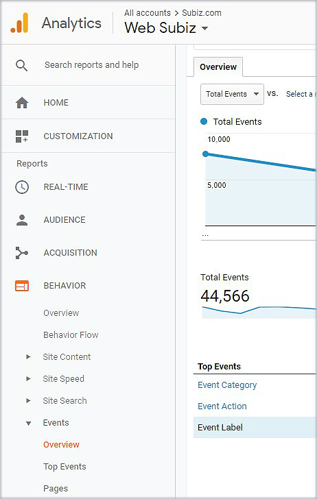
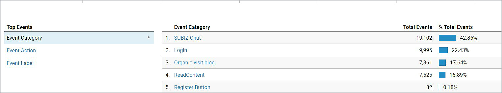
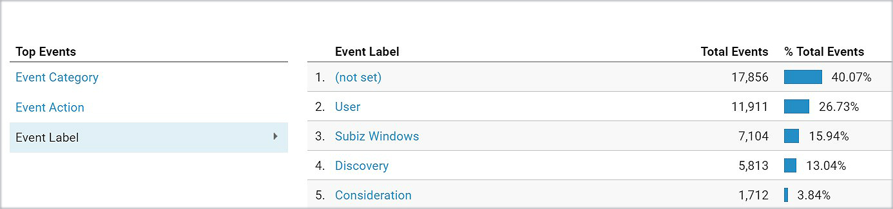

# Google Analytics and Subiz chat integration

Your website has integrated Subiz and Google Analytics \(GA\). Subiz will automatically identify GA account and send Subiz chat data to GA as events.

Particularly, Subiz can work with GA through Google Tag Manager.

### Send Subiz chat data to Google Ananlytics

There are three types of data that Subiz sends to GA including:

*  **Event message sent**: The user sends a message via the Subiz chat window
*  **Event message received**: The user receives a message via the Subiz chat window
*  **Event Subiz chat windows open**: Subiz chat windows open 

### Read Subiz chat event on Google Analytics

 An Event of Subiz chat on GA has the following three components. An Event hit includes a value for each component, and these values are displayed in your reports.

* **Event Category**: SUBIZ chat
* **Event Action**: + Received - action to receive messages via Subiz  + Sent - action to send messages via Subiz + Opened - Action to open the Subiz chat window
* **Event Label:** + User - Who receive and send messages via Subiz + Subiz windows - Subiz chat windows open

### How to see Subiz chat report on Google Analytics

* Step 1: [Sign in to Google Analytics.](https://analytics.google.com/)
* Step 2: [Navigate to your view](https://support.google.com/analytics/answer/6099198).
* Step 3: Open [Reports](https://support.google.com/analytics/answer/6102416).
* Step 4: Select **Behavior &gt; Events &gt; Overview**

* Step 5: Click Event category to see event called SUBIZ chat

* Step 6: Click Event Action to view actions as Received, Sent, Opened

* Step 7: Click Event Label to view labels as User, Subiz Windows

> Do you need help? Just click on [Subiz.com](https://subiz.com/en) and chat with us!

