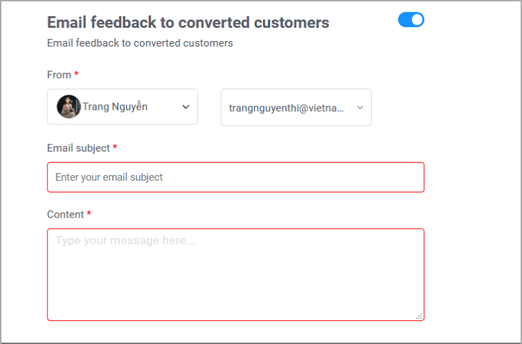

# Create a Pop-up campaign

Pop-ups work as window advertising along with a lot of information and call-to-action buttons corresponding to each targeted group of customers.

To create an effective Pop-up on Subiz, please follow the 3 steps below:

1. Design an attractive Pop-up displaying on the website
2. Set up conditions for each targeted customer
3. Send email notification to customers entering an email address on the Pop-up.

To create a new Pop-up, go to Campaign at [App.subiz.com/campaign](https://app.subiz.com/campaigns) &gt; Select Template &gt; Click Use Pop-up 

Then set up as instructed below:

### **1. Design an attractive Pop-up**

The Pop-up interface is a small window to transfer information along with a call-to-action button. Only when customers are fully engaged to do an action as planned \(such as viewing an advertisement or filling out the form\), you are considered to have successfully set up an effective pop-up.

Essential Tips to Boost Your Popup Conversions:

* **Utilize the highlighted headline and focus on the needs of the customers**

This is a very important first step. Visitors will be drawn to the content of your Pop-up and decide in an instant whether they want to stay on the page or not.

*  **Make an attractive offer in the Pop-up**

Customers tend to respond \(sign-up for your list or complete their purchase, etc\) when they see something urgent such as time limits or product limits

* **Collect customers’ data**

By using the information form, you can collect customer data. Here, you can add more fields such as phone number, email address or feedback.

Kindly note: Keep your form simple. 1 or 2 fields are good enough to boost those conversions further.

* **Call customer to do action** 

Importantly, to keep your customers engaged with the Pop-up, we recommend creating a highlighted action button.

On Subiz Pop-up, there are 2 action buttons including the primary button and second button. With each button, you can add more functions to run in the background as below:

**+ Conversion:** an action that you have achieved with your pop-ups. Customers are then converted into the subscriber list.

**+ Send form and Conversion:** When customers are done filling out the form and have then clicked on, which is considered to be a conversion.

**+ Goal Reached and Conversion:** As soon as customers click on this button, they will have completed the goal. Hence, they will no longer see this pop-up again. 

**+ Next page:** Another page will be displayed on the browser.

**+ Close pop-up:** Pop-up will automatically disappear in customers’ site view

**+ Open Subiz Widget:** The Subiz widget will open for visitors to chat online

**+ Turn to page:** There are 2 pages on Pop-up: Advertising page and thank you page. Customers will view the second page if you add the button **“Turn to page”**  

* **Use visual and vivid images**

Images are the fastest way to grab visitors’ attention and transfer information to customers. You can utilize our available banners or design your own and upload them for Pop-up background.

Specifically, adding Popup animation will bring a new impression to customers.

### **2. Set up the target for Pop-up**

You can create ****a Pop-up with 3 targets:

* **Timing:** Depending on customer behavior on the website, you can set up the target at “When to show**”**

Subiz automatically identifies 4 customer behaviors on your website

+ When a visitor is about to exit the page: On exit-intent

+ After a visitor has scrolled x% screen: After x percent scrolling

+ When the visitor is inactive \(click, type or click\): After x seconds of inactivity

+When a visitor has been on the page for at least x second: After x seconds

\*\*\*\*[**See more how to determine the user behavior that trigger your campaign and display your message**](https://help.subiz.com/su-dung-subiz-nang-cao/pop-up-chuyen-doi-khach-hang/huong-dan-su-dung-dieu-kien-thoi-diem-chay-pop-up)

* **Define targeted customers who are allowed to see the Pop-up:** you can decide who to appear the pop-up on the website at “Who to show”

Here are the information that you can segment:

+ Source: Visitors enter the website via a specific source such as Organic, Social, Direct or Advertising.

+ Location: The popup will appear to visitors from a specific location. 

+ Device: Visitors browsing on specific devices will see your message

+ Current URL: Visitors who are currently browsing a specific page will see your message

+ Frequency: Set how many times your message can appear per visitor  

If you don’t set Frequency, the pop-up will appear every time customers reload the page.

\*\*\*\*[**See more how to segment your visitors and specify the audience that should see your message.**](https://help.subiz.com/su-dung-subiz-nang-cao/pop-up-chuyen-doi-khach-hang/huong-dan-su-dung-dieu-kien-doi-tuong-khach-hang-chay-pop-up)\*\*\*\*

* **Schedule:** If you want the campaign to run immediately, skip this section

Otherwise, you can schedule your campaign at a specific time.

### **3. Notifications**

Should you like to send your customers a notification right after they complete filling out the form \(specifically email\), you are recommended to use Notification on Pop-up.

For example, as soon as finishing the subscription form, customers will be sent an email of a promotion program or product introduction that they are concerned about.

Besides, you can personalize the email sent to the customer by changing the Sender name and the email address of the sender.

  
For further support, please send us a request to Support@Subiz.com  

  

  
  
  

  
  

  

