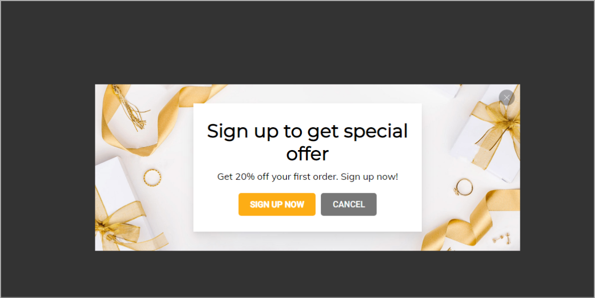

# High converting pop-ups

### **1. What are Pop-ups?**

Pop-ups are forms of online advertising on the website by suddenly displaying a small window in the foreground of the visual interface to attract visitors and call them to do an action.

Businesses can convey promotional messages, products or service advertising and convert targets, such as purchasing and filing out information more effectively using pop-ups.

### **2. 4 considerable benefits to use Pop-ups**

Pop-ups are an effective advertising tool for businesses due to 4 considerable advantages below:

* **Creating impressive advertisements and impulse purchases**

 Pop-ups help reveal the product details, services, and direct customers to the targeted advertising.  Simultaneously, using psychological tactics aims to impulse buying through promotion programs or  countdown timers.

* **Collecting customers' information**

Pop-ups engage customers to fill out the information form by creating impressive scenarios. You will actively connect with customers and motivate buying through different channels such as emails or phone calls.

* **Measuring Customer Satisfaction**

Customers’ opinions are the standard measure of satisfaction within a business. Accordingly, it’s easy to set up a proper development plan for your business.

* **Inviting customers to chat online**

Pop-ups offer to engage customers to chat online right on the Subiz widget, Facebook chat or Zalo. From there, you can understand the needs of the targeted customers.

### **3.  Frequently Asked Questions about Pop-ups**

* _**Is it easy to install Pop-ups?**_

It’s so easy to install Pop-ups. You can choose a sample from our library. This simple procedure can be done without a webmaster’s support

* _**What are the advantages of Pop-ups?**_

Easy to set up with various available samples

Choose the right time to run according to visitors’ behavior

Screen the right targeted customers based on their data

* _**Can I change the background of the Pop-ups?**_

Yes, you can choose the available background from Subiz Pop-ups library or create your own images.

* _**Can I send emails to customers filling out information on Pop-ups?**_

Yes, when the customer has entered the email address into the Pop-ups, an automated email will be delivered to the customer when set up is completed.

* _**Can I analyze the conversion and customer information from Pop-ups?**_

Yes, detailed activity statistics about Pop-up will be displayed along with conversion rates and customer lists.

You can create many Pop-ups on Subiz with different targets

