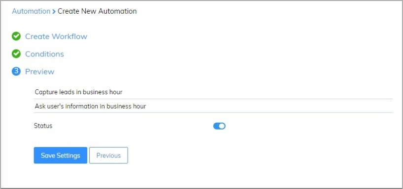

# Capture leads base on business hour

​Subiz widget always online to your customer can contact you any time, from there on you could have no miss any sales opportunities on the website. However, if they contact you out of business hour, how to notification for them? Also, ask their information and request to re-contact and support them.

With Subiz, you could use Capture leads to create form ask information base on the business hour, from there on you could notice with your user about your available time to support them. 

In order to set up capture leads based on the business hour, you could follow the instruction as below:

### Set up business hour 

To set up the business hour, you access this link: [App.subiz.com -> Setting -> Account -> Business hour.](https://app.subiz.com/settings/business-hours)

### Capture leads in business hour 

Firstly, you could set up as below: [Login App.subiz.com -> Setting -> Account -> Automation -> Workflow -> Create](https://app.subiz.com/settings/automation-workflow)

 In addition, you could edit the content of Capture leads as below: 

Secondly, you will install conditions for Automation and add time conditions: 

Finally, you fill the Automation name and save.

### Capture leads out of business hour 

You also create a new Automation and Edit message content as below: 

After that, you will install conditions for Automation and add time conditions: 

Finally, you fill the Automation name and save.

