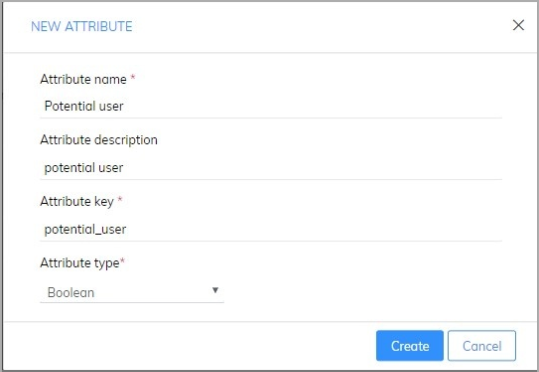
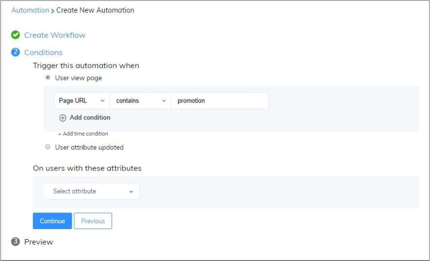

# Classify and follow up a potential user

​Subiz’s new update about Automation not only support you interact with a customer with a simple action like Automation send a message or capture leads but also help you run business automatically and high efficiency. 

The following article will instruct you how to use the Automation to classify and follow up potential customers.

### Step 1: Create a new user attribute 

Firstly, you need to create a new user attribute: [App.subiz.com -&gt; Settings -&gt; Account -&gt; User attributes -&gt; New Attribute](https://app.subiz.com/settings/user-attributes#)

After that, you fill the information as below: 

The user attributes that you create will display in User information

### Step 2: Set up Automation to update the user’s information 

You could automate classify user based on conditions after you set up this automation. In order to set up automation, you access this link: [App.subiz.com -&gt; Setting -&gt; Account -&gt; Automation -&gt; Workflow -&gt; Create. ](https://app.subiz.com/settings/automation-workflow)

Depending on how you define potential users, you can set up suitable conditions. For example, users who access the promotion page/quotation will be updated as potential users: 

Click Continue to update Automation’s name:

### Step 3: Automation send email to the potential user 

In this step, you can create email templates with information, images, attachments to attract customers. You can refer to how to create Automation send an email: [See detail ](https://help-en.subiz.com/optimise-the-use-of-subiz/how-to-enhance-interactions/some-common-automations/untitled-3)

Let’s start with setting up email templates: [App.subiz.com -&gt; Setting -&gt; Account -&gt; Automation -&gt; Create Conversation -&gt; Create. ](https://app.subiz.com/settings/automations/add-conversation)

After that, you set up conditions to send email to the potential user:

Finally, you save the Automation name: 

Automation will help you automatically categorize and send email to potential users:

