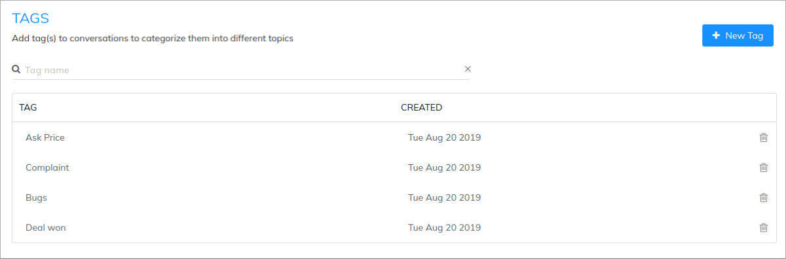
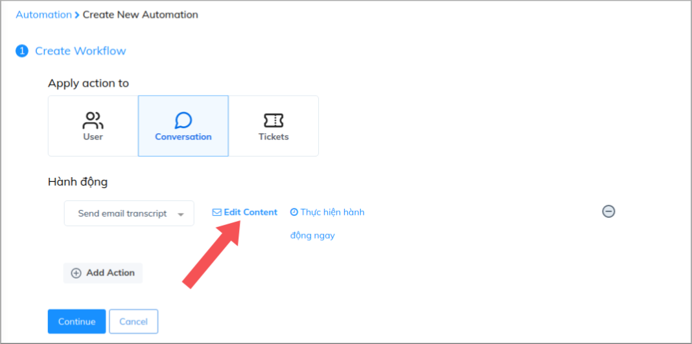
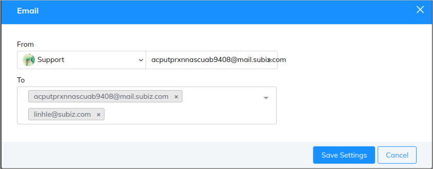
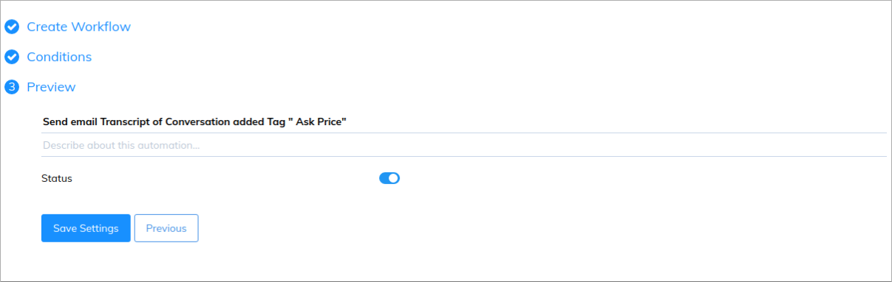
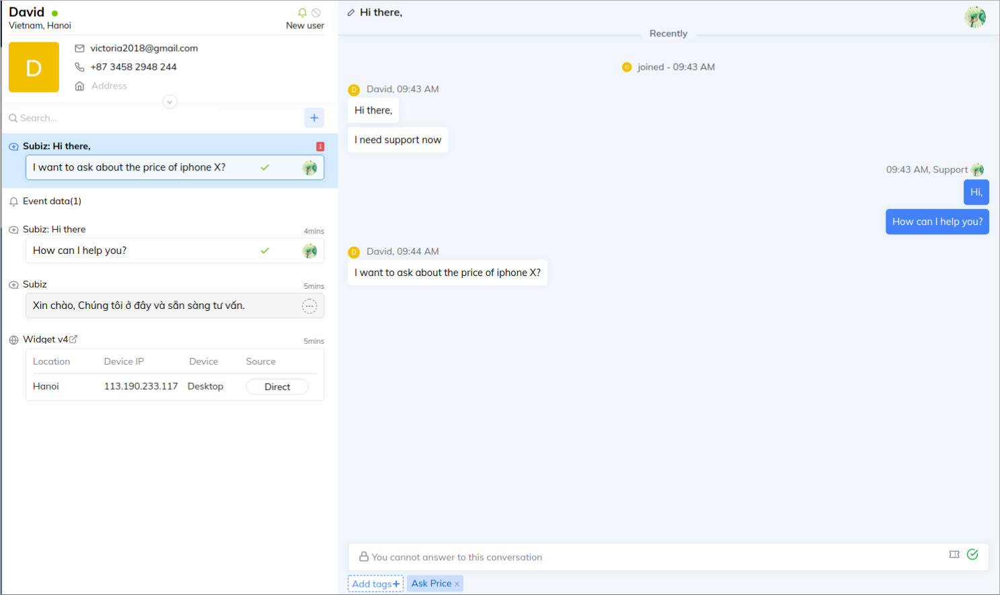
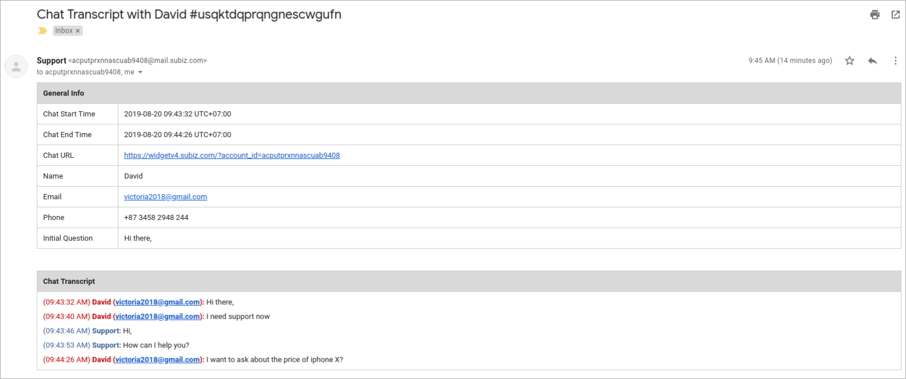

# Manage Customer Support with Email Transcript

‌Automation send email transcript is the feature that helps you to receive the detailed conversation via your email address. Instead of receiving all conversations, you can classify and select some kinds of conversation with important content. By combining with feature " **Add Tag** ", this process will take place automatically, giving you a general understanding of your customers and their requirement.  

For example: To save information and follow the potential users who ask about price, you can add Tag " **Ask price** " to the conversation. Then, the detail conversation will be sent to your email.

### **‌Step 1: Create Tags**

Tag is the feature used for classifying conversations into groups so that you can generally understand the requirement of users. Tag helps to generate the content of your conversations with users \( [Read more about Subiz Tag](https://help-en.subiz.com/getting-started-with-subiz/working-on-subiz/add-tags-to-a-conversation#create-a-new-tag) \)

To create Tag, you come to :[ Setting &gt; Tags](https://app.subiz.com/settings/tags)

### **Step 2: Create Automation send email transcript**

**1. Create workflow**

To create an automation send email transcript, you need to do as follow:

[**​​Setting &gt; Automation &gt; Workflow**](https://app.subiz.com/settings/automation-workflow)

After selecting **Applying action to Conversations** and action **Send email transcript** , you can **Edit Content** to add email receiving transcript

**2. Setting Condition**

You set condition as follows:

You can add one tag or a group of tags here

**3. Save Automation**

You create Automation name and description, and then click **Save setting**

### **Step 3: Add Tags to conversations**

After setting Automation, to receive email transcript you need to add tags to every conversation.

Then, you will receive a transcript email as following:

  
  
****

