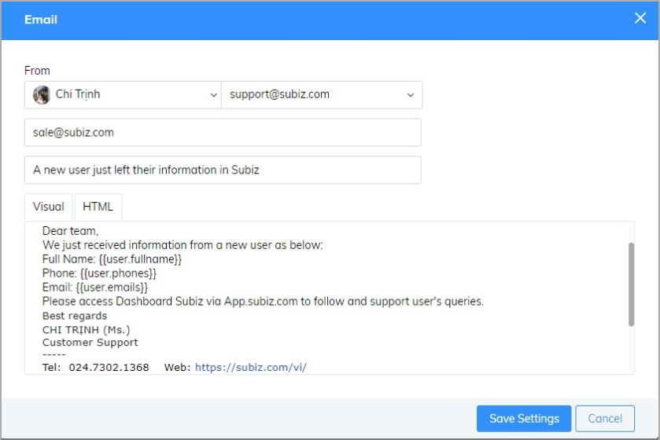
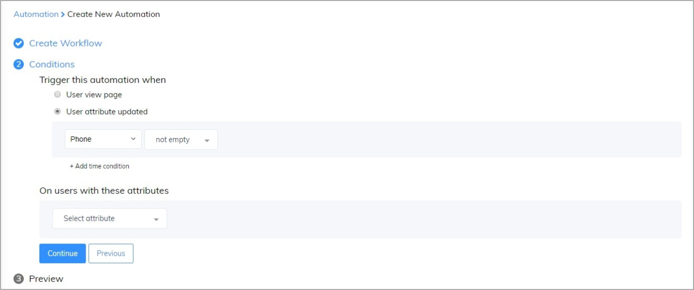
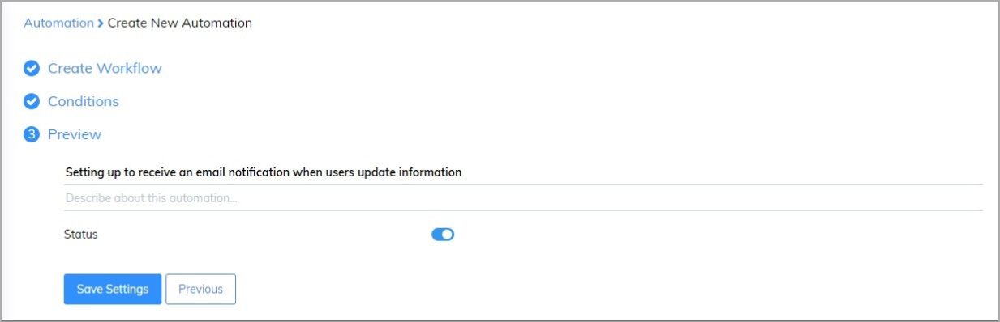
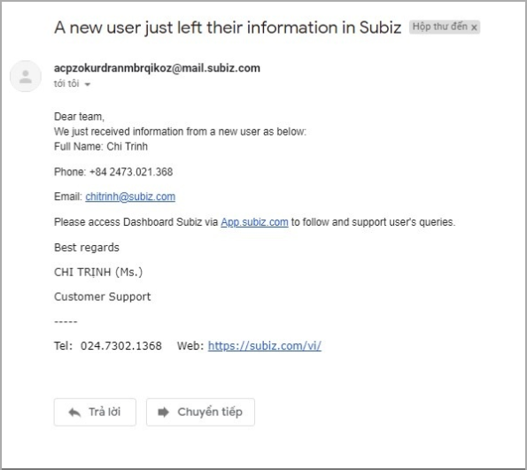

# Setting up to receive an email notification when users update information

​You have more chance to attract and increase interaction with a user who leaves their information. 

Except for the support you ask the user’s information automatically, Automation can help you receive an email notification when users left their information via widget chat. In the meantime, you and your co-worker can log into the account, follow the user’s queries and reconnected if they leave your website. 

The following article will guide how to receive an email notification when users update information 

### Step 1: Set up the content of email notification 

In order to create Automation send an email notification, you access via this link: [Automation -&gt; Workflow -&gt; Create. ](https://app.subiz.com/settings/automation-workflow)

Next, you will select the object to set up Automation: 

After choosing an **Apply action to the user** and action **Send Email notification**, you could **edit the content of the email** and fill in the email address that received notification. 

### Step 2: Set up conditions 

After completing the setup of the email content of Send Email Notification, click **Continue** to move to the next step. 

### Step 3: Give a name to Automation 

After finishing setting up the condition, click Continue to go to the last step. 

Automation will run when users fill their information via widget chat or Capture leads \([See more](https://help-en.subiz.com/optimise-the-use-of-subiz/how-to-enhance-interactions/some-common-automations/capture-leads)\). In the meantime, your team will receive an email notification as below:

