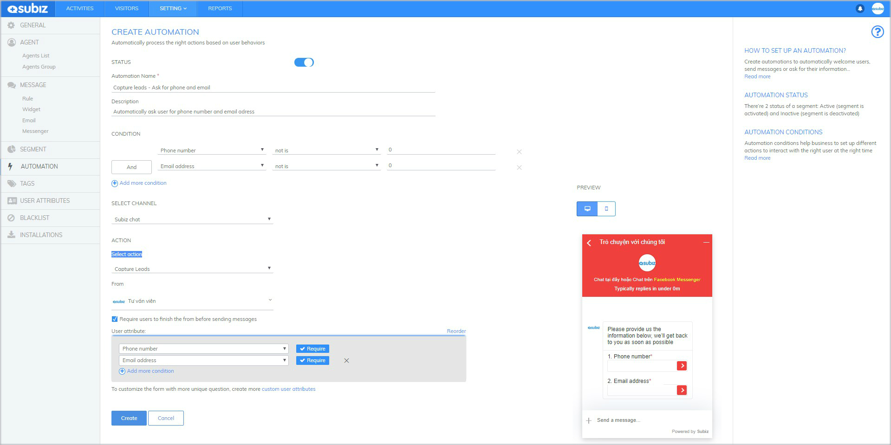
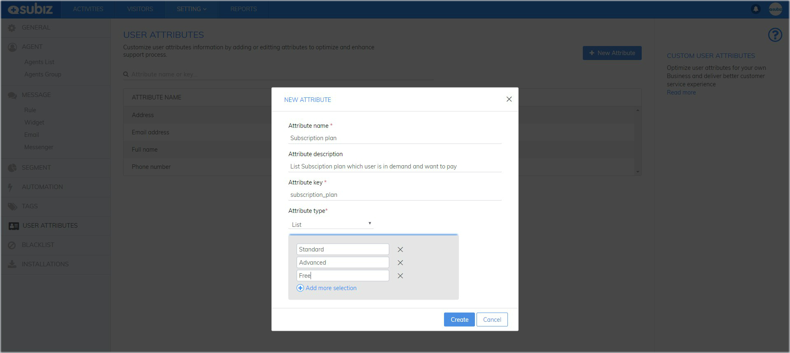
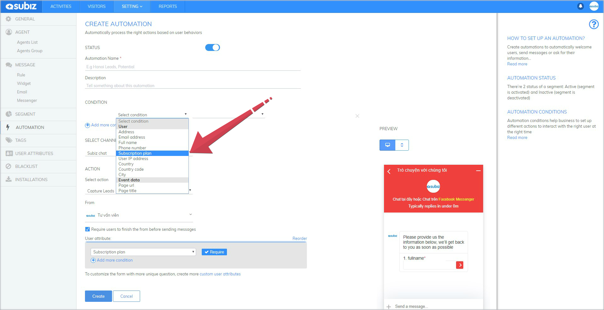
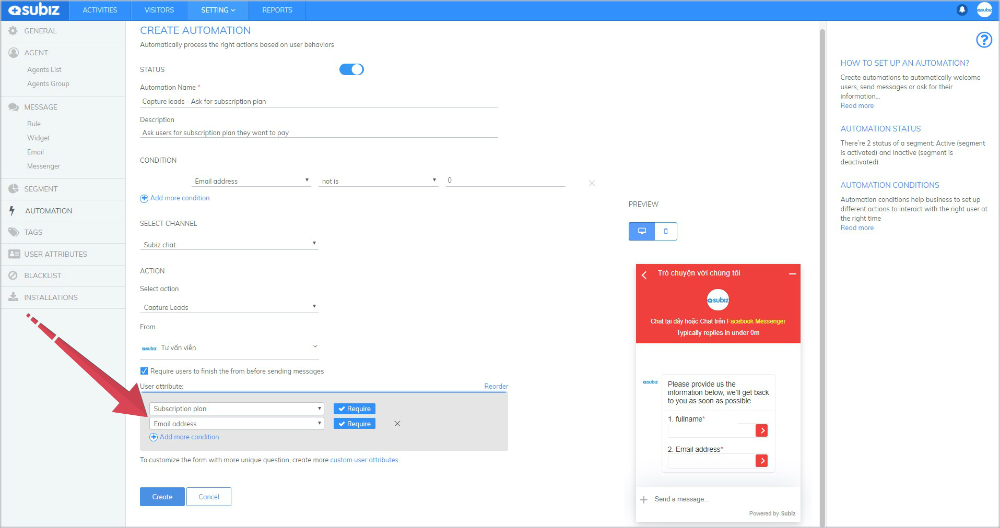
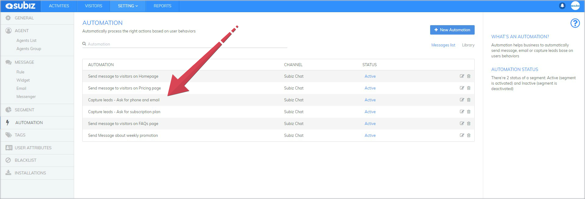
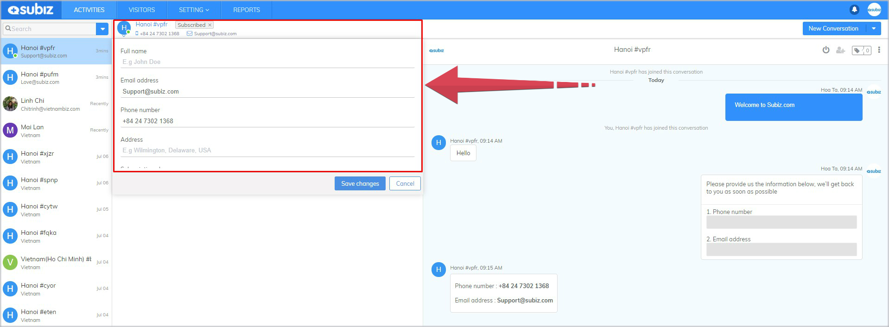

# Capture Leads

Potential customers are those who are in demand for products and services you offer. Subiz will help you identify and generate leads with powerful Automation  - Capture Leads.

Particularly, Subiz allows you to create additional user attributes to collect and manage your own user information. From there, you will be able to draw a clear picture of your target customers clearly and effectively.

### **Create New Automation - Capture Leads**

[Sign in App.subiz.com &gt; Settings &gt; Account &gt; Automation &gt; Create New Automation](https://app.subiz.com/settings/automation-add)

For example: Automation Capture Leads - Ask user info including of Full name, telephone number, email address as follows:

* Status: ON
* Automation Name and Description: Fill information to help you identify and understand the purpose of Automation setting
* Condition: There are several conditions to set Automation active
* Select channel: Subiz chat
* Action: Capture Lead
* From: Select Agent name
* Select "Require users to finish the form before sending messages"
* Add more condition to ask user

### **Create more user attributes**

Subiz allows you to create additional user attributes to collect leads of own business. From there, you will have a clear picture of target customers of own bussiness clearly and effectively.

Detailed guides are as follows:

**Step 1**: **Create new attribute**

[Setting &gt; Account &gt; User attributes &gt; New attribute &gt; Fill information in form &gt; Create](https://app.subiz.com/settings/user-attributes#)


Note: Attribute key needs to be written with the normal letters, underscore between each letter and  without any special characters. For example: subscription\_plan


**Step 2: The new attributes will automatically updated into one of Automation conditions and user info.**

**Step 3: Create  Automation - Capture leads to ask for the new attribute information**

### **Some useful tips for Automation - Capture leads**

1. **Subiz allows you create unlimited number of Automation** 

   2. **Capture lead acts after the first message of user**

  3. **User answer of Capture lead will be automatically updated and saved in user info**

> **Do you wonder? Chat online with Subiz Support Hero on website** [**Subiz.com**](https://subiz.com/vi/feature.html)**.**

  

