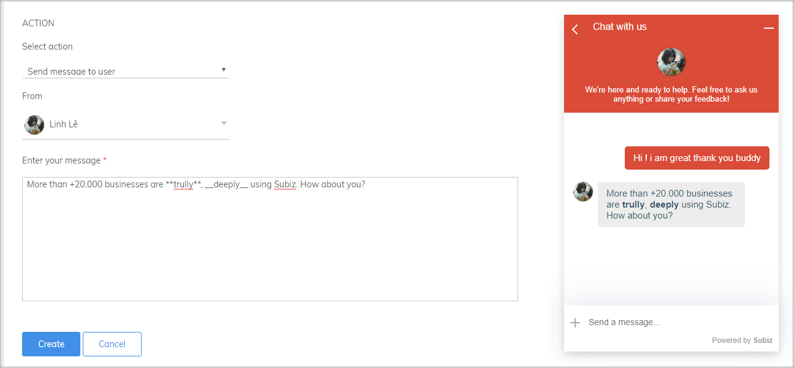
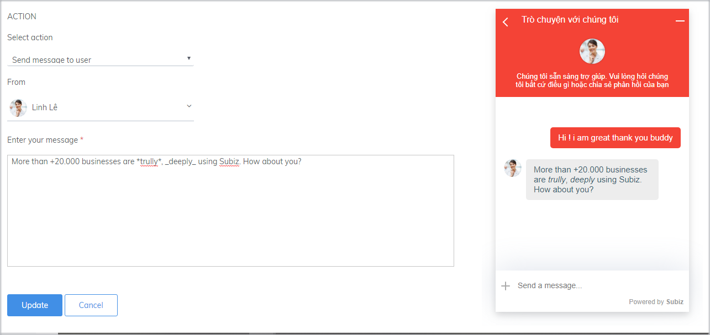
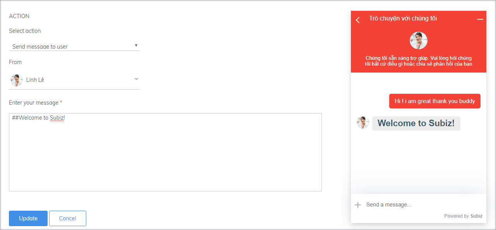
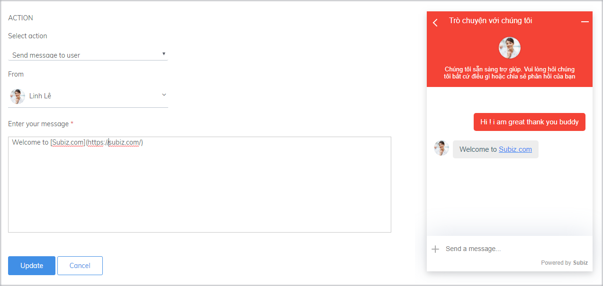
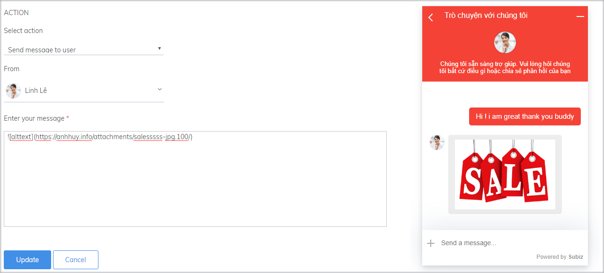
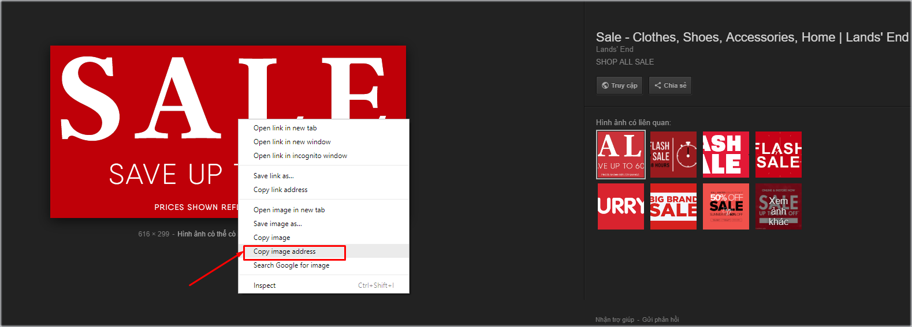
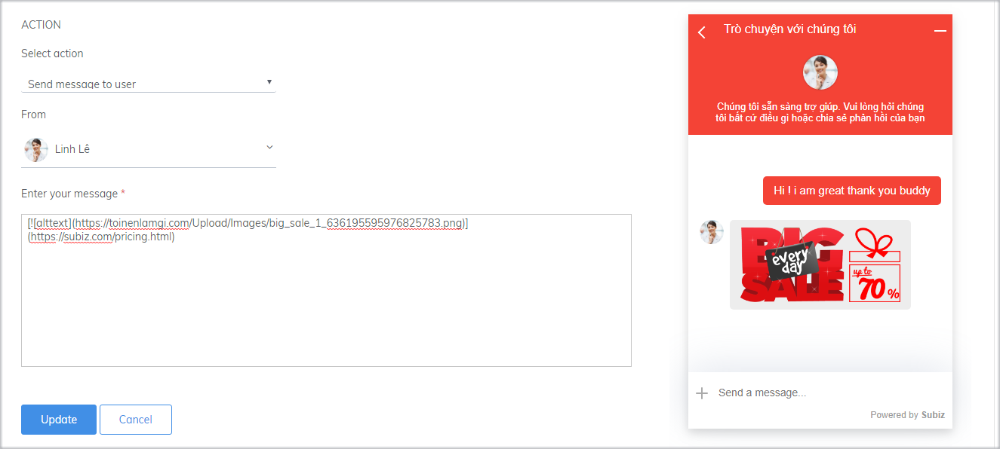
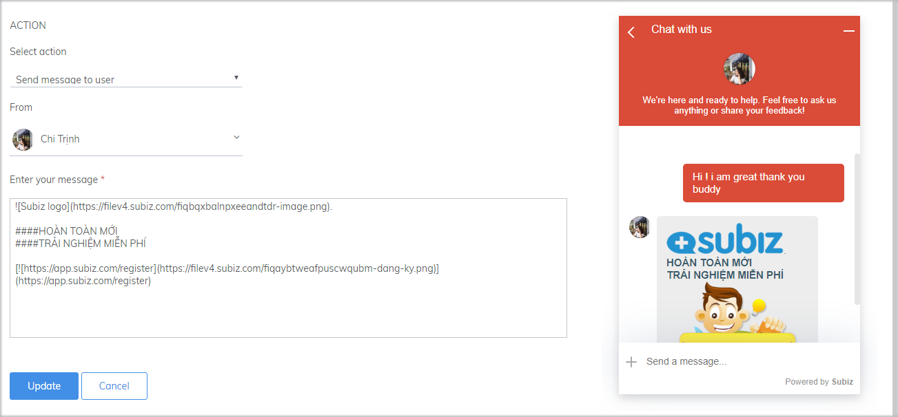

# Create Automation message with Markdown

A creative Automation message will attract customer to your widget, which will help to increase the interaction. A clear and concise message with eye-catching design will surely impress the customer. The following article will guide you to make use of Markdown code to design messages in Automation.

###  Bold and italic font

To draw the customers' attention to the important content of your message, you can either bold or italicize the font as follows:

* **Bold Font**

```text
**text**  hoặc __text__
```



* **Italic Font**

```text
 *text* hoặc _text_
```



### Customize Font

Use the following code to customize font

```text
# h1
## h2
### h3
#### h4
##### h5
###### h6
```



###  Attach a link to the text

 You can add link to the text, to take customers to the page you want to introduce:

```
[Đoạn text được gắn link](link muốn gắn)
```



###  Attach the image to the message

Using images will make your message content more interesting and attract customers to the chat window. You can attach the image to the message as follows:

```text

```



 You can search the image on Google, and get the link image according to the instruction:



### Attach a link to the image 

When customers click on the image, you can direct customers to the page you want by linking to this image:



### Combine markdown codes in a message

Combine markdown codes to create attractive greetings on your website!



### [ ](javascript:void%280%29;)

